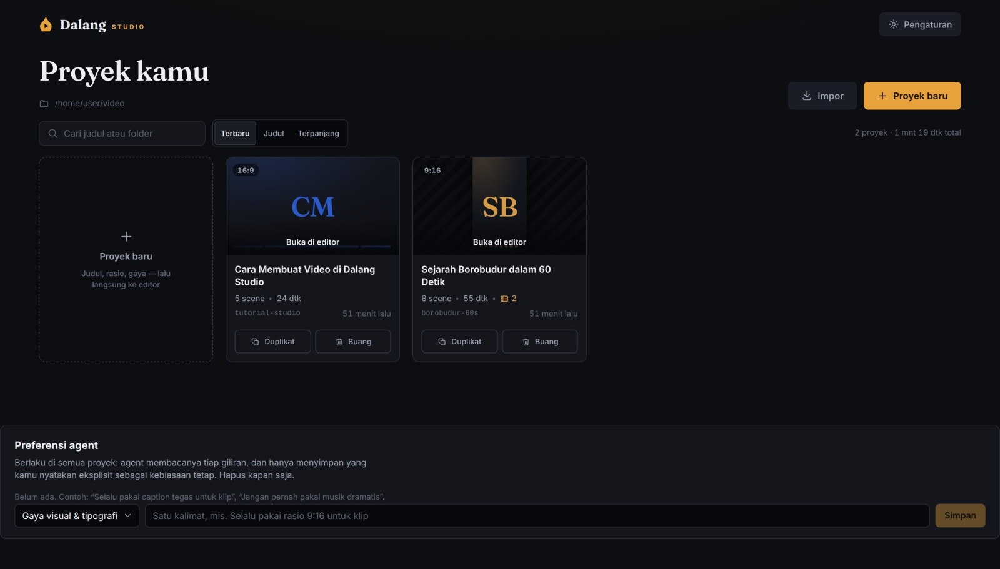
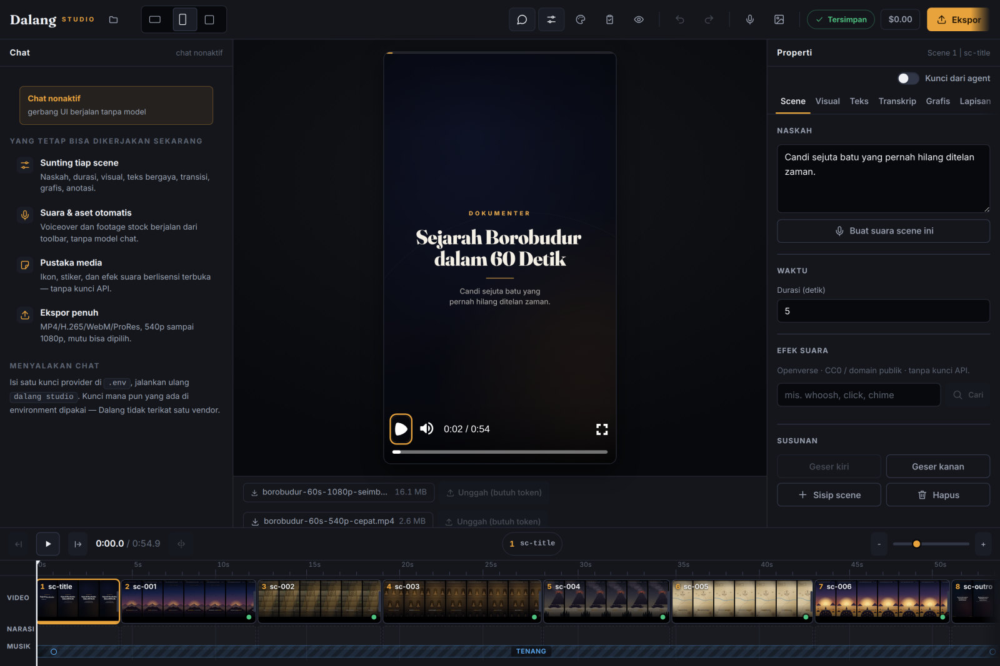
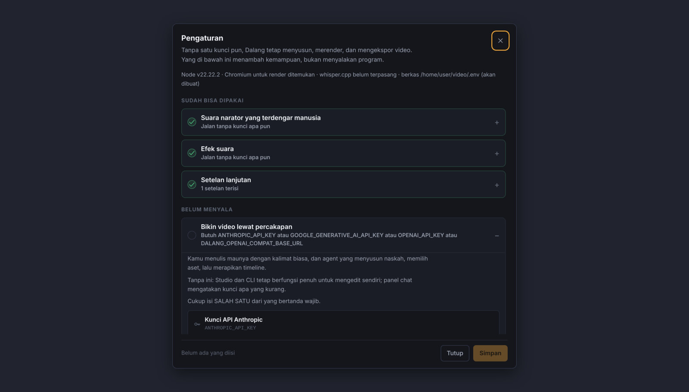

<p align="center">
  <picture>
    <source media="(prefers-color-scheme: dark)" srcset="docs/media/dalang-logo-dark.svg">
    
  </picture>
</p>

<p align="center">
  <strong>Editor video berpilot agent.</strong><br>
  AI menulis naskah, memilih visual, menyusun timeline, dan merender.<br>
  Kamu mengarahkan, dan bisa mengambil alih elemen mana pun.
</p>

<p align="center">
  <a href="docs/PRD.md">Dokumen produk</a> ·
  <a href="docs/decisions/">Keputusan teknis</a> ·
  <a href="docs/roadmap.md">Arah selanjutnya</a> ·
  <a href="CONTRIBUTING.md">Kontribusi</a>
</p>

---

"Cursor untuk video", bukan "Midjourney untuk video". Yang dihasilkan Dalang
bukan berkas video yang tidak bisa disunting lagi, melainkan **rencana adegan**
— satu berkas `plan.json` yang bisa dibaca manusia, diubah lewat operasi patch
tervalidasi, diurungkan, dan dirender ulang kapan saja. Agent dan manusia
menyunting objek yang sama dengan aturan yang sama.

Namanya diambil dari **dalang**, pemain wayang kulit yang menggerakkan seluruh
lakon dari balik layar. Marknya adalah **gunungan**, penanda yang ditancapkan
dalang untuk membuka lakon dan menandai pergantian adegan.

## Daftar isi

- [Tampilan](#tampilan)
- [Hasil render](#hasil-render)
- [Mulai](#mulai)
- [Cara kerjanya](#cara-kerjanya)
- [Kemampuan](#kemampuan)
- [Perintah](#perintah)
- [Konfigurasi](#konfigurasi)
- [Kualitas dan verifikasi](#kualitas-dan-verifikasi)
- [Batas yang dinyatakan](#batas-yang-dinyatakan)
- [Struktur repo](#struktur-repo)
- [Status dan keputusan](#status-dan-keputusan)

## Tampilan



Lobi (`dalang studio`). Tiap proyek adalah satu folder biasa berisi
`plan.json`. Kartunya memakai warna aksen dan rasio proyeknya sendiri; yang
sudah pernah diekspor memutar ekspor terakhirnya saat disorot. Durasi yang
tertulis sama persis dengan berkas hasil render.



Editor (`dalang studio proyekku/`). Chat agent yang bisa dilipat, preview
instan `@remotion/player` yang memakai komponen video yang sama dengan
renderer, panel properti bertab, dan timeline NLE dengan ruler ber-scrub,
klip filmstrip selebar durasinya, dan playhead tersinkron dua arah. Semua
panel membaca dan menulis scene-plan yang sama, sinkron lewat SSE.



Panel Pengaturan. Kemampuan disebut dengan apa yang bisa dilakukan, bukan nama
teknologinya; tiap kemampuan menyatakan apa yang tetap berjalan tanpanya, dan
tiap kunci bisa diuji ke layanannya sebelum disimpan.

## Hasil render

Frame di bawah dirender langsung dari
[`examples/borobudur-60s/plan.json`](examples/borobudur-60s/plan.json) memakai
preset `documentary-01`, tanpa AI — sesuai definisi Fase 0, yang gerbangnya
adalah satu pertanyaan: apakah hasilnya terlihat premium?

| | | |
|---|---|---|
|  |  |  |
|  |  |  |

## Mulai

Butuh Node ≥ 20 dan pnpm.

```bash
pnpm install
pnpm dalang setup      # memindai mesin, menanyakan sisanya, menulis .env
pnpm dalang studio     # lobi: daftar proyek di folder ini
```

`dalang setup` boleh dilewati seluruhnya. **Tanpa satu kunci API pun**, Dalang
tetap menyusun, merender, dan mengekspor video: narasi memakai Edge TTS,
scene tanpa aset memakai seni prosedural, dan seluruh editor manual berfungsi
penuh. Kunci menambah kemampuan, bukan menyalakan program.

Renderer memakai Chromium atau Chrome yang sudah terpasang; kalau tidak ada,
Remotion mengunduh headless shell sekali. Untuk mengembangkan UI dengan HMR,
jalankan `dalang studio` di satu terminal dan
`pnpm --filter @dalang/studio dev` di terminal lain.

## Cara kerjanya

Satu berkas adalah sumber kebenarannya, dan satu jenis operasi mengubahnya.

```
                    plan.json  (scene-plan v1, zod strict)
                        |
      +-----------------+------------------+
      |                 |                  |
   agent            manusia            pipeline
 (tools §6.2)     (Studio / CLI)   (TTS, aset, proxy)
      |                 |                  |
      +--------> patch op tervalidasi <----+
                        |
                 patch log + inverse
                        |
                  undo / redo / diff
```

**Scene-plan sebagai sumber kebenaran.** Skema zod v1 yang strict dan
berversi, dengan artefak
[JSON Schema](packages/core/schema/scene-plan.v2.schema.json) untuk
autocomplete editor yang selalu sinkron lewat unit test. Perubahan skema
§5.1 hanya boleh lewat ADR.

**Patch op, bukan tulis-ulang.** Setiap perubahan adalah operasi tervalidasi
yang membawa inversnya, jadi undo, redo, dan diff ringkas didapat gratis.
Batch bersifat atomik. Agent dan manusia memakai kontrak yang sama, jadi tidak
ada jalur istimewa untuk salah satunya.

**Kontrak yang ditegakkan kode, bukan prompt.** Empat aturan di bawah ini ada
di dalam `@dalang/core` dan berlaku untuk siapa pun yang memanggilnya:

| Kontrak | Artinya |
|---|---|
| `locked` | Scene terkunci menolak `updateScene`, `removeScene`, `replaceAsset`, dan reorder dari agent. `lockScene` hanya untuk manusia. |
| `visual.pinned` | Aset yang dipilih eksplisit tidak boleh ditimpa auto-resolve pipeline. |
| `renderState` | Data turunan; di luar patch dan undo, hanya pipeline yang menulisnya lewat helper khusus. |
| Patch atomik | Selalu membawa inverse. Gagal di tengah berarti tidak ada yang berubah. |

**Port, bukan integrasi langsung.** TTS, stock, ASR, transkoder, target
render, dan tujuan publikasi semuanya di balik port. Itu yang membuat render
lokal dan render Lambda bisa berbagi satu jalur, dan membuat setiap provider
bisa diganti tanpa menyentuh inti.

**Cache berbasis isi.** Ledger SQLite di `.dalang/` di samping plan mengunci
hasil tiap tahap ke hash isinya. Mengganti narasi satu scene hanya
mensintesis ulang scene itu; menjalankan ulang tanpa perubahan tidak
mengerjakan apa pun; proses yang mati di tengah melanjutkan, bukan mengulang.

## Kemampuan

### Menyusun video lewat percakapan

Agent "dalang" bekerja di atas proyek: brief, riset, `writeScenePlan`, suara
dan aset, lalu preview. Revisi berikutnya berupa patch kecil, bukan penulisan
ulang. Ia **netral vendor**: model default mengikuti API key yang terpasang di
lingkunganmu (Anthropic, Google, OpenAI, atau gateway OpenAI-compatible) dan
dipilih dari data registry models.dev, bukan dari preferensi kami. Lebih dari
satu kunci berarti kamu wajib memilih eksplisit.

Yang membedakannya dari "LLM menulis JSON": agent **memeriksa kerjanya
sendiri** terhadap resep format yang dipakai, dan bisa **melihat hasil
rendernya**.

<details>
<summary>Resep format, kritik diri, dan tinjauan visual</summary>

- **6 resep format konten** (bebas, edukasi, tutorial, klip, berita, cerita),
  masing-masing dengan kerangka beat, rentang scene dan durasi, serta aturan
  struktur. Satu sumber dipakai dua arah: menyusun system prompt *dan*
  memeriksa hasilnya, jadi nasihat dan pemeriksa tidak pernah berbeda pendapat.
- **`critiqueDraft`** membuat loopnya berubah dari *tulis lalu harap* menjadi
  *tulis, periksa, perbaiki*, dengan pemeriksa yang bukan model.
- **Detektor generic**: klise, kata pagar, kata pengisi, kalimat di atas 25
  kata, pengulangan gagasan antar scene, dan **irama datar** — keseragaman
  panjang kalimat adalah penanda terkuat naskah mesin. Semuanya leksikal dan
  statistik: tanpa model, tanpa biaya token.
- **Durasi diestimasi dari suku kata**, bukan jumlah kata. Bahasa Indonesia
  berafiks berat, jadi "dan" dan "mempertanggungjawabkan" tidak boleh dihitung
  sama, dan "2024" bukan satu kata melainkan delapan suku kata.
- **`reviewRender`** merender beberapa frame kunci lalu menilainya dengan model
  vision, digabung dengan kritik struktur dalam satu laporan. Framenya dipilih
  dengan alasan: momen paling ramai di tiap scene, karena di situlah tata letak
  bertabrakan. Loopnya dibatasi di kode (bawaan 3 per giliran), bukan di prompt.
  Jawaban model yang tidak bisa diurai ditandai peringatan, tidak pernah
  dilaporkan bersih.
- **Guardrails di kode**: step cap 15, anggaran per giliran dan per proyek,
  gerbang persetujuan untuk render final dan TTS massal (non-interaktif berarti
  tolak), dan setiap panggilan tool tercatat (`dalang log`).
- **Suite eval berskor** (`pnpm --filter @dalang/agent eval`): lima brief
  bersumbu berbeda, skor 0-100 dari kepatuhan brief dan kerajinan — sehingga
  perubahan prompt atau model bisa dibandingkan dengan angka, bukan kesan.
  Mode `--self-check` menguji rangkanya tanpa model, dan mode itu menjaga CI.
- **Memori preferensi lintas proyek**: hanya yang kamu nyatakan sebagai
  kebiasaan tetap, semuanya terlihat dan bisa dihapus di lobi, disimpan di
  `~/.dalang/memori.json` dan bukan di dalam plan. Preferensi yang saling
  bertentangan ditandai, dan agent diminta bertanya alih-alih memilih sendiri.

Rujukan: [ADR-0009](docs/decisions/0009-agent-runtime.md),
[ADR-0017](docs/decisions/0017-agent-berkerajinan.md),
[ADR-0022](docs/decisions/0022-agent-melihat-hasilnya.md),
[ADR-0029](docs/decisions/0029-memori-preferensi-lintas-proyek.md)
</details>

### Editor yang terasa seperti editor

Timeline NLE dengan ruler ber-scrub, klip filmstrip selebar durasinya, trim di
tepi klip, belah di playhead, track suara per scene, dan transport. Satu scene
boleh memuat **beberapa potongan gambar berurutan**: titik potongnya digambar
di dalam kotak scene dan bisa diseret, pisau di transport membelah POTONGAN
sementara tombol di sebelahnya membelah SCENE. Teks, grafis, dan lapisan video
**diseret langsung di atas preview**, bukan lewat form angka. Semua keluarannya
patch op biasa: tercatat, bisa Ctrl+Z, dan terlihat agent di giliran
berikutnya.

<details>
<summary>Kanvas, lapisan, dan keyframe</summary>

- **Kotak pegangan dibaca dari DOM yang sudah ter-render**, jadi selalu pas di
  preset mana pun — termasuk preset yang belum ditulis. Jangkar dipilih ulang
  saat dilepas dan tepinya memakai margin aman, jadi menyeret "ke pinggir"
  mendarat di kolom aman yang sama dengan teks lain. Menyeret tidak pernah
  mengubah perataan teks: itu keputusan tipografi, bukan letak.
- **Menempel ke elemen lain** saat diseret (pusat ke pusat, tepi ke tepi,
  bersebelahan) dengan garis bantu di tepi yang disejajarkan. **Pemilihan
  jamak**: Shift+klik menambah anggota, menyeret salah satu memindahkan
  semuanya sejauh yang sama dalam satu patch, jadi satu undo mengembalikan
  semuanya.
- **Potongan di dalam satu scene** (maks 24): belah, geser tepi, buang, susun
  ulang. Contoh siap-render ada di
  [`examples/klip-borobudur`](examples/klip-borobudur/) — satu narasi, tiga
  potongan, satu potong keras dan satu larut; CI merendernya tiap kali. Menggeser tepi punya dua rasa — `ripple` memanjangkan atau memendekkan
  scene-nya, `roll` menukar durasi dengan potongan tetangga sehingga panjang
  scene tidak berubah dan yang bergerak hanya titik potongnya. Aritmetikanya
  hidup di core dan mengekspor BATASNYA, jadi seretan pointer berhenti di tempat
  yang sama dengan tempat op menolak. Di antara dua potongan bawaannya potong
  keras; larut dipasang per potongan kalau memang dibutuhkan.
- **Lapisan video** (maks 2 per scene) untuk B-roll, picture-in-picture, atau
  bukti visual. Medianya memakai bentuk `visual` yang sama, jadi Ken Burns,
  filter, kecepatan, trim, cermin, dan titik fokus berlaku tanpa rumus kedua —
  dan lapisan ikut bertambah pintar setiap kali `visual` bertambah. Kotaknya
  jangkar plus geseran fraksional, jadi satu nilai tetap benar di 16:9, 9:16,
  dan 1:1.
- **Keyframe properti**: `tracks` pada grafis, teks, dan lapisan
  menganimasikan properti pada waktu yang dipilih, bukan yang tersedia.
  Daftar propertinya tertutup dan rentang nilainya sama persis dengan properti
  statisnya, jadi keyframe tidak bisa membawa nilai yang akan ditolak skema.
  Waktunya fraksi jendela tampil, jadi scene yang dipanjangkan membawa serta
  animasinya tanpa satu angka pun dihitung ulang.
- Berlian keyframe di timeline **bisa diseret** atau digeser dengan papan
  ketik, menempel ke keyframe track lain pada lapisan yang sama, dan mendarat
  di atas keyframe lain ditolak alih-alih ditumpuk.
- **Anotasi tutorial** (zoom, sorot, panah, blur) ikut bisa diseret dan diubah
  ukurannya di atas tangkapan layar.
- **Perangkat sinematik lewat kontrak data**: filter per scene (6 preset plus
  cerah, kontras, saturasi, opacity, blur), transisi per scene dengan tempo
  yang bisa diatur, hingga 3 teks overlay, rasio yang bisa ditukar, gerak Ken
  Burns dengan cermin horizontal dan titik fokus crop, serta kecepatan video
  0,25-4x.
- **Satu bahasa easing** dinamai per rasa (settle, glide, dolly) dipakai kedua
  preset, dengan util keyframe bersama — tidak ada lagi masuk-keluar teks yang
  linear.

Rujukan: [ADR-0011](docs/decisions/0011-pengayaan-editor.md),
[ADR-0015](docs/decisions/0015-kehandalan-gerak.md),
[ADR-0024](docs/decisions/0024-manipulasi-langsung-di-kanvas.md),
[ADR-0025](docs/decisions/0025-lapisan-video.md),
[ADR-0027](docs/decisions/0027-keyframe-properti.md),
[ADR-0033](docs/decisions/0033-beberapa-klip-dalam-satu-scene.md)
</details>

### Teks dan tipografi

Caption karaoke tersinkron dari word timestamp asli TTS atau estimasi
deterministik, dengan **empat gaya** (Klasik, Tegas, Chip, Halus), tipografi
kinetik per kata atau per karakter, garis luar 0-8 piksel untuk keterbacaan di
footage ramai, dan penekanan stabilo yang menyapu saat teks masuk. **Enam font
variable ter-bundle** (OFL, dirender offline): Fraunces, Inter, Space Grotesk,
Lora, Plus Jakarta Sans karya Tokotype, dan Anton.

Rujukan: [ADR-0016](docs/decisions/0016-tipografi.md)

### Suara

Narasi lewat rantai ElevenLabs → Edge TTS → silence offline, dengan word
timestamp native bila providernya menyediakan. Setiap degradasi ditandai per
scene, jadi kamu selalu tahu suara mana yang placeholder.

<details>
<summary>Amplop audio, ducking, dan pengukuran kenyaringan</summary>

- **Satu bentuk amplop untuk semua yang berbunyi**: suara aset visual, suara
  lapisan, dan trek audio tambahan. `volume`, fade masuk dan keluar, ducking,
  dan normalisasi — satu implementasi, satu panel kendali, jadi tidak ada panel
  yang diam-diam kehilangan sakelar ducking.
- **Ducking mengikuti rentang bicara nyata** dari word timestamp, bukan seluruh
  jendela scene. Jeda di bawah 1,2 detik tetap diduck supaya musik tidak
  memompa.
- **Kenyaringan diukur dengan pengukur EBU R128 / ITU-R BS.1770-4 yang ditulis
  sendiri** — tanpa ffmpeg, tanpa biner tambahan — dan koefisien penapis K
  dihitung ulang per laju cuplik, bukan disalin dari tabel 48 kHz.
- **Normalisasi per klip, bukan per program**: tiap sumber dibawa ke
  `meta.loudnessTarget` (bawaan -16 LUFS) sebelum volumenya diterapkan, jadi
  `volume` selalu berarti hal yang sama. Berkas mono dikoreksi 3,01 LU karena
  campurannya stereo.
- **Belum diukur berarti penguatan 1, bukan tebakan.** Berkas yang kodeknya
  tidak bisa didekode dilewati dengan alasan yang disebutkan.
- **Campuran akhir setiap render diukur dari berkas hasilnya**, lalu dikoreksi
  ke sasaran dengan penguatan rata (toleransi ±1 LU, dipangkas di puncak
  -1 dBFS, video disalin tanpa enkode ulang). CLI dan Studio menyebut angkanya
  beserta koreksinya.
- **Musik latar** dari dua bed CC0 ter-bundle yang disintesis deterministik dan
  loop mulus, dengan fade yang **bisa diseret di timeline**. `audio.tracks`
  (maks 8) untuk ambience, wawancara, atau lagu berlisensi.

Rujukan: [ADR-0007](docs/decisions/0007-tts-dan-word-timestamps.md),
[ADR-0014](docs/decisions/0014-ekspor-kaya-craft-expert.md),
[ADR-0026](docs/decisions/0026-audio-per-klip.md)
</details>

### Rekaman panjang dan transkrip

Dalang bisa **mendengar**, bukan cuma menyusun materi buatannya sendiri.
Rantai ASR-nya **whisper.cpp (offline) → Deepgram → ElevenLabs Scribe**, dengan
offline di depan karena privasi, bukan akurasi: rekaman mentah adalah materi
paling pribadi yang dipegang Dalang, dan mengirimnya ke pihak ketiga harus jadi
pilihan sadar pemiliknya.

<details>
<summary>Proxy, unggahan yang bisa dilanjutkan, dan titik potong</summary>

- **Proxy pratinjau** H.264 sisi pendek 540 dibuat oleh ffmpeg bawaan Remotion
  — tanpa biner baru, tanpa "pasang ffmpeg dulu". Dipakai hanya oleh preview
  Studio dan render draf; render final selalu membaca berkas aslinya, dan
  ekspor OTIO/FCPXML tidak pernah menyebut proxy.
- **"Perlu proxy" adalah keputusan murni dengan alasan yang terbaca**: kodek
  yang tidak diputar browser (HEVC, ProRes), rekaman ≥ 60 detik, resolusi di
  atas 720p, laju di atas 30 fps, atau laju bit di atas 25 Mbps. Yang ringan
  dibiarkan apa adanya.
- **Dibuat di latar**: ffmpeg melaporkan kemajuan per berkas dan bisa
  dibatalkan; editor tetap bisa dipakai, dan patch, undo, serta render tidak
  menunggu.
- **Unggahan bisa dilanjutkan setelah putus**: per potongan 8 MiB dengan offset
  yang bertahan di server, jadi memuat ulang tab atau me-restart tidak
  mengulang byte yang sudah sampai.
- **Titik masuk dipilih dengan melihat rekamannya**: strip bingkai dan bentuk
  gelombang sepanjang rekaman, dengan jendela scene digambar di atasnya.
  `findCutPoints` mencari jeda hening (-35 dB, 0,35 detik) supaya potongan
  jatuh di jeda alami, bukan di tengah napas.
- **Caption untuk footage orang**: scene tanpa narasi tulis mendapat caption
  dari transkrip rekamannya, dengan `visual.speed` ikut dihitung.
- Cache dikunci **isi berkas**: salinan identik tidak ditranskrip dua kali, dan
  berkas berbeda bernama sama tidak memakai cache yang salah.

Rujukan: [ADR-0021](docs/decisions/0021-transkrip-fondasi.md),
[ADR-0028](docs/decisions/0028-proxy-rekaman-panjang.md)
</details>

### Media dan hak pakai

Video dan foto stok dari **Pexels** dan **Pixabay**, GIF dan stiker dari
**GIPHY** dan **Tenor**, ikon dari **Iconify** (237 set, tanpa kunci), efek
suara dari **Openverse**. Setiap aset membawa metadata lisensinya, dan hak
pakai dijaga tiga lapis.

<details>
<summary>Tiga lapis penjagaan hak pakai, dan yang sengaja tidak diintegrasikan</summary>

- Lisensi ditulis **apa adanya** dengan penanda `PERIKSA HAK PAKAI`.
- Kritik sutradara `aset-hak-pakai` menegur bila aset bertanda itu terpakai —
  memeriksa **lisensinya**, bukan nama providernya.
- Urutan rantai stock menaruh Pexels dan Pixabay **selalu** di depan GIPHY dan
  Tenor, dan itu dikunci test.
- Ikon disaring dengan **daftar putih SPDX**: lisensi yang belum dikenal
  dianggap tidak aman sampai ditinjau, apa pun ber-`-NC-` ditolak lebih dulu,
  dan set yang mewajibkan kredit ditandai.
- Openverse dipilih di atas Freesound karena syarat pemakaian API Freesound
  sendiri gratis hanya untuk keperluan non-komersial, terlepas dari lisensi
  suaranya.
- **Tempelan mengikuti rasio**: `scene.graphics` (maks 4) memakai jangkar plus
  geseran fraksional, bukan koordinat piksel. `audio.sfx` (maks 24)
  menambatkan bunyi ke **scene**, bukan garis waktu mutlak — scene digeser,
  bunyinya ikut.
- **Tidak diintegrasikan, dengan alasan tertulis**: MyInstants, yarn.co, dan
  icon-icons. Ketiganya tanpa API resmi, dan syarat pakainya melarang persis
  apa yang dibutuhkan integrasi otomatis (akses lewat bot, scraping, atau
  penggunaan komersial).

Rujukan: [ADR-0008](docs/decisions/0008-stock-provider-dan-lisensi.md),
[ADR-0018](docs/decisions/0018-pustaka-media.md)
</details>

### Render, ekspor, dan publikasi

Render lokal dengan **bundle cache persisten** berbasis content-fingerprint
(start render sekitar 2 detik saat cache hit), profil draf dan final, format
MP4 (H.264+AAC), WebM (VP9+Opus), MOV (ProRes+PCM), dan H.265, resolusi
540/720/1080p, serta mutu Cepat, Seimbang, dan Terbaik yang dijelaskan jujur
per kombinasi.

<details>
<summary>Render cloud, interchange, dan unggah ke YouTube</summary>

- **Remotion Lambda** sebagai implementasi kedua port `RenderTarget`. Aset
  situs dan aset plan dibedakan: font dan bed musik ikut bundel komposisi,
  sedangkan narasi, footage, ikon, stiker, dan efek suara dialamatkan lewat
  URL — itu yang membuat situs cukup dipasang sekali, bukan tiap render.
- **URL bertanda tangan per berkas sebagai bawaan**, bukan bucket publik,
  supaya footage yang belum dirilis tidak bisa dibaca siapa pun yang punya
  URL-nya. Aset yang isinya tidak berubah tidak diunggah ulang.
- **Estimasi biaya ada di kontrak `RenderTarget`**, dijawab dari durasi plan
  tanpa memanggil AWS sama sekali, dan dibulatkan ke atas: gerbang anggaran
  yang terlalu optimistis lebih berbahaya daripada yang terlalu hati-hati.
- **Ekspor OpenTimelineIO dan FCPXML** untuk difinishing di DaVinci Resolve,
  Premiere, atau Final Cut. Setiap ekspor **selalu melaporkan apa yang tidak
  ikut menyeberang** — caption karaoke, teks bergaya, Ken Burns, filter,
  anotasi — dan daftarnya ikut ditulis ke dalam berkasnya, karena berkas ekspor
  sering berpindah tangan tanpa log yang menyertainya.
- **Impor .otio dan .fcpxml** jadi kerangka scene-plan: urutan, durasi, dan
  titik masuk yang benar, naskah kosong, dan catatannya mengatakan begitu.
  Bentuk berkasnya yang menentukan pembacanya, bukan ekstensinya. Potongan
  diletakkan di **tengah** tumpang-tindih transisi, titik yang sama dipakai
  Dalang untuk berpindah scene.
- **Unggah ke YouTube** dari riwayat render, CLI, atau tool agent: resumable
  per potongan 8 MiB lewat YouTube Data API v3, dengan tiga pengaman karena
  unggahan tidak bisa diurungkan — selalu lewat konfirmasi, bawaan privat, dan
  ledger yang menolak mengunggah berkas yang sama dua kali tanpa `--force`.

Rujukan: [ADR-0014](docs/decisions/0014-ekspor-kaya-craft-expert.md),
[ADR-0019](docs/decisions/0019-render-cloud.md),
[ADR-0023](docs/decisions/0023-keluar-dan-masuk.md),
[ADR-0030](docs/decisions/0030-publikasi-langsung.md)
</details>

### Dalang sebagai kemampuan agent lain

`dalang mcp [akar]` menyajikan garis waktu ke agent mana pun yang bicara MCP:
baca rencana, ubah lewat patch op tervalidasi, urungkan, kritik struktur,
ekspor. Scene terkunci ditolak persis seperti untuk agent Dalang sendiri.

**Tidak ada tool yang memanggil model atau membelanjakan uang.** Kliennya sudah
agent; yang tidak dipunyainya adalah timeline. Render hanya kalau dijalankan
dengan `--izinkan-render`. Pagar ruang kerjanya satu folder akar dengan semua
path diperiksa, termasuk symlink.

<details>
<summary>Memasangnya di klien MCP</summary>

```json
{
  "mcpServers": {
    "dalang": {
      "command": "pnpm",
      "args": ["dalang", "mcp", "/path/ke/folder/video"],
      "cwd": "/path/ke/DalangAI"
    }
  }
}
```

Tambahkan `"--hanya-baca"` kalau agent lain cukup boleh membaca, atau
`"--izinkan-render"` kalau ia juga boleh merender frame. Transportnya stdio.

Studio dan server MCP boleh memegang proyek yang **sama**: server MCP menulis
dengan bandingkan-dan-tukar dan menerapkan ulang patch pada plan yang segar,
sementara tahap pipeline Studio menyimpan hasilnya sebagai delta di atas plan
terbaru — jadi editan dari luar selagi tahap berjalan tidak ditimpa.

Rujukan: [ADR-0023](docs/decisions/0023-keluar-dan-masuk.md)
</details>

## Perintah

```bash
# Penyiapan dan pemeriksaan
pnpm dalang setup                    # pandu penyiapan: pindai, tanya, uji, tulis .env
pnpm dalang doctor --uji             # apa yang menyala, apa yang kurang, kunci mana yang ditolak
pnpm dalang providers:check          # cek penyedia aset ke layanan aslinya

# Bekerja
pnpm dalang studio                   # lobi: daftar proyek di folder ini
pnpm dalang studio proyekku/         # langsung buka satu proyek
pnpm dalang chat proyekku/           # chat agent di terminal
pnpm dalang validate proyekku/       # skema + kritik sutradara
pnpm dalang generate proyekku/       # pipeline: TTS, aset, proxy
pnpm dalang transcribe proyekku/     # transkripsi rekaman ke renderState
pnpm dalang review proyekku/         # render frame kunci, nilai dengan model vision
pnpm dalang log proyekku/            # garis waktu pipeline, agent, dan biaya
pnpm dalang memori                   # preferensi lintas proyek

# Menghasilkan berkas
pnpm dalang render proyekku/ --profile draft
pnpm dalang render proyekku/ --video-format webm --resolution 720 --quality terbaik
pnpm dalang still  proyekku/ -t 8 -t 29 -t 44 -o out
pnpm dalang export proyekku/ --format otio        # ke Resolve, Premiere, Final Cut
pnpm dalang import rough.otio -o proyekku/        # dari editor lain jadi kerangka
pnpm dalang publish proyekku/ --privasi unlisted  # unggah render terbaru ke YouTube

# Cloud dan integrasi
pnpm dalang cloud:check proyekku/                 # konfigurasi Lambda + estimasi biaya
pnpm dalang render proyekku/ --target lambda      # render di AWS
pnpm dalang mcp ~/video                           # timeline sebagai tool untuk agent lain

# Pengembangan
pnpm test | pnpm typecheck | pnpm lint
pnpm studio:remotion                              # Remotion Studio untuk preset
pnpm --filter @dalang/studio gate:layout          # geometri UI di 18 lebar layar
pnpm --filter @dalang/studio gate:interaksi       # seretan sungguhan lewat CDP
pnpm --filter @dalang/renderer asset-url-parity   # paritas aset lokal vs URL
```

Folder proyek dan `plan.json` diterima sama saja di semua perintah.

## Konfigurasi

Semua konfigurasi opsional. Satu **katalog** memuat ke-33 setelan beserta
kemampuan yang dibukanya dan langkah mendapatkannya, dikelompokkan dengan
bahasa tujuan ("Ubah rekaman jadi teks berwaktu", bukan "ASR"). Empat
permukaan membacanya, jadi menambah satu entri memunculkannya di keempatnya
sekaligus:

| Permukaan | Untuk |
|---|---|
| `.env.example` | Dibangkitkan dari katalog; tes menolak yang basi |
| `dalang setup` | Wizard yang memindai dulu, baru bertanya |
| `dalang doctor --uji` | Laporan keadaan, dan menghubungi tiap layanan |
| Panel Pengaturan | Sama, di lobi Studio, tanpa terminal |

Satu tes memindai seluruh kode sumber dan menolak variabel lingkungan yang
dibaca program tetapi tidak dijelaskan ke siapa pun. Audit yang melahirkan
katalog ini menemukan sembilan variabel seperti itu, yang diam-diam mengunci
transkripsi, stiker, dan efek suara.

Isi kunci tidak pernah dicetak ke layar maupun dikirim ke peramban: yang
tampil hanya empat karakter terakhirnya. Berkas `.env` milikmu tidak pernah
ditulis ulang — komentar, urutan, dan variabel yang bukan urusan Dalang tetap
di tempatnya.

Rujukan: [ADR-0032](docs/decisions/0032-konfigurasi-yang-bisa-ditemukan.md)

## Kualitas dan verifikasi

| Gerbang | Yang dijaganya |
|---|---|
| 1165 unit test | Kontrak lock, pin, dan undo; timing caption; snapshot timeline demo; cache, resume, dan fallback pipeline; protokol provider lewat fixture; keamanan staging path |
| Render smoke test | Render sungguhan di CI, bukan mock |
| Gerbang paritas migrasi | Plan v1 (dimigrasikan) dan plan v2 dirender, wajib identik byte per byte — tiap sisi dirender dua kali sebagai kontrol, jadi render yang tidak deterministik tidak bisa terbaca sebagai cacat migrasi |
| Gerbang tata letak | Geometri UI di 18 lebar layar (380-1920), editor dan lobi: kontrol yang saling menindih, tergunting, atau membuat halaman bisa digeser ke samping |
| Gerbang interaksi | Seretan pointer dan papan ketik **sungguhan** lewat CDP, lalu plan **di server** yang diperiksa — seretan yang cuma menggeser kotak di layar tanpa patch adalah cacat yang tidak ditangkap unit test mana pun |
| Gerbang paritas aset | Satu still dirender lewat dua jalur (bundel dan URL) dan wajib identik byte per byte; kalau berselisih, selisihnya dilaporkan sebagai hitungan piksel dan PNG-nya diunggah sebagai artefak CI |
| Gerbang interop | Keluaran OTIO/FCPXML dibaca ulang dengan pustaka OpenTimelineIO dan adapter fcpx_xml resmi, atas plan apa adanya DAN varian berklip banyak |
| Eval self-check | Penilai yang rusak atau plan contoh yang melanggar kaidahnya sendiri membuat CI merah, tanpa kunci API dan tanpa biaya |

Semua berjalan di CI GitHub Actions, tanpa kunci API dan tanpa jaringan
berbayar. Lint dan format dengan Biome.

**Hasil ukur** di container CPU-only, video 55 detik dan 8 scene:

| Profil | Waktu render | Keluaran |
|---|---|---|
| Draft 540p | 78 detik | 2,6 MB |
| Final 1080p | 242 detik | 16,1 MB |

Campuran akhir kedua render mendarat di -16,0 LUFS, tepat di sasaran, diukur
dari berkas hasilnya sendiri.

## Batas yang dinyatakan

Bagian ini ada supaya tidak ada yang perlu menebak. Yang belum pernah
dijalankan terhadap layanan sungguhan, dikatakan begitu.

- **Jalur AWS Lambda belum pernah dijalankan terhadap akun sungguhan** — repo
  ini tidak punya kredensialnya. Yang terverifikasi: seluruh urutan langkah
  dengan fake, dan seluruh kontrak SDK lewat typecheck terhadap tipe paket
  terpasang, yang menemukan dua API deprecated dan satu kunci S3 tebakan yang
  salah untuk WebM dan MOV. `dalang cloud:check` dibuat supaya pemilik repo
  bisa memverifikasi sisanya sendiri.
- **Jalur ASR berbayar dan whisper.cpp belum dijalankan di sini.** Bentuk
  responsnya divalidasi Zod, jadi kontrak yang meleset gagal dengan pesan,
  bukan menghasilkan transkrip kosong diam-diam.
- **Tinjauan vision belum pernah dijalankan terhadap model sungguhan.**
- **Unggahan YouTube diuji terhadap HTTP palsu** yang mengikuti dokumentasi
  Google, belum terhadap YouTube sungguhan.
- **Ekspor OTIO dan FCPXML belum pernah dibuka di Resolve, Premiere, atau
  Final Cut sungguhan.** Yang ada: gerbang CI yang membacanya ulang dengan
  pustaka OpenTimelineIO resmi.
- **Skor eval mengukur kepatuhan dan kerajinan, bukan apakah naskahnya
  menarik.** Plan membosankan yang rapi bisa mendapat 100.
- **Agent tidak bisa mendengar isi rekaman.** Deteksi hening menunjukkan di
  mana memotong, bukan apa yang layak dipotong; untuk memilih momen ia
  diperintahkan meminta transkrip, bukan menebak.
- **Visual dasar scene belum bisa di-keyframe**, dan **screen recording**
  (deteksi klik, auto-zoom kursor) belum dibangun.
- **Klip di dalam scene belum bisa J/L cut, speed ramp, atau multicam.** Satu
  scene sekarang memang boleh memuat beberapa potongan berurutan yang bisa
  dibelah, digeser tepinya (ripple/roll), dibuang, dan disusun ulang — tapi
  audio tetap melekat pada kliknya sendiri, `speed` tetap satu angka per klip,
  dan tidak ada sinkronisasi banyak sumber.
  [ADR-0033](docs/decisions/0033-beberapa-klip-dalam-satu-scene.md) menulis
  batasnya lengkap.
- **Preset tutorial-01 menggambar potongannya, tapi anotasinya tetap milik
  scene.** Sorotan dan panah berjangkar pada satu screenshot; kalau potongan
  kedua menampilkan layar lain, anotasinya tidak ikut berpindah.

Batas per keputusan ditulis lengkap di bagian "Batas" masing-masing ADR.

## Struktur repo

```
packages/
  core/            skema scene-plan, patch ops, patch log, resolusi durasi (zod saja)
  pipeline/        stage deterministik, ledger SQLite, content-hash, port provider
  providers/       adapter TTS, stock, ASR, ikon, efek suara, publikasi + katalog konfigurasi
  agent/           runtime agent: AI SDK v7, registry models.dev, tools, guardrails
  studio/          UI hybrid (Vite + React + Player) + server Hono/SSE single-writer
  templates/       preset Remotion terkurasi (documentary-01, tutorial-01) + 6 font
  renderer/        RenderTarget lokal: staging, bundling, profil, pengukur kenyaringan
  render-lambda/   RenderTarget cloud (Remotion Lambda)
  interop/         pembaca dan penulis OpenTimelineIO dan FCPXML
  mcp/             server MCP
  cli/             perintah dalang
examples/
  borobudur-60s/   demo dokumenter + aset lokal berlisensi tercatat
  tutorial-studio/ demo tutorial dari tangkapan layar Dalang Studio sendiri
  klip-borobudur/  demo klip: satu scene, tiga potongan gambar (ADR-0033)
docs/
  PRD.md           dokumen produk (sumber kebenaran)
  decisions/       ADR
  roadmap.md       arah selanjutnya, disusun dari inventaris kode dibanding lapangan
  media/           logo, tangkapan layar, dan frame hasil render
```

## Status dan keputusan

Fase 0 sampai 4 dan 6 sampai 8 selesai; Fase 5 selesai kecuali verifikasi
terhadap AWS sungguhan; Fase 9 selesai kecuali dua hal yang tercatat di
[Batas yang dinyatakan](#batas-yang-dinyatakan); Fase 10 berjalan.

| Fase | Isi | Keadaan |
|---|---|---|
| 0 | Fondasi visual: skema v0, preset `documentary-01`, render lokal | Selesai |
| 1 | Pipeline deterministik: TTS, aset, cache content-hash, resumability | Selesai |
| 2 | Agent: AI SDK v7, registry models.dev, tools, guardrails | Selesai |
| 3 | UI hybrid: Dalang Studio tiga panel | Selesai |
| 4 | Mode tutorial dan preset `tutorial-01` | Selesai |
| 5 | RenderTarget cloud (Remotion Lambda) | Selesai, belum diverifikasi ke AWS |
| 6 | Transkrip sebagai fondasi | Selesai |
| 7 | Agent melihat hasil kerjanya, dan bisa diukur | Selesai |
| 8 | Interchange OTIO/FCPXML dan server MCP | Selesai |
| 9 | Editor yang terasa seperti editor | Selesai kecuali dua batas |
| 10 | Skala dan kolaborasi | Berjalan |

Sisa Fase 9 dan Fase 10 ada di [docs/roadmap.md](docs/roadmap.md), disusun
dari inventaris kode repo ini dibanding lapangan (editor video, kerangka
agentik, format interchange, ASR), lengkap dengan celah beserta buktinya,
risiko yang harus diputuskan, dan daftar yang sengaja **tidak** dikerjakan.

<details>
<summary>Indeks keputusan arsitektur (ADR)</summary>

Setiap keputusan yang tidak bisa dibalik murah ditulis sebagai ADR sebelum
diimplementasikan, lengkap dengan konteks, alternatif yang ditolak, dan
batasnya. Perubahan skema §5.1 hanya boleh lewat ADR.

| ADR | Judul |
|---|---|
| [0001](docs/decisions/0001-struktur-monorepo.md) | Struktur monorepo |
| [0002](docs/decisions/0002-state-management-patch-log.md) | Patch-log, bukan CRDT |
| [0003](docs/decisions/0003-deviasi-skema-scene-plan-v0.md) | Deviasi dan presisi skema scene-plan v0 |
| [0004](docs/decisions/0004-render-stack-fase-0.md) | Render stack: lokal, libx264, Chromium terdeteksi |
| [0005](docs/decisions/0005-pengerasan-fondasi-fase-0.md) | Pengerasan fondasi: kontrak timestamps, cache bundle, CI |
| [0006](docs/decisions/0006-arsitektur-pipeline-deterministik.md) | Arsitektur pipeline deterministik |
| [0007](docs/decisions/0007-tts-dan-word-timestamps.md) | TTS Bahasa Indonesia dan word timestamps |
| [0008](docs/decisions/0008-stock-provider-dan-lisensi.md) | Stock provider dan metadata lisensi |
| [0009](docs/decisions/0009-agent-runtime.md) | Agent runtime |
| [0010](docs/decisions/0010-studio-ui.md) | UI hybrid: Studio, server single-writer, SSE |
| [0011](docs/decisions/0011-pengayaan-editor.md) | Filter, transisi, teks overlay, chat multimodal |
| [0012](docs/decisions/0012-mode-tutorial.md) | Mode tutorial dan preset `tutorial-01` |
| [0013](docs/decisions/0013-pengayaan-editor-2.md) | Teks bergaya, tempo transisi, seni prosedural, font |
| [0014](docs/decisions/0014-ekspor-kaya-craft-expert.md) | Ekspor kaya, musik latar, kaidah sutradara |
| [0015](docs/decisions/0015-kehandalan-gerak.md) | Kehandalan gerak dan satu bahasa easing |
| [0016](docs/decisions/0016-tipografi.md) | Caption bergaya, tipografi kinetik, rupa teks |
| [0017](docs/decisions/0017-agent-berkerajinan.md) | Resep format, kritik diri, mengklip rekaman |
| [0018](docs/decisions/0018-pustaka-media.md) | GIF, stiker, ikon, efek suara |
| [0019](docs/decisions/0019-render-cloud.md) | RenderTarget cloud: aset lewat URL, biaya lebih dulu |
| [0020](docs/decisions/0020-lobi-workspace.md) | Lobi, dan gerbang yang mengukur tata letak |
| [0021](docs/decisions/0021-transkrip-fondasi.md) | Transkrip sebagai fondasi |
| [0022](docs/decisions/0022-agent-melihat-hasilnya.md) | Agent melihat hasil kerjanya, dan bisa diukur |
| [0023](docs/decisions/0023-keluar-dan-masuk.md) | Interchange, dan Dalang sebagai kemampuan |
| [0024](docs/decisions/0024-manipulasi-langsung-di-kanvas.md) | Manipulasi langsung di kanvas |
| [0025](docs/decisions/0025-lapisan-video.md) | Lapisan video |
| [0026](docs/decisions/0026-audio-per-klip.md) | Audio per klip |
| [0027](docs/decisions/0027-keyframe-properti.md) | Keyframe sembarang untuk properti |
| [0028](docs/decisions/0028-proxy-rekaman-panjang.md) | Proxy pratinjau dan rekaman panjang |
| [0029](docs/decisions/0029-memori-preferensi-lintas-proyek.md) | Memori preferensi lintas proyek |
| [0030](docs/decisions/0030-publikasi-langsung.md) | Publikasi langsung ke YouTube |
| [0031](docs/decisions/0031-studio-hanya-menerima-perintah-dirinya-sendiri.md) | Studio hanya menerima perintah dari dirinya sendiri |
| [0032](docs/decisions/0032-konfigurasi-yang-bisa-ditemukan.md) | Konfigurasi yang bisa ditemukan tanpa membaca kode |
| [0033](docs/decisions/0033-beberapa-klip-dalam-satu-scene.md) | Beberapa klip dalam satu scene; skema v2 + migrasi pertama |

</details>

---

Alur kontribusi dan konvensi: [CONTRIBUTING.md](CONTRIBUTING.md).
