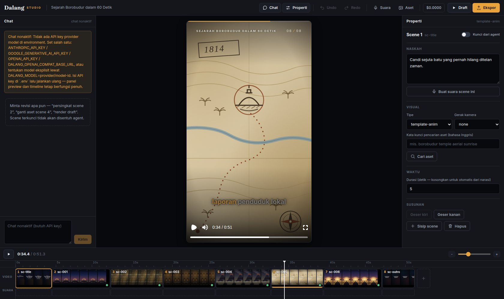
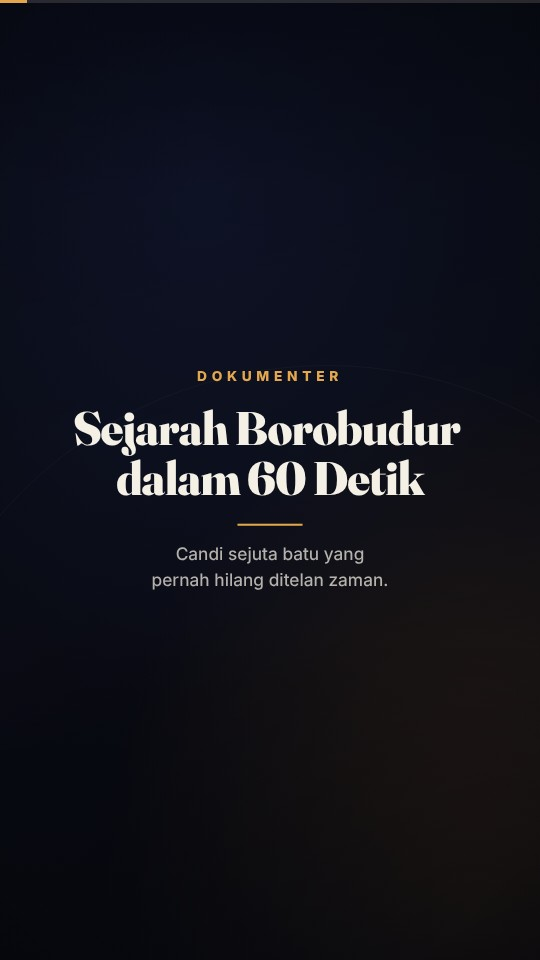
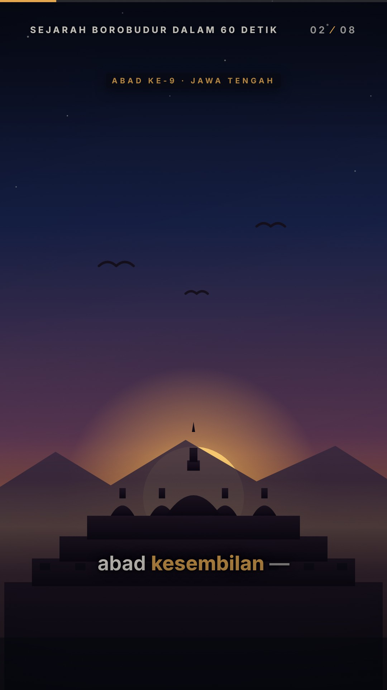
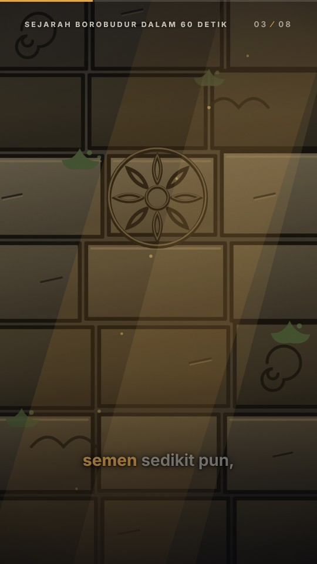
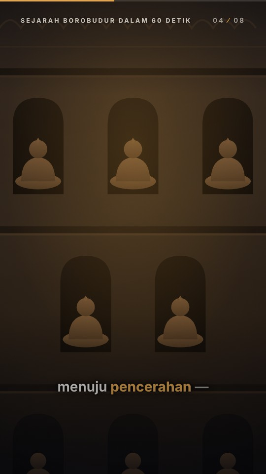
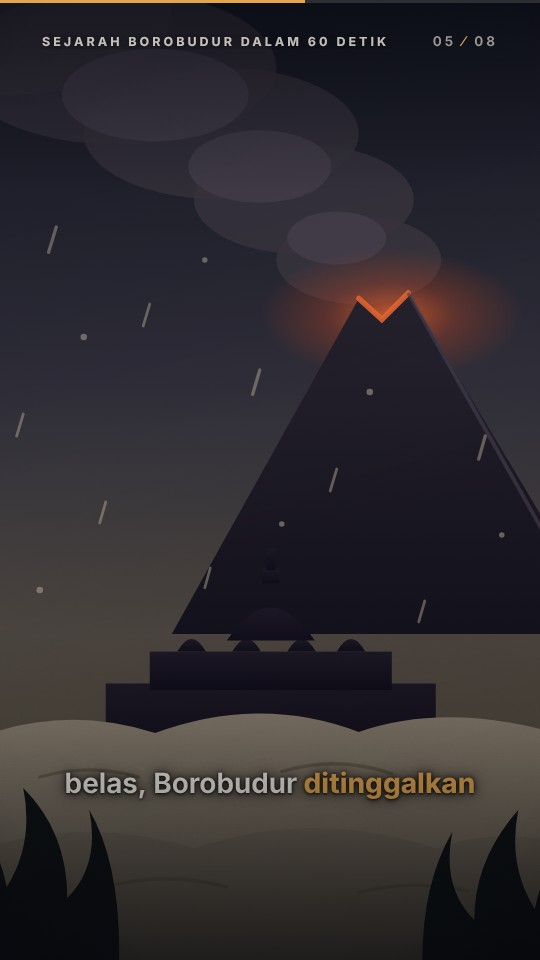
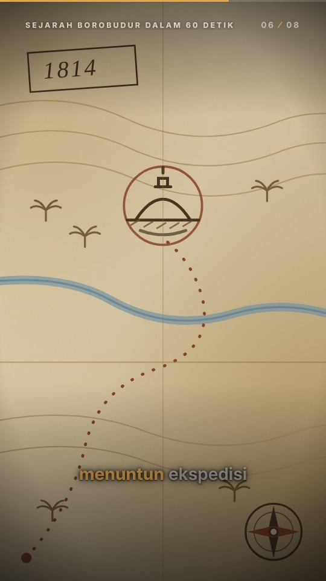

# Dalang AI

**Platform video editor berpilot agent** — AI sebagai pilot yang menulis naskah,
memilih visual, menyusun timeline, dan me-render; manusia sebagai co-pilot yang
bisa mengarahkan dan mengambil alih elemen mana pun. "Cursor untuk video",
bukan "Midjourney untuk video".

Dokumen produk lengkap: [docs/PRD.md](docs/PRD.md) ·
Keputusan teknis: [docs/decisions/](docs/decisions/)

## Status: Fase 4 (Mode Tutorial) selesai + Pengayaan editor 2 (ADR-0013) + Ekspor kaya & kaidah sutradara (ADR-0014) + Kehandalan gerak (ADR-0015) + Tipografi (ADR-0016) + Agent berkerajinan (ADR-0017) + Pustaka media (ADR-0018) · Fase 3, 2, 1, 0 selesai



*Dalang Studio (`pnpm dalang studio proyekku/`), tata letak kelas editor:
chat agent (kiri, bisa dilipat), preview instan `@remotion/player` (tengah),
panel properti (kanan), dan timeline NLE di dasar — ruler ber-scrub, klip
filmstrip selebar durasinya, track suara, playhead tersinkron dua arah
dengan Player. Semua panel membaca-menulis scene-plan yang sama, sinkron
via SSE.*

> *Gate Fase 0: apakah hasil render terlihat premium?*

| | | |
|---|---|---|
|  |  |  |
|  |  |  |

Frame di atas dirender langsung dari
[`examples/borobudur-60s/plan.json`](examples/borobudur-60s/plan.json)
(hardcoded, tanpa AI — sesuai definisi Fase 0) memakai preset `documentary-01`.

Yang sudah berjalan:

- **Skema scene-plan v0** (zod, strict, versioned) + **patch operations** dengan
  lock enforcement di level kode, batch atomik, dan inverse ops → undo/redo.
  Artefak [JSON Schema](packages/core/schema/scene-plan.v1.schema.json) untuk
  autocomplete editor, selalu sinkron via unit test.
- **Preset `documentary-01`**: tipografi editorial (Fraunces + Inter,
  di-vendor, render offline), caption karaoke tersinkron (timestamps TTS asli
  ATAU estimasi deterministik), Ken Burns / pan, film grain + vignette +
  gradien keterbacaan, chrome global (progress, running head, penghitung
  scene), crossfade antar scene, title & outro card.
- **Renderer lokal** (RenderTarget `local`): **bundle cache persisten**
  (content-fingerprint; start render ~2 dtk saat hit), overlay aset per plan,
  deteksi Chromium terpasang, profil `draft`/`final`, render video & stills.
- **CLI `dalang`**: `validate`, `still`, `render` — opsi tervalidasi, pesan
  error ramah, `--no-cache`, `--concurrency`.
- **Pipeline deterministik (Fase 1)** — `dalang generate`:
  - **TTS per scene** dengan chain fallback (ElevenLabs → Edge TTS → silence
    offline) dan **word-timestamps native** → caption karaoke sinkron; setiap
    degradasi ditandai `fallback` per scene.
  - **Asset resolve** Pexels/Pixabay (foto+video, orientasi ikut aspect
    ratio, seleksi rendisi deterministik) + **metadata lisensi per aset**
    (audit-ready, R-10).
  - **Cache content-hash + resumable** di ledger SQLite (`.dalang/` di samping
    plan): ganti narasi satu scene → hanya scene itu yang disintesis ulang;
    run ulang = no-op; crash → lanjut, bukan mengulang; cache hit bahkan
    memulihkan renderState yang hilang.
  - Scene `pinned`/`locked` tidak pernah disentuh otomatisasi (ditegakkan di
    core).
- **Agent runtime (Fase 2)** — `dalang chat`:
  - Chat dengan agent "dalang" di atas proyek: brief → riset (tier-volume) →
    `writeScenePlan` → TTS/aset → preview; revisi lewat **patch kecil**
    (`applyPatch` memakai kontrak §5.2 apa adanya — lock ditegakkan core).
  - **Model-agnostic & netral vendor** (Vercel AI SDK v7 + registry
    models.dev): default TIDAK memihak provider — mengikuti API key yang
    terpasang di environment-mu (anthropic / google / openai /
    openai-compatible); model dipilih dari data registry, override
    `--model` / `DALANG_MODEL`. Lebih dari satu key = wajib memilih
    eksplisit (dua tingkat, §6.4).
  - **Guardrails di kode** (§6.3): step cap 15, budget per giliran & per
    proyek, approval gate utk renderFinal/TTS massal (non-interaktif =
    tolak default), semua tool call ter-log (`dalang log`).
  - **Sadar editan manual**: file plan yang diubah di luar chat terdeteksi
    per giliran dan disuntikkan ke konteks agent (PRD §5.2); riwayat +
    undo/redo (`/undo`, `/redo`) bertahan lintas restart.
- **UI hybrid (Fase 3)** — `dalang studio`:
  - **Perangkat sinematik lewat kontrak data (ADR-0011)**: filter per scene
    (6 preset + cerah/kontras/saturasi/opacity), transisi per scene
    (larut/geser/sapu/potong), hingga 3 teks overlay
    (judul/subjudul/label/kutipan, posisi & timing), switcher rasio
    16:9/9:16/1:1 — semuanya patch ops §5.2, jadi agent dan manusia sama
    kuatnya, dan semuanya bisa di-undo.
  - **Chat multimodal dengan autodeteksi**: lampirkan gambar sebagai
    referensi visual; tombolnya aktif hanya bila registry models.dev
    menyatakan model orkestrator mendukung input gambar.
  - **Satu state, tata letak editor** (PRD §8): chat agent · preview
    `@remotion/player` (komponen video yang sama dengan renderer — patch →
    preview < 1 dtk, tanpa render) · panel properti BERTAB
    (Scene/Visual/Teks/Transisi: segmented, chip filter, slider, kartu
    transisi) · **timeline NLE**:
    ruler waktu yang bisa di-scrub, playhead tersinkron dua arah, klip
    filmstrip selebar durasi (drag untuk susun ulang, **trim handle** di
    tepi kanan mengubah durasi — snap 0.1s, bisa di-undo), track suara per
    scene, transport play/jeda + zoom, pintasan Spasi. **Dialog Ekspor
    beropsi** (Draft 540p / Final 1080p), **kartu pembuka brief** di proyek
    kosong + dialog Brief baru (twin select, segmen sama lebar, glyph rasio
    proporsional) + chip aksi cepat di chat, komposer kartu utuh dengan
    kirim ikon pesawat. Sistem kontrol buatan sendiri tanpa dependensi UI
    (switch/kartu radio/tooltip CSS, ring fokus konsisten, set ikon presisi
    grid-24 terverifikasi lembar ikon).
    Mobile-friendly (laci penuh layar, Ekspor selalu terlihat, target
    sentuh besar); ikon SVG tanpa emoji.
  - **Edit manual = patch user**: narasi/durasi/visual/reorder/hapus/tambah,
    tombol kunci per scene — masuk patch log yang sama, bisa di-undo, dan
    terlihat agent di giliran berikutnya (§5.2 dua arah; edit file di luar
    UI pun terdeteksi).
  - **Grid kandidat aset** → pilih manual = aset terpasang & **ter-pin**;
    status pipeline per scene (belum/proses/ok/fallback/error) live di
    timeline; **estimasi biaya sebelum aksi mahal** + dialog konfirmasi
    (pola 428) dan approval gate agent yang dijembatani ke dialog UI.
  - Server single-writer (Hono + SSE) memakai ulang sesi/guardrails/stage
    yang sama dengan CLI; media tersaji traversal-safe + Range 206
    (ADR-0010). Tanpa API key, chat nonaktif dengan alasan jelas — panel
    manual tetap berfungsi penuh.
- **Pengayaan editor 2 (ADR-0013)** — teks & rupa yang lebih kaya, studio
  yang terasa hidup:
  - **Teks bergaya**: perataan kiri/tengah/kanan, ukuran S/M/L, penekanan
    chip berlatar atau garis bawah aksen — semantik sama di kedua preset;
    teks seposisi mengalir rapi dalam satu kolom.
  - **Tempo transisi per scene** (`durationFrames` 6–24) lewat slider Durasi;
    **4 varian seni prosedural** (duotone/sinar/kontur/grid) untuk scene
    tanpa aset; **4 font variable ter-bundle** (Fraunces, Inter, Space
    Grotesk, Lora — OFL, offline) dipilih dari dialog **Gaya proyek**
    bersama token warna aksen/dasar (satu op `setMeta`, undoable).
  - **Unggah gambar sendiri** dari panel Visual: tersimpan ke
    `assets/unggah-*`, terpasang ter-pin + beralih tipe `image` dalam satu
    batch patch yang bisa di-undo.
  - **Terasa hidup tanpa refresh**: setiap patch autosave server-side dan
    disiarkan SSE ke semua tab; chip "Tersimpan / Menyambung" di topbar,
    putus koneksi terdeteksi realtime, reconnect otomatis menyegarkan state
    — terverifikasi Playwright tanpa reload halaman.
  - **Agent lebih handal**: riwayat sesi panjang dipangkas aman (marker +
    drop kepala `tool` yatim yang ditolak provider), system prompt mengenal
    seluruh perangkat baru.
- **Ekspor kaya + hasil rasa editor (ADR-0014)**:
  - **Format & kualitas dipilih di dialog Ekspor**: MP4 (H.264+AAC) /
    WebM (VP9+Opus) / MOV (ProRes+PCM master), resolusi 540/720/1080p, mutu
    Cepat/Seimbang/Terbaik (CRF+preset per codec, dijelaskan jujur per
    kombinasi) — juga dari CLI (`--video-format --resolution --quality`).
    Ketiga format terverifikasi E2E dari byte kontainernya.
  - **Musik latar akhirnya hidup**: `audio.music` §5.1 dieksekusi penuh —
    dua bed CC0 ter-bundle (disintesis deterministik, loop mulus), fade
    in/out, **ducking otomatis di bawah narasi**; dipilih dari dialog Gaya
    (satu op `setAudio`, undoable), sama untuk preview dan render.
  - **Gerak lebih hidup**: transisi dan Ken Burns memakai easing kubik
    (settle seperti dolly), tempo transisi demo bervariasi per momen.
  - **Kritik sutradara otomatis** (`critiquePlan`): heuristik anti-generic
    (hook 3 detik, musik hening, gerak/transisi monoton, narasi terlalu
    padat, hierarki teks, outro) tampil di `dalang validate` DAN disuntikkan
    ke konteks agent + KAIDAH SUTRADARA di system prompt — agent memperbaiki
    rencananya sendiri sebelum diminta.
- **Kehandalan gerak + sisa perkakas editor (ADR-0015)**:
  - **Latar prosedural benar-benar hidup**: sinar berputar, kontur bernapas,
    grid melayang, cincin struktur tergambar lalu berputar pelan — semua
    fungsi frame deterministik (terbukti dari selisih piksel antar frame,
    bukan klaim).
  - **Satu bahasa easing** (`anim.ts`): kurva dinamai per rasa
    (settle/glide/dolly) + util keyframe `kf()` dan `enterExit()`, dipakai
    kedua preset — tak ada lagi masuk/keluar teks yang linear.
  - **Gerak & bingkai**: tambahan pan atas/bawah + melayang, **cermin
    horizontal**, **titik fokus crop**, **kecepatan video** (0.25–4x), dan
    **blur** 0–20px sebagai filter; chip teks jadi **kaca** (backdrop blur)
    dengan glow lembut, kicker menyala di footage gelap.
  - **Belah scene di playhead** (bagian kedua mewarisi aset resolved,
    undoable), **panah kiri/kanan menggeser playhead** (Shift = 1 detik),
    **drop file gambar ke klip** langsung terpasang ter-pin.
  - **H.265** di dialog Ekspor + **chip preset** Sosial / Web ringan /
    Master arsip.
- **Tipografi lengkap (ADR-0016)** — teks sebagai elemen utama, bukan hiasan:
  - **Caption karaoke punya 4 gaya**: Klasik, **Tegas** (KAPITAL tebal
    ber-garis-luar, kata aktif membesar — untuk klip pendek berenergi),
    **Chip** (kata aktif berkotak aksen), Halus (tanpa karaoke); plus
    ukuran S/M/L dan posisi bawah/tengah. *(Field `caption.style` ada di
    skema sejak v0 tapi tidak pernah dieksekusi — sekarang hidup.)*
  - **Tipografi kinetik**: animasi masuk teks per KATA (`pop`, `rise`,
    berjenjang) atau per karakter (`typewriter`).
  - **Rupa teks penuh**: warna bebas, **garis luar 0–8px** (keterbacaan di
    footage ramai), KAPITAL, kerapatan huruf, dan penekanan **stabilo** —
    sapuan stabilo yang menyapu saat teks masuk.
  - **6 font ter-bundle** (OFL, offline): Fraunces, Inter, Space Grotesk,
    Lora, **Plus Jakarta Sans** (karya Tokotype — foundry Indonesia), dan
    **Anton** (display berat untuk judul menghentak).
- **Agent berkerajinan (ADR-0017)** — jawaban atas "agentnya masih terlalu
  umum": bentuk yang berbeda per jenis konten, diperiksa mesin.
  - **6 resep format konten** (bebas, edukasi, tutorial, klip, berita,
    cerita) — masing-masing punya kerangka beat, rentang scene/durasi, dan
    aturan struktur. Satu sumber dipakai DUA arah: menyusun system prompt
    agent *dan* memeriksa hasilnya, jadi nasihat dan pemeriksa tidak pernah
    berbeda pendapat.
  - **`critiqueDraft`** — agent memeriksa kerjanya sendiri terhadap resep itu
    sebelum lanjut ke suara/aset/render. Loopnya berubah dari *tulis lalu
    harap* menjadi *tulis, periksa, perbaiki*, dengan pemeriksa yang bukan
    model.
  - **Mengklip rekaman panjang**: `ingestVideo` membaca durasi/dimensi
    rekaman lewat ffprobe, `visual.trimStartSec` memilih titik masuk, dan
    satu rekaman bisa dipakai banyak scene dengan titik berbeda —
    podcast 40 menit jadi beberapa klip vertikal. `findCutPoints` mencari
    **jeda hening** (ffmpeg, -35 dB / 0,35 dtk) supaya potongan jatuh di
    jeda alami, bukan di tengah napas.
    *Batas jujur: agent tidak bisa mendengar ISI rekaman — hening menunjukkan
    di mana memotong, bukan apa yang layak dipotong. Untuk memilih momen ia
    diperintahkan meminta transkrip, bukan menebak.*
  - **Detektor "generic"** — klise, kata pagar, kata pengisi, kalimat di atas
    25 kata, pengulangan gagasan antar scene, dan **irama datar**
    (keseragaman panjang kalimat: penanda terkuat naskah mesin). Semuanya
    leksikal/statistik, tanpa model, tanpa biaya token.
  - **Durasi diestimasi dari SUKU KATA**, bukan jumlah kata — Bahasa
    Indonesia berafiks berat, jadi "dan" dan "mempertanggungjawabkan" tidak
    boleh dihitung sama, dan angka ("2024" = 8 suku kata) tidak boleh
    diabaikan.
  - **Catatan sutradara terlihat manusia**: tombol berlencana di header
    membuka daftar temuan berperingkat dengan kerangka format yang sedang
    dipakai — dihitung di browser, jadi selalu sinkron dengan editan terakhir.
- **Pustaka media (ADR-0018)** — GIF, stiker, ikon, dan efek suara, dengan
  hak pakai yang dinyatakan apa adanya:
  - **GIF & stiker** lewat **GIPHY** dan **Tenor** (API resmi keduanya).
    Stiker mempertahankan latar tembus pandang (WebP/GIF, bukan MP4 yang
    tak berkanal alfa); peringkat konten aman-semua-umur secara bawaan.
  - **Ikon** lewat **Iconify** — API publik tanpa kunci, 237 set. Lisensi
    melekat per set, jadi penyaringnya memakai **daftar putih SPDX**: yang
    belum dikenal dianggap tidak aman sampai ditinjau, apa pun ber-`-NC-`
    ditolak lebih dulu, dan set yang mewajibkan kredit ditandai.
  - **Efek suara** lewat **Openverse** (bawaan `cc0`/`pdm`) — dipilih di atas
    Freesound karena syarat pemakaian API Freesound sendiri gratis hanya untuk
    keperluan non-komersial, terlepas dari lisensi suaranya.
  - **Tempelan yang mengikuti rasio**: `scene.graphics[]` (maks 4) memakai
    jangkar + geseran fraksional, bukan koordinat piksel — satu nilai tetap
    benar di 16:9, 9:16, dan 1:1. Ikon diwarnai lewat CSS mask, bukan
    `currentColor` (SVG yang dimuat sebagai `` tidak mewarisi warna
    induknya). `audio.sfx[]` (maks 24) menambatkan bunyi ke **scene**, bukan
    garis waktu mutlak: scene digeser, bunyinya ikut.
  - **Hak pakai dijaga tiga lapis**: lisensi ditulis apa adanya dengan penanda
    `PERIKSA HAK PAKAI`, kritik sutradara `aset-hak-pakai` menegur bila aset
    bertanda itu terpakai (memeriksa lisensinya, bukan nama providernya), dan
    urutan rantai stock menaruh Pexels/Pixabay SELALU di depan GIPHY/Tenor —
    dikunci test.
  - **Panel manual di Studio**, bukan hanya lewat chat: tab **Grafis** (cari
    ikon/stiker, pad jangkar 3x3, ukuran/opasitas/rotasi/gerak/warna, daftar
    terpasang yang bisa dilipat) dan bagian **Efek suara** di tab Scene.
    Alasannya bukan selera — ikon dan efek suara tidak butuh kunci API sama
    sekali, jadi menguncinya di balik chat akan mematikan fitur gratis pada
    pemasangan yang paling umum. Semuanya patch USER: bisa di-undo dan
    terlihat agent di giliran berikutnya.
  - **`dalang providers:check`** memverifikasi setiap provider terhadap
    layanan aslinya (bukan mock): kunci terpasang, endpoint hidup, dan field
    yang benar-benar dipakai kode ada di respons. "Belum diatur" dibedakan
    dari "tak terjangkau".
  - *Tidak diintegrasikan, dengan alasan tertulis di ADR-0018: **MyInstants,
    yarn.co, icon-icons** — ketiganya tanpa API resmi, dan syarat pakainya
    melarang persis apa yang dibutuhkan integrasi otomatis (akses via bot,
    scraping, atau penggunaan komersial). Iconify dan Openverse dipakai
    sebagai penggantinya.*
- **Kualitas terjaga otomatis**: 467 unit test (kontrak lock/pin/undo, timing
  caption, snapshot timeline demo, cache/resume/fallback pipeline, protokol
  provider via fixture, keamanan staging path), Biome lint+format, dan CI
  GitHub Actions dengan **render smoke-test** nyata (prekursor R-8).
- Hasil ukur di container CPU-only: draft 540p **85 dtk**, final 1080p
  **4m38s** untuk video 51 dtk (8 scene) — lihat ADR-0004. E2E pipeline:
  MP4 hasil `generate --render` terverifikasi ber-stream audio AAC.

## Menjalankan

```bash
pnpm install

pnpm test                 # 467 unit test (7 paket) — tanpa browser & jaringan
pnpm typecheck            # semua paket
pnpm lint                 # Biome

pnpm dalang studio proyekku/          # UI hybrid 3 panel di browser — Fase 3
pnpm dalang chat proyekku/            # chat agent di terminal — Fase 2
pnpm dalang validate examples/borobudur-60s/plan.json
pnpm dalang generate examples/borobudur-60s/plan.json            # pipeline: TTS + aset
pnpm dalang generate examples/borobudur-60s/plan.json --render draft
pnpm dalang render   examples/borobudur-60s/plan.json --profile draft
pnpm dalang render   examples/borobudur-60s/plan.json --video-format webm --resolution 720 --quality terbaik
pnpm dalang still    examples/borobudur-60s/plan.json -t 8 -t 29 -t 44 -o out
pnpm dalang log      proyekku/        # garis waktu pipeline + agent + biaya
pnpm dalang providers:check           # cek kunci & endpoint provider ke layanan asli

pnpm studio:remotion      # Remotion Studio (alat pengembang preset/template)
```

`dalang studio` menyajikan app yang sudah ter-build
(`pnpm --filter @dalang/studio build`, otomatis tersedia setelah clone +
build sekali). Untuk pengembangan UI dengan HMR: jalankan `dalang studio` di
satu terminal dan `pnpm --filter @dalang/studio dev` di terminal lain.

API key provider (opsional — semuanya punya jalur offline/fallback): salin
`.env.example` → `.env`. Tanpa key, TTS memakai provider `silence`
(placeholder, ditandai jelas) dan scene stock yang belum resolved gagal dengan
pesan env var yang dibutuhkan.

Alur kontribusi & konvensi: [CONTRIBUTING.md](CONTRIBUTING.md).

Butuh Node ≥ 20 dan pnpm. Renderer otomatis memakai Chromium/Chrome yang sudah
terpasang (Playwright/sistem); kalau tidak ada, Remotion mengunduh headless
shell sekali.

## Struktur repo (ADR-0001)

```
packages/
  core/       skema scene-plan + patch ops + patch log + resolusi durasi (zod saja)
  pipeline/   stages deterministik + ledger SQLite + content-hash + ports provider
  providers/  adapter TTS (ElevenLabs/Edge/silence), stock (Pexels/Pixabay/GIPHY/Tenor),
              ikon (Iconify) & efek suara (Openverse) — semua di balik port pipeline
  agent/      runtime agent: AI SDK v7, registry models.dev, tools §6.2, guardrails
  studio/     UI hybrid 3 panel (Vite+React+Player) + server Hono/SSE single-writer
  templates/  preset Remotion terkurasi (documentary-01, tutorial-01) + 6 font vendored
  renderer/   RenderTarget lokal: staging, bundling, profil draft|final
  cli/        dalang studio | chat | validate | generate | still | render | log |
              providers:check
examples/
  borobudur-60s/   plan.json demo + aset ilustrasi lokal (lisensi tercatat)
docs/
  PRD.md           dokumen produk (sumber kebenaran)
  decisions/       ADR (R-1 patch-log vs CRDT, R-7 monorepo, deviasi skema,
                   render stack, pengerasan fondasi)
  media/           frame hasil render untuk review gate
```

Kontrak-kontrak penting yang SUDAH ditegakkan kode (bukan prompt):

- Scene `locked` menolak `updateScene`/`removeScene`/`replaceAsset`/reorder
  dari agent; `lockScene` hanya untuk user. (PRD §5.1, §6.3, UC-4)
- `visual.pinned`: aset pilihan eksplisit tidak boleh ditimpa auto-resolve
  pipeline. (PRD §8.2)
- `renderState` = data turunan; di luar patch/undo, ditulis pipeline lewat
  helper khusus. (PRD §5.1)
- Patch selalu atomik + membawa inverse → undo/redo & diff ringkas gratis.
  (PRD §5.2)

## Roadmap fase (PRD §11)

- [x] **Fase 0 — Fondasi visual**: skema v0, preset `documentary-01`, render
      lokal dari JSON hardcoded, gate kualitas.
- [x] **Fase 1 — Pipeline deterministik**: TTS + word timestamps native
      (ADR-0007), asset fetch Pexels/Pixabay + lisensi (ADR-0008), caching
      content-hash + resumability per scene di SQLite (ADR-0006),
      `dalang generate`. *Catatan: skor kualitas TTS ID (R-2) menunggu API
      key — kerangka evalnya siap; R-5/R-6 butuh perangkat keras nyata.*
- [x] **Fase 2 — Agent**: Vercel AI SDK v7 + registry models.dev (ADR-0009),
      tools §6.2 lengkap, guardrails §6.3 (step/budget/approval/log),
      `dalang chat` dengan kesadaran editan manual & undo/redo. *Catatan:
      perilaku live dengan model nyata butuh API key pemilik repo — loop
      teruji penuh dengan mock terskrip.*
- [x] **Fase 3 — UI hybrid**: `dalang studio` — 3 panel, @remotion/player,
      edit manual + lock + reorder, diff & undo, status pipeline per scene,
      grid aset ter-pin, approval & estimasi biaya di UI (ADR-0010).
      *Catatan: giliran agent live di UI & grid aset dengan provider nyata
      menunggu API key pemilik repo — jalur HTTP-nya teruji penuh dengan
      mock/fake.*
- [x] **Fase 4 — Mode tutorial + preset tutorial-01** (ADR-0012): konten
      how-to berbasis screenshot — preset kedua bergaya dokumentasi produk
      (kartu screenshot ber-titlebar di kertas terang, chip langkah, caption
      terang), keempat anotasi §9 sebagai animasi murni (zoom dengan klem
      pan, sorot + peredup, panah pemilih sisi lapang, blur redaksi), ingest
      aset lokal di stage assets, tool agent `locateUiElement` dengan
      VERIFIKASI grounding (crop → konfirmasi), tab Anotasi di Inspector,
      demo `examples/tutorial-studio` dari screenshot nyata Dalang Studio.
      *Catatan: grounding live butuh API key model vision; screen recording
      (deteksi klik, auto-zoom kursor) belum dibangun.*
- [ ] **Fase 5 — RenderTarget cloud**, publish integrations.

Tugas riset R-2…R-6 & R-8…R-11 (PRD §14) belum diputuskan — masing-masing akan
menghasilkan ADR sebelum implementasinya, mengikuti pola R-1/R-7 yang sudah ada
di `docs/decisions/`.
