<p align="center">
  <picture>
    <source media="(prefers-color-scheme: dark)" srcset="docs/media/dalang-logo-dark.svg">
    
  </picture>
</p>

<p align="center">
  <strong>Editor video berpilot agent.</strong><br>
  AI menulis naskah, memilih visual, menyusun timeline, dan merender.<br>
  Kamu mengarahkan, dan bisa mengambil alih elemen mana pun.
</p>

<p align="center">
  <a href="https://github.com/TegarTheGreat/DalangAI/actions/workflows/ci.yml"></a>
  
  
  
  
  
</p>

<p align="center">
  <a href="#mulai">Mulai</a> ·
  <a href="#model-dan-provider">Model</a> ·
  <a href="#pakai-dari-agent-lain">Agent lain</a> ·
  <a href="#perintah">Perintah</a> ·
  <a href="#konfigurasi">Konfigurasi</a> ·
  <a href="#pertanyaan-umum">Tanya jawab</a><br>
  <a href="docs/PRD.md">Dokumen produk</a> ·
  <a href="docs/decisions/">Keputusan teknis</a> ·
  <a href="docs/roadmap.md">Arah selanjutnya</a> ·
  <a href="CONTRIBUTING.md">Kontribusi</a>
</p>

---

"Cursor untuk video", bukan "Midjourney untuk video". Yang dihasilkan Dalang
bukan berkas video yang tidak bisa disunting lagi, melainkan **rencana adegan**
— satu berkas `plan.json` yang bisa dibaca manusia, diubah lewat operasi patch
tervalidasi, diurungkan, dan dirender ulang kapan saja. Agent dan manusia
menyunting objek yang sama dengan aturan yang sama.

Namanya diambil dari **dalang**, pemain wayang kulit yang menggerakkan seluruh
lakon dari balik layar. Marknya adalah **gunungan**, penanda yang ditancapkan
dalang untuk membuka lakon dan menandai pergantian adegan.

> [!NOTE]
> **Kunci API model tidak wajib.** Dari empat jalur pemakaian, tiga tidak
> membutuhkannya: menyunting sendiri di Studio, memakai agent yang sudah kamu
> langgani (Claude Code, Codex, Gemini CLI, Cursor, VS Code, opencode) lewat
> server MCP, atau model lokal (Ollama, LM Studio). Kunci hanya perlu untuk chat
> agent Dalang sendiri dengan provider cloud. Lihat [Mulai](#mulai).

## Sekilas

| Yang membedakan | Artinya |
|---|---|
| **Satu sumber kebenaran** | `plan.json`: skema zod yang ketat dan berversi. Agent dan manusia mengubahnya lewat patch op yang sama; tiap op membawa inversnya, jadi undo, redo, dan diff gratis. |
| **Agent yang memeriksa kerjanya** | Resep per format konten, kritik struktur yang bukan model, tinjauan frame dengan model vision, dan guardrail yang ditegakkan di kode (batas langkah, anggaran, persetujuan biaya). |
| **Netral vendor** | Model, harga, dan kapabilitas dibaca dari registry [models.dev](https://models.dev); 211 dari 226 provider di dalamnya bisa dipanggil langsung, ditambah Ollama lokal. |
| **Bisa dipakai agent lain** | Server MCP plus `dalang agen siapkan` untuk Claude Code, Codex, Gemini CLI, Cursor, VS Code, dan opencode. |
| **Editor sungguhan** | Studio tiga panel: timeline NLE, seret langsung di kanvas, keyframe, lapisan video, beberapa potongan per scene, suntingan berdua. |
| **Hasil yang bisa dibawa keluar** | Render MP4/WebM/MOV/H.265 lokal atau Lambda, subtitle `.srt`/`.vtt`, ekspor OTIO dan FCPXML, unggah ke YouTube, sulih suara banyak bahasa. |
| **Diukur, bukan diklaim** | Gerbang CI yang merender video sungguhan lalu mengukur pikselnya, bunyinya, dan berkas ekspornya dengan pembaca rujukan. |

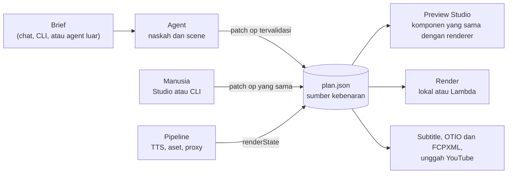
```mermaid
flowchart LR
    brief["Brief<br/>(chat, CLI, atau agent luar)"] --> agent["Agent<br/>naskah dan scene"]
    agent -->|patch op tervalidasi| plan[("plan.json<br/>sumber kebenaran")]
    manusia["Manusia<br/>Studio atau CLI"] -->|patch op yang sama| plan
    pipeline["Pipeline<br/>TTS, aset, proxy"] -->|renderState| plan
    plan --> studio["Preview Studio<br/>komponen yang sama dengan renderer"]
    plan --> render["Render<br/>lokal atau Lambda"]
    plan --> keluar["Subtitle, OTIO dan FCPXML,<br/>unggah YouTube"]
```

## Daftar isi

- [Tampilan](#tampilan)
- [Hasil render](#hasil-render)
- [Dibuat dengan Dalang sendiri](#dibuat-dengan-dalang-sendiri)
- [Mulai](#mulai)
- [Cara kerjanya](#cara-kerjanya)
- [Kemampuan](#kemampuan)
- [Model dan provider](#model-dan-provider)
- [Pakai dari agent lain](#pakai-dari-agent-lain)
- [Perintah](#perintah)
- [Konfigurasi](#konfigurasi)
- [Kualitas dan verifikasi](#kualitas-dan-verifikasi)
- [Pertanyaan umum](#pertanyaan-umum)
- [Batas yang dinyatakan](#batas-yang-dinyatakan)
- [Struktur repo](#struktur-repo)
- [Status dan keputusan](#status-dan-keputusan)

## Tampilan

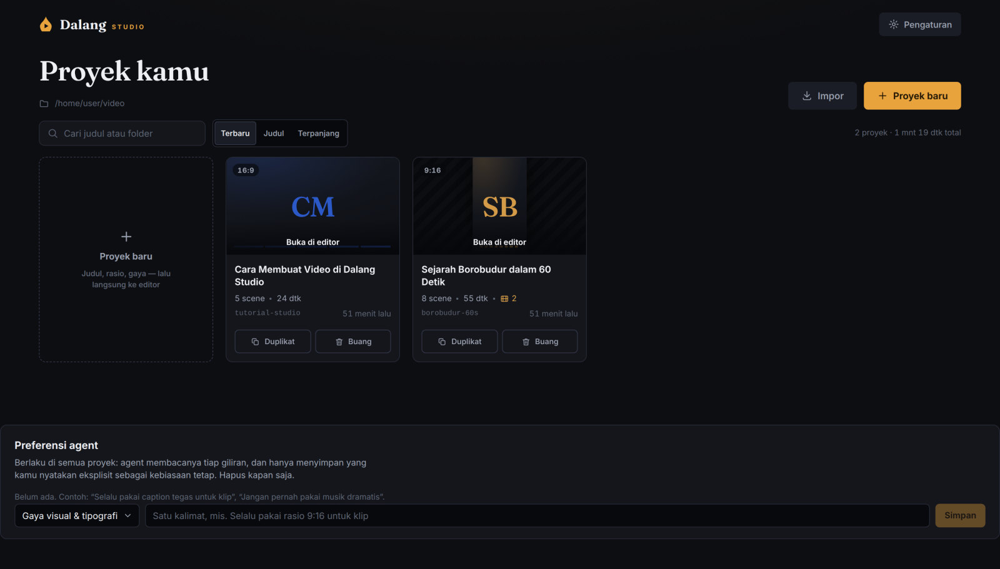

Lobi (`dalang studio`). Tiap proyek adalah satu folder biasa berisi
`plan.json`. Kartunya memakai warna aksen dan rasio proyeknya sendiri; yang
sudah pernah diekspor memutar ekspor terakhirnya saat disorot. Durasi yang
tertulis sama persis dengan berkas hasil render.

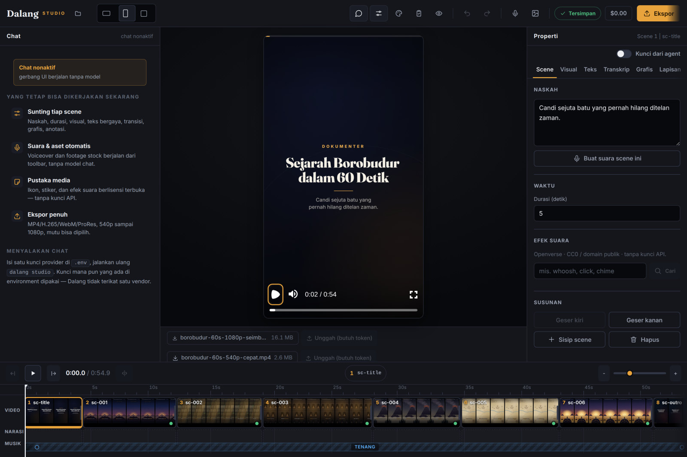

Editor (`dalang studio proyekku/`). Chat agent yang bisa dilipat, preview
instan `@remotion/player` yang memakai komponen video yang sama dengan
renderer, panel properti bertab, dan timeline NLE dengan ruler ber-scrub,
klip filmstrip selebar durasinya, dan playhead tersinkron dua arah. Semua
panel membaca dan menulis scene-plan yang sama, sinkron lewat SSE.

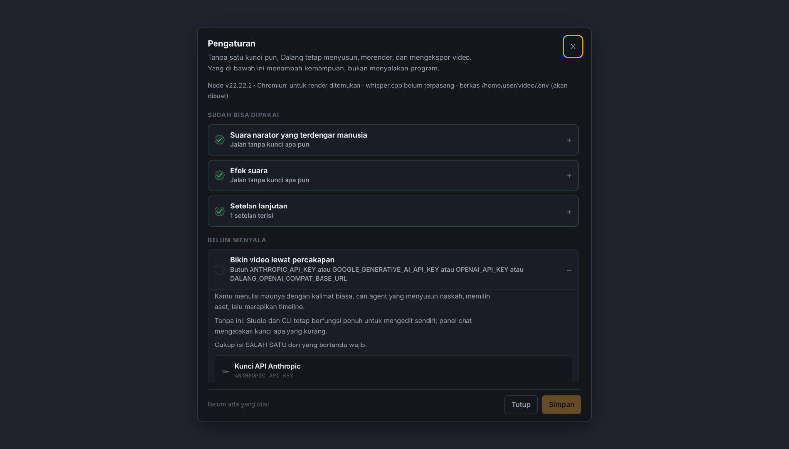

Panel Pengaturan. Kemampuan disebut dengan apa yang bisa dilakukan, bukan nama
teknologinya; tiap kemampuan menyatakan apa yang tetap berjalan tanpanya, dan
tiap kunci bisa diuji ke layanannya sebelum disimpan.

## Hasil render

Frame di bawah dirender langsung dari
[`examples/borobudur-60s/plan.json`](examples/borobudur-60s/plan.json) memakai
preset `documentary-01`, tanpa AI — sesuai definisi Fase 0, yang gerbangnya
adalah satu pertanyaan: apakah hasilnya terlihat premium?

|  | 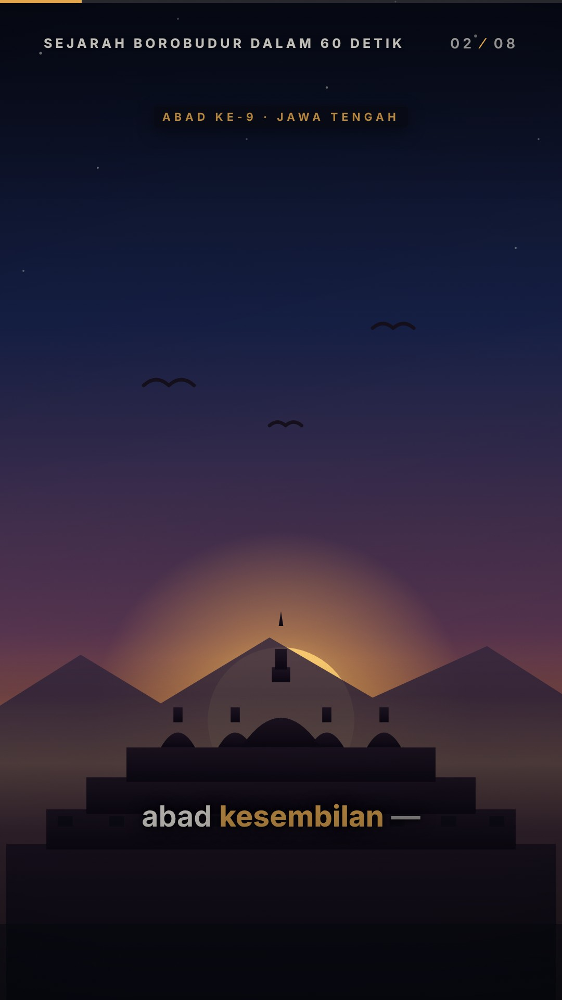 | 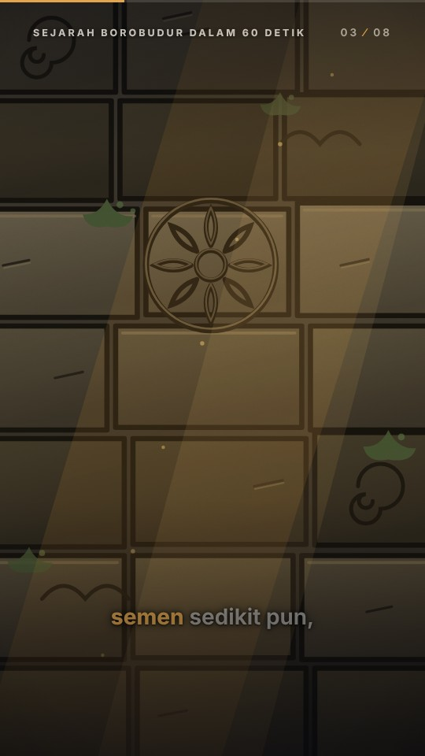 |
|:--:|:--:|:--:|
| Kartu judul | Matahari terbit | Batu |
| 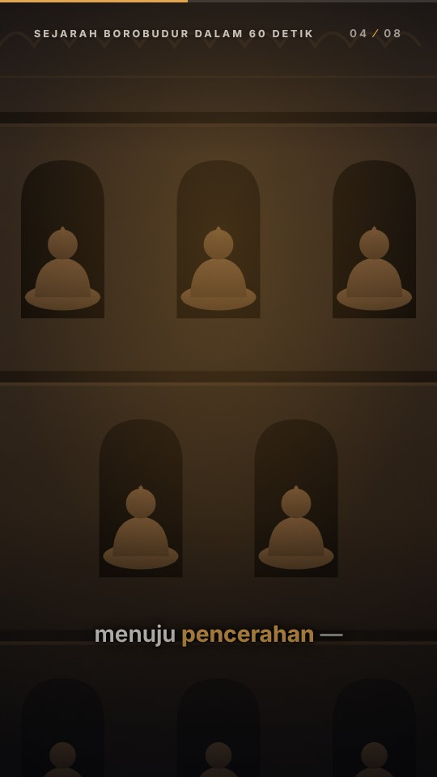 | 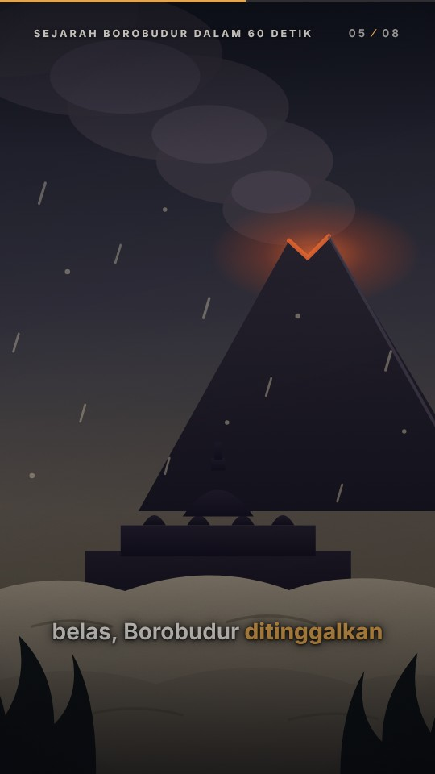 | 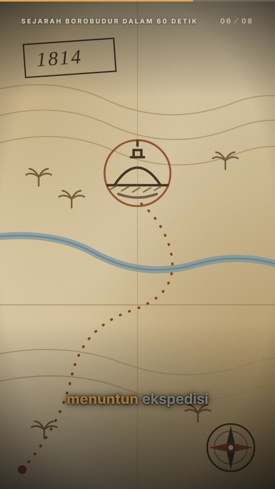 |
| Relief | Abu vulkanik | Peta |

## Dibuat dengan Dalang sendiri

Video promosi Dalang berdurasi 2 menit dibuat dengan Dalang: satu video 16:9,
1080p, 120 detik, 21 scene, preset `klip-01`, dirakit dari **satu `plan.json`**.
Isinya teks kinetik dengan bunyi ketik, tangkapan layar Studio yang sungguhan
(diambil lewat CDP, bukan mockup), kartu kode dan terminal yang dibuat dari data
nyata (potongan plan video itu sendiri, keluaran `dalang validate`, ringkasan
langkah CI), cuplikan *Big Buck Bunny* dan *Sintel* (© Blender Foundation,
CC BY 3.0), serta musik 100 BPM dan semua bunyi yang disintesis.

| 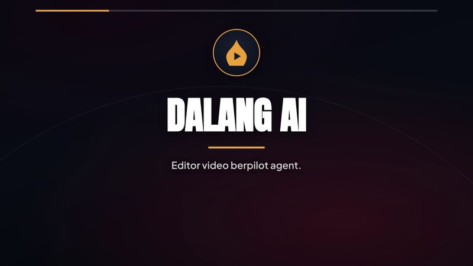 | 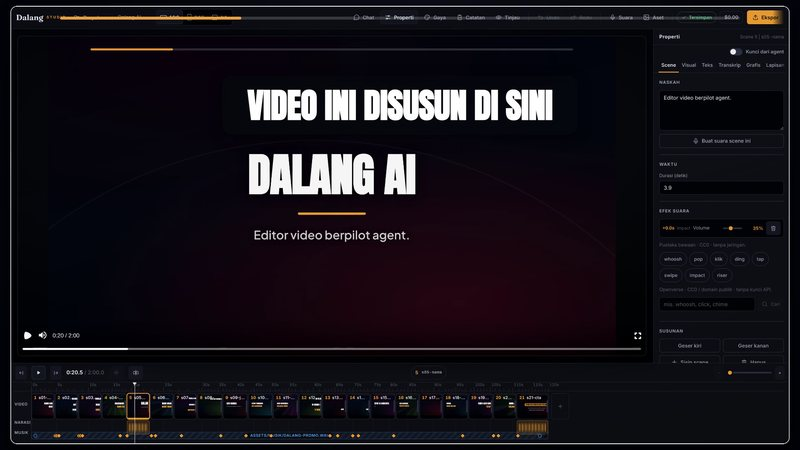 | 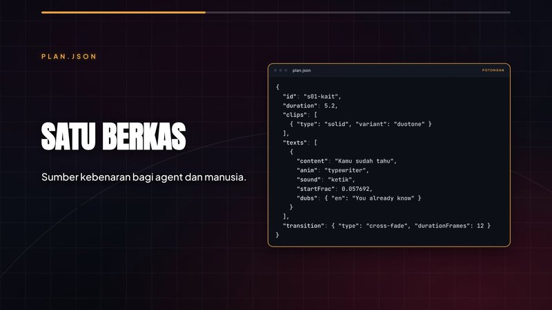 |
|:--:|:--:|:--:|
| Kartu merek | Studio sungguhan, bukan mockup | Potongan `plan.json` video ini sendiri |
| 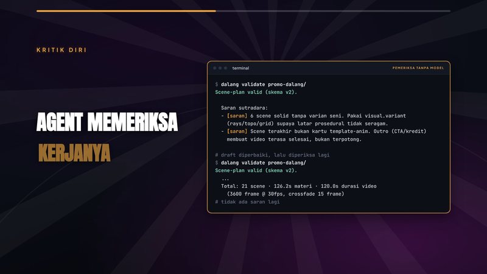 | 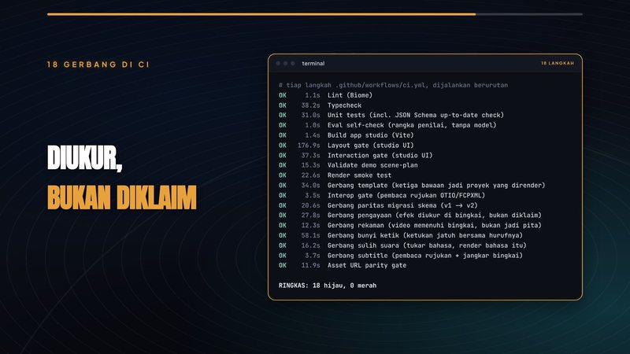 | 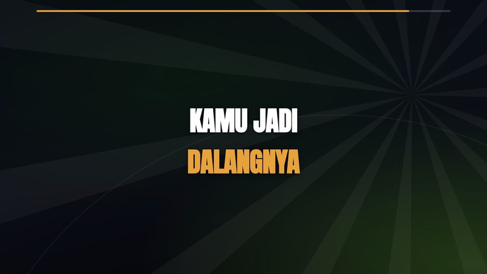 |
| Keluaran `dalang validate` | Ringkasan langkah CI | Tipografi kinetik dengan bunyi ketik |

Terukur di berkas akhirnya: 1920x1080 30 fps, -16,1 LUFS (sasaran -16), puncak
sejati -1,3 dBTP; render 320 detik di container CPU-only. Dua hal yang perlu
dibaca bersamanya: plan-nya ditulis oleh skrip pembangkit, **bukan oleh agent**
(tidak ada kunci model di lingkungan itu), dan videonya **tanpa narator** (tidak
ada penyedia TTS yang terjangkau di sana). Membuatnya menemukan dua cacat nyata
yang lolos dari semua gerbang — panel Chat yang membuat preview menyusut jadi
nol, dan baji gelap pada clock-wipe 16:9 — dan keduanya kini diperbaiki dan
dijaga gerbang. Ceritanya lengkap di [roadmap §3.12](docs/roadmap.md).

## Mulai

Butuh Node ≥ 20 dan pnpm.

```bash
git clone https://github.com/TegarTheGreat/DalangAI.git
cd DalangAI
pnpm install
pnpm dalang setup      # pindai mesin, tanya sisanya, tulis .env (boleh dilewati)
pnpm dalang studio     # lobi: daftar proyek di folder ini
```

Renderer memakai Chromium atau Chrome yang sudah terpasang; kalau tidak ada,
Remotion mengunduh headless shell sekali. Untuk mengembangkan UI dengan HMR,
jalankan `dalang studio` di satu terminal dan
`pnpm --filter @dalang/studio dev` di terminal lain.

### Pilih jalurmu

Pertanyaannya cuma satu: **siapa yang berpikir?** Semua jalur menyunting
`plan.json` yang sama, jadi bisa berpindah jalur di tengah proyek.

| # | Jalur | Siapa yang berpikir | Perlu kunci model? | Mulai dengan |
|---|---|---|---|---|
| 1 | [Tanpa AI](#jalur-1--menyunting-sendiri-tanpa-ai) | Kamu, di Studio | Tidak | `pnpm dalang template mulai esai-video --out proyekku --judul "Judulku"` |
| 2 | [Agent yang kamu langgani](#jalur-2--claude-code-codex-gemini-cli-dan-sejenisnya) | Claude Code, Codex, Gemini CLI, Cursor, VS Code, opencode | Tidak: memakai langganan agent itu | `pnpm dalang agen siapkan ~/video` |
| 3 | [Model lokal](#jalur-3--model-lokal-tanpa-cloud) | Ollama atau LM Studio di mesinmu | Tidak, dan tanpa cloud | `DALANG_MODEL=ollama/<model> pnpm dalang chat proyekku/` |
| 4 | [Provider cloud](#jalur-4--provider-cloud-dengan-kunci-api) | 211 dari 226 provider di models.dev | Ya | `export <PROVIDER>_API_KEY=...` lalu `pnpm dalang chat proyekku/` |

#### Jalur 1 — Menyunting sendiri, tanpa AI

```bash
pnpm dalang template daftar            # klip-tiga-detik, esai-video, tutorial-langkah
pnpm dalang template mulai esai-video --out proyekku --judul "Judulku"
pnpm dalang studio proyekku/           # edit di timeline, seret langsung di kanvas
pnpm dalang render proyekku/ --profile draft   # video jadi (folder out/, atau -o)
```

**Tanpa satu kunci API pun**, Dalang tetap menyusun, merender, dan mengekspor
video: narasi memakai Edge TTS (gratis, butuh internet; tanpa itu jatuh ke trek
hening berdurasi tepat), scene tanpa aset memakai seni prosedural, dan seluruh
editor manual berfungsi penuh. Kunci menambah kemampuan, bukan menyalakan
program.

#### Jalur 2 — Claude Code, Codex, Gemini CLI, dan sejenisnya

Kalau kamu sudah berlangganan salah satu agent coding, **agent-nya yang
berpikir dan langgananmu yang membayar**; Dalang memberinya garis waktu lewat
server MCP dan perintah CLI lewat shell-nya. Satu perintah memasangnya:

```bash
pnpm dalang agen siapkan ~/video --untuk claude-code,codex   # tulis konfigurasi + panduan
pnpm dalang agen uji ~/video                                 # buktikan servernya hidup
cd ~/video && claude                                         # atau codex, gemini, opencode
```

Lalu bicara dengan agent-nya seperti biasa: "buat proyek video promo kopi 30
detik dari template klip-tiga-detik, isi naskahnya, lalu tulis subtitle-nya".
Rinciannya, termasuk klien mana yang sudah diperiksa dengan binernya dan mana
yang belum, ada di [Pakai dari agent lain](#pakai-dari-agent-lain).

#### Jalur 3 — Model lokal, tanpa cloud

```bash
# Pasang Ollama (ollama.com), lalu unduh model yang mendukung tool-calling:
ollama pull <model>
DALANG_MODEL=ollama/<model> pnpm dalang chat proyekku/

# Ollama di mesin lain di jaringanmu:
OLLAMA_HOST=192.168.1.20:11434 DALANG_MODEL=ollama/<model> pnpm dalang chat proyekku/

# LM Studio (nyalakan server lokalnya dulu):
DALANG_MODEL=lmstudio/<model> pnpm dalang chat proyekku/
```

Tanpa kunci, tanpa akun, dan tidak ada yang meninggalkan mesinmu. Satu-satunya
syarat: modelnya harus bisa **tool-calling**, karena agent bekerja dengan
memanggil tool. Dalang tidak menguji model lokal mana pun, dan mutu agent di
sini bergantung seluruhnya pada kemampuan modelnya.

#### Jalur 4 — Provider cloud dengan kunci API

```bash
pnpm dalang models                  # kunci mana yang terbaca, dan model apa yang dipilih
export DEEPSEEK_API_KEY=...         # nama variabel tiap provider: dalang models provider
pnpm dalang chat proyekku/          # tepat SATU provider terdeteksi: modelnya dipilihkan

# atau pilih sendiri:
DALANG_MODEL=groq/llama-3.3-70b-versatile pnpm dalang chat proyekku/
```

Lebih dari satu kunci terpasang, atau provider-nya agregator (OpenRouter), berarti
kamu yang memilih lewat `DALANG_MODEL`. Aturan lengkapnya ada di
[Model dan provider](#model-dan-provider).

### Apa yang butuh apa

| Kemampuan | Offline penuh | Tanpa kunci, butuh internet | Butuh kunci atau akun |
|---|---|---|---|
| Menyunting di Studio, render lokal, subtitle, ekspor OTIO/FCPXML | ya (butuh Chromium) | | |
| Narasi | trek hening berdurasi tepat | Edge TTS | ElevenLabs |
| Aset visual | seni prosedural, gambar dan rekaman sendiri | ikon Iconify | stok Pexels dan Pixabay, stiker GIPHY dan Tenor |
| Bunyi dan musik | 8 efek dan 2 musik bawaan | efek suara Openverse | |
| Transkripsi rekaman | whisper.cpp | | Deepgram, ElevenLabs Scribe |
| Chat agent Dalang | model lokal (Ollama, LM Studio) | | provider cloud |
| Agent luar lewat MCP | server MCP-nya sendiri; agent-nya sesuai langgananmu | | |
| Tinjauan visual (`dalang review`) | | | model dengan input gambar |
| Unggah YouTube | | | `YOUTUBE_ACCESS_TOKEN` |
| Render cloud | | | akun AWS (Lambda) |

### Resep singkat

<details>
<summary>Dari brief ke video lewat chat</summary>

```bash
export ANTHROPIC_API_KEY=...          # atau provider lain, atau DALANG_MODEL=ollama/<model>
pnpm dalang studio                    # lobi: buat proyek, tulis brief di panel Chat
# atau di terminal:
pnpm dalang chat proyekku/
pnpm dalang generate proyekku/        # suara narasi dan aset
pnpm dalang render proyekku/ --profile final -o out/video.mp4
```
</details>

<details>
<summary>Mengedit rekaman sendiri dengan transkrip</summary>

Pasang rekamannya lewat panel sumber di Studio, lalu:

```bash
pnpm dalang proxy proyekku/                  # proxy 540p supaya preview ringan
pnpm dalang transcribe proyekku/ --pembicara # whisper.cpp lebih dulu bila terpasang
pnpm dalang render proyekku/ --profile draft --proxy
```
</details>

<details>
<summary>Versi bahasa lain (sulih suara dan subtitle)</summary>

```bash
pnpm dalang sulih proyekku/                        # keadaan tiap bahasa
pnpm dalang sulih proyekku/ --bahasa en --suara    # TTS untuk bahasa itu
pnpm dalang render proyekku/ --bahasa en -o out/en.mp4
pnpm dalang subtitle proyekku/ --bahasa en
```
</details>

<details>
<summary>Difinishing di Resolve, Premiere, atau Final Cut</summary>

```bash
pnpm dalang export proyekku/ --format otio      # atau fcpxml
pnpm dalang import rough.otio -o proyekku/      # arah sebaliknya: kerangka dari editor lain
```

Setiap ekspor menyebut apa yang tidak ikut menyeberang (caption, teks bergaya,
Ken Burns, filter, anotasi).
</details>

## Cara kerjanya

Satu berkas adalah sumber kebenarannya, dan satu jenis operasi mengubahnya.

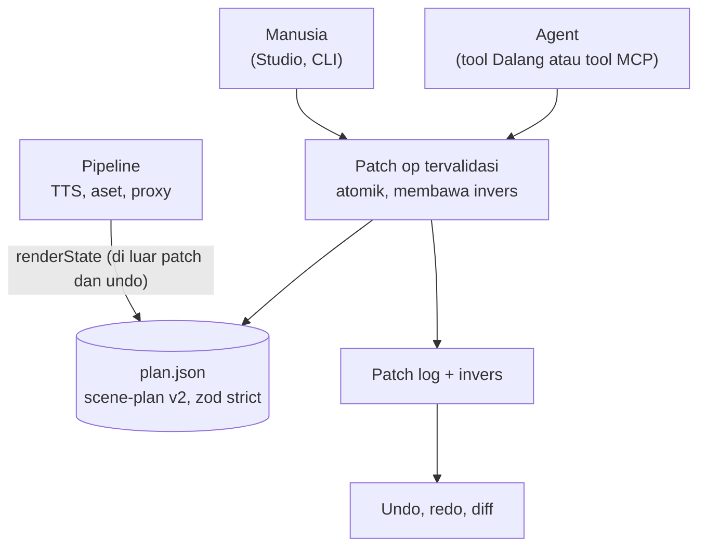
```mermaid
flowchart TB
    agent["Agent<br/>(tool Dalang atau tool MCP)"] --> patch
    manusia["Manusia<br/>(Studio, CLI)"] --> patch
    patch["Patch op tervalidasi<br/>atomik, membawa invers"] --> plan[("plan.json<br/>scene-plan v2, zod strict")]
    pipeline["Pipeline<br/>TTS, aset, proxy"] -->|"renderState (di luar patch dan undo)"| plan
    patch --> log["Patch log + invers"]
    log --> undo["Undo, redo, diff"]
```

**Scene-plan sebagai sumber kebenaran.** Skema zod v2 yang strict dan
berversi (plan v1 dimigrasikan saat dibaca), dengan artefak
[JSON Schema](packages/core/schema/scene-plan.v2.schema.json) untuk
autocomplete editor yang selalu sinkron lewat unit test. Perubahan skema
§5.1 hanya boleh lewat ADR.

**Patch op, bukan tulis-ulang.** Setiap perubahan adalah operasi tervalidasi
yang membawa inversnya, jadi undo, redo, dan diff ringkas didapat gratis.
Batch bersifat atomik. Agent dan manusia memakai kontrak yang sama, jadi tidak
ada jalur istimewa untuk salah satunya.

**Kontrak yang ditegakkan kode, bukan prompt.** Empat aturan di bawah ini ada
di dalam `@dalang/core` dan berlaku untuk siapa pun yang memanggilnya:

| Kontrak | Artinya |
|---|---|
| `locked` | Scene terkunci menolak `updateScene`, `removeScene`, `replaceAsset`, dan reorder dari agent. `lockScene` hanya untuk manusia. |
| `visual.pinned` | Aset yang dipilih eksplisit tidak boleh ditimpa auto-resolve pipeline. |
| `renderState` | Data turunan; di luar patch dan undo, hanya pipeline yang menulisnya lewat helper khusus. |
| Patch atomik | Selalu membawa inverse. Gagal di tengah berarti tidak ada yang berubah. |

**Port, bukan integrasi langsung.** TTS, stock, ASR, transkoder, target
render, dan tujuan publikasi semuanya di balik port. Itu yang membuat render
lokal dan render Lambda bisa berbagi satu jalur, dan membuat setiap provider
bisa diganti tanpa menyentuh inti.

**Cache berbasis isi.** Ledger SQLite di `.dalang/` di samping plan mengunci
hasil tiap tahap ke hash isinya. Mengganti narasi satu scene hanya
mensintesis ulang scene itu; menjalankan ulang tanpa perubahan tidak
mengerjakan apa pun; proses yang mati di tengah melanjutkan, bukan mengulang.

### Perjalanan satu patch

Sama untuk agent Dalang, agent luar lewat MCP, dan tombol di Studio — hanya
pengirimnya yang berbeda. Studio dan server MCP boleh memegang proyek yang
**sama**: penulisannya bandingkan-dan-tukar, jadi suntingan orang lain tidak
ditimpa diam-diam.

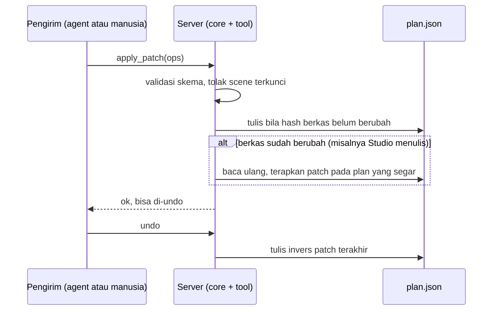
```mermaid
sequenceDiagram
    participant K as Pengirim (agent atau manusia)
    participant S as Server (core + tool)
    participant P as plan.json
    K->>S: apply_patch(ops)
    S->>S: validasi skema, tolak scene terkunci
    S->>P: tulis bila hash berkas belum berubah
    alt berkas sudah berubah (misalnya Studio menulis)
        S->>P: baca ulang, terapkan patch pada plan yang segar
    end
    S-->>K: ok, bisa di-undo
    K->>S: undo
    S->>P: tulis invers patch terakhir
```

### Istilah

| Istilah | Artinya |
|---|---|
| Scene-plan, `plan.json` | Satu berkas JSON yang memuat seluruh video: scene, narasi, klip, teks, audio, dan tampilan. Satu-satunya sumber kebenaran. |
| Scene | Satu adegan: narasi, satu atau beberapa potongan gambar, teks, grafis, lapisan video, dan transisi keluar. |
| Klip (potongan) | Potongan gambar berurutan di dalam satu scene; bisa dibelah, digeser tepinya, dibuang, dan disusun ulang. |
| Patch op | Satu perubahan tervalidasi pada plan. Selalu membawa inversnya, dan satu batch bersifat atomik. |
| `renderState` | Data turunan (aset yang sudah ditemukan, suara narasi). Ditulis pipeline, di luar patch dan undo. |
| Ledger | Berkas SQLite di `.dalang/` yang mengunci hasil tiap tahap pipeline ke hash isinya. |
| Preset | Gaya tampilan yang dirender Remotion: `documentary-01`, `tutorial-01`, `klip-01`. |
| Template | Scene-plan sah plus manifes, untuk memulai proyek atau meminjam tampilannya; dibagikan sebagai berkas. |
| Gerbang (gate) | Pemeriksaan di CI yang menjalankan hal sungguhan lalu mengukur hasilnya, bukan sekadar menguji fungsinya. |
| MCP | Model Context Protocol: cara agent lain memanggil tool Dalang. |
| Registry | [models.dev](https://models.dev): data model, harga, dan provider yang dibaca Dalang. |
| ADR | Catatan keputusan arsitektur, ditulis sebelum diimplementasikan, lengkap dengan batasnya. |

## Kemampuan

### Menyusun video lewat percakapan

Agent "dalang" bekerja di atas proyek: brief, riset, `writeScenePlan`, suara
dan aset, lalu preview. Revisi berikutnya berupa patch kecil, bukan penulisan
ulang. Ia **netral vendor**: model default mengikuti API key yang terpasang di
lingkunganmu — provider mana pun yang dikenal registry models.dev, atau model
lokal lewat Ollama dan LM Studio — dan dipilih dari data registry, bukan dari
preferensi kami. Lebih dari satu kunci berarti kamu wajib memilih eksplisit
([aturannya](#model-dan-provider)). Tanpa kunci sama sekali, agent luar seperti
Claude Code bisa memegang kemudi lewat [server MCP](#pakai-dari-agent-lain).

Yang membedakannya dari "LLM menulis JSON": agent **memeriksa kerjanya
sendiri** terhadap resep format yang dipakai, dan bisa **melihat hasil
rendernya**.

<details>
<summary>Resep format, kritik diri, dan tinjauan visual</summary>

- **6 resep format konten** (bebas, edukasi, tutorial, klip, berita, cerita),
  masing-masing dengan kerangka beat, rentang scene dan durasi, serta aturan
  struktur. Satu sumber dipakai dua arah: menyusun system prompt *dan*
  memeriksa hasilnya, jadi nasihat dan pemeriksa tidak pernah berbeda pendapat.
- **`critiqueDraft`** membuat loopnya berubah dari *tulis lalu harap* menjadi
  *tulis, periksa, perbaiki*, dengan pemeriksa yang bukan model.
- **Detektor generic**: klise, kata pagar, kata pengisi, kalimat di atas 25
  kata, pengulangan gagasan antar scene, dan **irama datar** — keseragaman
  panjang kalimat adalah penanda terkuat naskah mesin. Semuanya leksikal dan
  statistik: tanpa model, tanpa biaya token.
- **Durasi diestimasi dari suku kata**, bukan jumlah kata. Bahasa Indonesia
  berafiks berat, jadi "dan" dan "mempertanggungjawabkan" tidak boleh dihitung
  sama, dan "2024" bukan satu kata melainkan delapan suku kata.
- **`reviewRender`** merender beberapa frame kunci lalu menilainya dengan model
  vision, digabung dengan kritik struktur dalam satu laporan. Framenya dipilih
  dengan alasan: momen paling ramai di tiap scene, karena di situlah tata letak
  bertabrakan. Loopnya dibatasi di kode (bawaan 3 per giliran), bukan di prompt.
  Jawaban model yang tidak bisa diurai ditandai peringatan, tidak pernah
  dilaporkan bersih.
- **Guardrails di kode**: step cap 15, anggaran per giliran dan per proyek,
  gerbang persetujuan untuk render final dan TTS massal (non-interaktif berarti
  tolak), dan setiap panggilan tool tercatat (`dalang log`).
- **Suite eval berskor** (`pnpm --filter @dalang/agent eval`): lima brief
  bersumbu berbeda, skor 0-100 dari kepatuhan brief dan kerajinan — sehingga
  perubahan prompt atau model bisa dibandingkan dengan angka, bukan kesan.
  Mode `--self-check` menguji rangkanya tanpa model, dan mode itu menjaga CI.
- **Memori preferensi lintas proyek**: hanya yang kamu nyatakan sebagai
  kebiasaan tetap, semuanya terlihat dan bisa dihapus di lobi, disimpan di
  `~/.dalang/memori.json` dan bukan di dalam plan. Preferensi yang saling
  bertentangan ditandai, dan agent diminta bertanya alih-alih memilih sendiri.

Rujukan: [ADR-0009](docs/decisions/0009-agent-runtime.md),
[ADR-0017](docs/decisions/0017-agent-berkerajinan.md),
[ADR-0022](docs/decisions/0022-agent-melihat-hasilnya.md),
[ADR-0029](docs/decisions/0029-memori-preferensi-lintas-proyek.md,
[ADR-0044](docs/decisions/0044-registry-sampai-ke-pemanggilan.md)
</details>

### Editor yang terasa seperti editor

Timeline NLE dengan ruler ber-scrub, klip filmstrip selebar durasinya, trim di
tepi klip, belah di playhead, track suara per scene, dan transport. Satu scene
boleh memuat **beberapa potongan gambar berurutan**: titik potongnya digambar
di dalam kotak scene dan bisa diseret, pisau di transport membelah POTONGAN
sementara tombol di sebelahnya membelah SCENE. Teks, grafis, dan lapisan video
**diseret langsung di atas preview**, bukan lewat form angka. Semua keluarannya
patch op biasa: tercatat, bisa Ctrl+Z, dan terlihat agent di giliran
berikutnya.

<details>
<summary>Kanvas, lapisan, dan keyframe</summary>

- **Kotak pegangan dibaca dari DOM yang sudah ter-render**, jadi selalu pas di
  preset mana pun — termasuk preset yang belum ditulis. Jangkar dipilih ulang
  saat dilepas dan tepinya memakai margin aman, jadi menyeret "ke pinggir"
  mendarat di kolom aman yang sama dengan teks lain. Menyeret tidak pernah
  mengubah perataan teks: itu keputusan tipografi, bukan letak.
- **Menempel ke elemen lain** saat diseret (pusat ke pusat, tepi ke tepi,
  bersebelahan) dengan garis bantu di tepi yang disejajarkan. **Pemilihan
  jamak**: Shift+klik menambah anggota, menyeret salah satu memindahkan
  semuanya sejauh yang sama dalam satu patch, jadi satu undo mengembalikan
  semuanya.
- **Potongan di dalam satu scene** (maks 24): belah, geser tepi, buang, susun
  ulang. Memilih potongan di panel Properti membawa preview ke potongan itu —
  menyetel gerak kamera sambil menatap potongan yang salah adalah cara termudah
  menghabiskan sepuluh menit untuk perubahan yang tidak pernah terlihat. Contoh
  siap-render ada di
  [`examples/klip-borobudur`](examples/klip-borobudur/) — satu narasi, tiga
  potongan, satu potong keras dan satu larut; CI merendernya tiap kali. Menggeser tepi punya dua rasa — `ripple` memanjangkan atau memendekkan
  scene-nya, `roll` menukar durasi dengan potongan tetangga sehingga panjang
  scene tidak berubah dan yang bergerak hanya titik potongnya. Aritmetikanya
  hidup di core dan mengekspor BATASNYA, jadi seretan pointer berhenti di tempat
  yang sama dengan tempat op menolak. Di antara dua potongan bawaannya potong
  keras; larut dipasang per potongan kalau memang dibutuhkan.
- **Lapisan video** (maks 2 per scene) untuk B-roll, picture-in-picture, atau
  bukti visual. Medianya memakai bentuk `visual` yang sama, jadi Ken Burns,
  filter, kecepatan, trim, cermin, dan titik fokus berlaku tanpa rumus kedua —
  dan lapisan ikut bertambah pintar setiap kali `visual` bertambah. Kotaknya
  jangkar plus geseran fraksional, jadi satu nilai tetap benar di 16:9, 9:16,
  dan 1:1.
- **Keyframe properti**: `tracks` pada grafis, teks, lapisan, dan **visual
  dasar scene** menganimasikan properti pada waktu yang dipilih, bukan yang
  tersedia.
  Daftar propertinya tertutup dan rentang nilainya sama persis dengan properti
  statisnya, jadi keyframe tidak bisa membawa nilai yang akan ditolak skema.
  Waktunya fraksi jendela tampil, jadi scene yang dipanjangkan membawa serta
  animasinya tanpa satu angka pun dihitung ulang.
- Berlian keyframe di timeline **bisa diseret** atau digeser dengan papan
  ketik, menempel ke keyframe track lain pada lapisan yang sama, dan mendarat
  di atas keyframe lain ditolak alih-alih ditumpuk.
- **Kamera klip diarahkan tangan**: zum, geser X/Y, dan opasitas visual dasar
  punya keyframe sendiri, jadi gerak yang berubah di TENGAH potongan — menahan
  dulu lalu menghentak masuk, mundur pelan dari detail ke seluruh bidang —
  akhirnya bisa dinyatakan. Delapan preset `motion` tetap ada untuk yang tidak
  butuh itu; begitu kameranya di-keyframe, presetnya mengalah seluruhnya
  supaya tidak ada gerak yang separuh preset separuh tangan.
- **Anotasi tutorial** (zoom, sorot, panah, blur) ikut bisa diseret dan diubah
  ukurannya di atas tangkapan layar.
- **Perangkat sinematik lewat kontrak data**: filter per scene (6 preset plus
  cerah, kontras, saturasi, opacity, blur), transisi per scene dengan tempo
  yang bisa diatur, hingga 3 teks overlay, rasio yang bisa ditukar, gerak Ken
  Burns dengan cermin horizontal dan titik fokus crop, serta kecepatan video
  0,25-4x.
- **Satu bahasa easing** dinamai per rasa (settle, glide, dolly) dipakai kedua
  preset, dengan util keyframe bersama — tidak ada lagi masuk-keluar teks yang
  linear.

Rujukan: [ADR-0011](docs/decisions/0011-pengayaan-editor.md),
[ADR-0015](docs/decisions/0015-kehandalan-gerak.md),
[ADR-0024](docs/decisions/0024-manipulasi-langsung-di-kanvas.md),
[ADR-0025](docs/decisions/0025-lapisan-video.md),
[ADR-0027](docs/decisions/0027-keyframe-properti.md),
[ADR-0033](docs/decisions/0033-beberapa-klip-dalam-satu-scene.md),
[ADR-0036](docs/decisions/0036-keyframe-kamera-klip.md)
</details>

### Template yang bisa dibagikan

Sebuah template adalah **scene-plan yang sah plus manifes** — bukan format
kedua yang harus dikejar tiap kali plan bertambah kemampuan. Ia membawa
kerangka scene DAN seluruh tampilannya, dan satu aturan menentukan isinya:
semua ikut kecuali yang menunjuk berkas. Kata-kata berpindah; aset, musik
unggahan, transkrip, dan proxy tidak, sebab di komputer orang lain semuanya
cuma jadi tautan putus. Rujukan yang berkasnya ada di setiap pemasangan —
ikon `iconify:`, bunyi dan musik `pustaka:` — ikut.

Dua cara memakainya, dan keduanya berbeda: **mulai proyek baru** dari
kerangkanya, atau **pinjam tampilannya saja** untuk video yang sudah kamu
tulis sendiri — preset, rasio, token warna dan huruf, zona aman, gaya caption
— tanpa menyentuh narasi, potongan, aset, maupun durasi. Yang kedua keluar
sebagai patch op biasa, jadi bisa Ctrl+Z.

Tiga template bawaan ikut terpasang (klip pendek, esai video, tutorial), dan
ada test yang menuntut ketiganya lulus kaidah sutradara repo ini sendiri —
template dipakai sebagai titik awal, jadi kesalahannya ikut disalin ke tiap
proyek yang lahir darinya. Registrinya satu folder JSON di rumah Dalang, jadi
template bisa disalin, dikirim, atau dimasukkan git.

**Yang tidak ada: tokonya.** Tidak ada indeks yang di-host, akun, peringkat,
atau pemasangan dari URL — template berpindah sebagai berkas.
[ADR-0037](docs/decisions/0037-paket-template.md) menulis kenapa, dan batas
lainnya.

### Menyunting berdua

Studio bisa dibuka ke jaringan lokal dengan `dalang studio --lan`. Ia mencetak
URL lengkap berisi **kunci acak** untuk tiap alamat mesin ini, dan tanpa kunci
itu tamu jaringan tidak bisa apa-apa — termasuk membaca. Tanpa `--lan` tidak
ada yang berubah: Studio tetap hanya mendengar di loopback.

Bentrok **ditolak, bukan digabungkan diam-diam**. Tiap suntingan membawa
revisi yang jadi dasarnya, dan server menolaknya kalau petak yang disentuh —
sebesar SCENE — sudah berubah di tangan orang lain. Yang ditolak mendapat
kalimat yang menyebut siapa dan apa, lalu layarnya disegarkan. Dua orang di
scene berbeda tidak saling menghalangi.

Bilah kehadiran menunjukkan siapa yang sedang membuka proyek dan di scene
mana; ia kosong saat kamu sendirian. Nama bisa diklik untuk diganti.

**Yang tidak ada: akun dan izin per-orang.** Yang punya tautan punya
segalanya, dan tidak ada penggabungan otomatis — dua orang yang menyunting
scene yang sama harus bergantian.
[ADR-0038](docs/decisions/0038-beberapa-orang-satu-proyek.md) menulis kenapa,
dan batas lainnya.

### Teks dan tipografi

Caption karaoke tersinkron dari word timestamp asli TTS atau estimasi
deterministik, dengan **enam gaya** (Klasik, Tegas, Chip, Halus, Pita,
Karaoke), tipografi kinetik per kata atau per karakter, **enam animasi masuk**
(Larut, Pop, Naik, Ketik, Kabur masuk, Geser masuk), garis luar 0-8 piksel
untuk keterbacaan di footage ramai, dan penekanan stabilo yang menyapu saat
teks masuk. **Sembilan font variable ter-bundle** (OFL, dirender offline):
Fraunces, Inter, Space Grotesk, Lora, Plus Jakarta Sans karya Tokotype, Anton,
Playfair Display, Manrope, dan JetBrains Mono.

Gaya `Pita` menaruh seluruh baris di atas pita solid — keterbacaannya tidak
bergantung pada gambar di belakangnya, jadi ia tetap terbaca di footage
seramai apa pun. `Karaoke` menyisakan jejak: kata yang sudah lewat tetap
beraksen, jadi penonton bisa mengejar kalimat yang terlewat sekilas.

- **Zona aman platform**: `meta.safeArea` mengosongkan tepi bingkai yang akan
  ditimpa antarmuka platform tujuan — tepi bawah (judul, nama akun) dan tepi
  kanan (rel tombol) pada video 9:16. Caption dan teks menjauh dari sana;
  gambarnya tetap penuh. Angkanya fraksi yang kamu tentukan, BUKAN daftar nama
  platform: repo ini tidak bisa memverifikasi ukuran antarmuka TikTok, Reels,
  atau Shorts, dan angka tak terverifikasi yang dibekukan sebagai nama platform
  akan menua diam-diam. Bawaannya nol, jadi plan yang sudah ada tidak bergeser
  satu piksel pun — dibuktikan gerbang paritas byte, bukan diklaim. Pitanya
  digambar di kanvas Studio supaya yang menyunting melihat batasnya, bukan cuma
  akibatnya; gerbang interaksi mengukur ketiga pitanya lewat pointer sungguhan.

- **Berkas subtitle `.srt` dan `.vtt`** yang berjalan BERSAMA video, bukan
  dibakar ke dalamnya: penonton bisa mematikannya, YouTube bisa
  menerjemahkannya, dan mesin pencari membacanya — tiga hal yang tidak bisa
  dilakukan piksel. Waktunya diambil dari tata letak RENDER, jadi ia tidak
  melenceng tiap kali ada transisi, dan sumbernya sama dengan caption layar:
  word timestamp TTS kalau ada, transkrip rekaman kalau itu yang dipakai,
  taksiran kalau belum. Pengelompokan kartunya berbeda dari caption layar dan
  itu disengaja — kartu tiga kata yang berganti tiap 700 ms adalah kedipan,
  bukan subtitle. Lima permukaan memakai satu fungsi yang sama: `dalang
  subtitle`, tombol SRT/WebVTT di dialog Ekspor, tool agent `writeSubtitle`,
  tool MCP `dalang_write_subtitle` untuk agent lain, dan ikut terunggah otomatis
  bersama video ke YouTube. Gerbang CI membuktikan berkasnya terbaca pembaca
  RUJUKAN (`webvtt-py`, bukan pembaca kami sendiri) dan tiap kartunya jatuh di
  scene yang benar menurut renderer — bukan diklaim, diuji.

Rujukan: [ADR-0016](docs/decisions/0016-tipografi.md),
[ADR-0034](docs/decisions/0034-zona-aman-platform.md),
[ADR-0039](docs/decisions/0039-berkas-subtitle.md)

### Warna, efek, gerak, dan transisi

**Sebelas preset warna** (Asli, Hangat, Sejuk, Mono, Vivid, Film, Noir, Senja,
Malam, Pudar, Pastel) plus kecerahan/kontras/saturasi/blur yang bisa disetel
sendiri — semuanya fungsi `filter` CSS, jadi preview Player dan render final
satu sumber kebenaran.

**Dua efek yang bukan filter**: vignette dan butiran film. Tidak ada fungsi
filter CSS yang menggelapkan tepi saja atau menambah noise, jadi keduanya
digambar sebagai lapisan. Butirannya **statis** — pola ber-seed tetap, sama di
tiap bingkai — karena butiran yang berubah tiap bingkai terlihat seperti
kompresi rusak, bukan seperti film, dan ia menghancurkan efisiensi enkode.

**Sebelas gerak kamera**, tiga di antaranya punya AKSEN alih-alih laju tetap:
`punch-in` zum cepat lalu **diam** (berhentinya itu penekanannya), `tilt`
memiringkan pelan untuk kesan tangan, `pan-diagonal` menggeser dua sumbu.

**Sepuluh transisi** keluar scene, dengan tempo 6-24 bingkai yang bisa diatur
per batas.

Gerbang CI **mengukur** efeknya di bingkai sungguhan: vignette wajib
menggelapkan sudut tanpa menambah tekstur, butiran wajib menambah tekstur
tanpa menggelapkan sudut. Dua tuntutan yang saling menyilang — menukar
implementasi keduanya membuat keempat pemeriksaan merah.

Rujukan: [ADR-0011](docs/decisions/0011-pengayaan-editor.md),
[ADR-0041](docs/decisions/0041-pengayaan.md)

### Suara

Narasi lewat rantai ElevenLabs → Edge TTS → silence offline, dengan word
timestamp native bila providernya menyediakan. Setiap degradasi ditandai per
scene, jadi kamu selalu tahu suara mana yang placeholder.

<details>
<summary>Amplop audio, ducking, dan pengukuran kenyaringan</summary>

- **Satu bentuk amplop untuk semua yang berbunyi**: suara aset visual, suara
  lapisan, dan trek audio tambahan. `volume`, fade masuk dan keluar, ducking,
  dan normalisasi — satu implementasi, satu panel kendali, jadi tidak ada panel
  yang diam-diam kehilangan sakelar ducking.
- **Ducking mengikuti rentang bicara nyata** dari word timestamp, bukan seluruh
  jendela scene. Jeda di bawah 1,2 detik tetap diduck supaya musik tidak
  memompa.
- **Kenyaringan diukur dengan pengukur EBU R128 / ITU-R BS.1770-4 yang ditulis
  sendiri** — tanpa ffmpeg, tanpa biner tambahan — dan koefisien penapis K
  dihitung ulang per laju cuplik, bukan disalin dari tabel 48 kHz.
- **Normalisasi per klip, bukan per program**: tiap sumber dibawa ke
  `meta.loudnessTarget` (bawaan -16 LUFS) sebelum volumenya diterapkan, jadi
  `volume` selalu berarti hal yang sama. Berkas mono dikoreksi 3,01 LU karena
  campurannya stereo.
- **Belum diukur berarti penguatan 1, bukan tebakan.** Berkas yang kodeknya
  tidak bisa didekode dilewati dengan alasan yang disebutkan.
- **Campuran akhir setiap render diukur dari berkas hasilnya**, lalu dikoreksi
  ke sasaran dengan penguatan rata (toleransi ±1 LU, dipangkas di puncak
  -1 dBFS, video disalin tanpa enkode ulang). CLI dan Studio menyebut angkanya
  beserta koreksinya.
- **Musik latar** dari dua bed CC0 ter-bundle yang disintesis deterministik dan
  loop mulus, dengan fade yang **bisa diseret di timeline**. `audio.tracks`
  (maks 8) untuk ambience, wawancara, atau lagu berlisensi.

Rujukan: [ADR-0007](docs/decisions/0007-tts-dan-word-timestamps.md),
[ADR-0014](docs/decisions/0014-ekspor-kaya-craft-expert.md),
[ADR-0026](docs/decisions/0026-audio-per-klip.md)
</details>

### Sulih suara

Satu scene-plan bisa memuat **banyak bahasa**. Yang berganti hanya narasi,
suaranya, teks di layar, dan judul; gambarnya dijamin sama karena memang plan
yang sama — bukan salinan folder yang harus dijaga tetap sinkron dengan tangan.

Seluruhnya berdiri di atas satu fungsi: `planInLanguage` menukar bahasanya dan
mengembalikan **scene-plan biasa**. Karena itu tidak ada satu pun jalur di
hilir yang perlu tahu soal sulih suara — durasi, tata letak, caption, subtitle,
ducking, campuran akhir, dan ekspor interop bekerja apa adanya.

- **Durasi IKUT bahasanya.** Kalimat Inggris jarang sepanjang padanan
  Indonesianya, jadi video sulihannya boleh lebih pendek atau lebih panjang.
  Alternatifnya adalah mempercepat ucapan supaya muat di gambar yang tetap —
  dan itu terdengar. Susunan scene-nya tidak berubah: yang belum diterjemahkan
  tampil BISU, bukan dibuang.
- **Teks layar dan judul ikut disulih.** Suara yang salah terdengar sekali;
  teks yang salah terlihat di setiap bingkai.
- **Suara sendiri per bahasa** lewat `audio.dubVoices`. Tanpa itu, suara
  bahasa utama yang membaca teks bahasa lain — dan ketiga permukaan
  mengatakannya, karena yang tidak diberi tahu akan mengira itu batas TTS-nya.
- **Menerjemahkan pekerjaan agent**, bukan flag CLI: `translateNarration`
  menerjemahkan seluruh naskah sekali jalan supaya istilahnya konsisten, dan
  aturan pertamanya bukan makna melainkan PANJANG UCAPAN. Jawaban model yang
  tidak bisa diurai tidak menghasilkan patch apa pun — plan yang tersulih
  separuh lebih buruk daripada yang belum sama sekali.

```bash
pnpm dalang sulih proyekku/                        # keadaan tiap bahasa
pnpm dalang sulih proyekku/ --bahasa en --suara    # TTS untuk bahasa itu
pnpm dalang render proyekku/ --bahasa en              # out/proyekku-540p-cepat.en.mp4
pnpm dalang subtitle proyekku/ --bahasa en
pnpm dalang export proyekku/ --bahasa en              # timeline.en.otio untuk editor lain
```

Bahasa ikut di **nama berkas** (`final.en.mp4`; bahasa utama tetap tanpa
akhiran), jadi dua render dari satu proyek tidak saling menimpa. Pengunggah
membaca bahasa videonya dari nama itu: mengunggah `final.en.mp4` membawa judul,
deskripsi, dan subtitle berbahasa Inggris — bukan milik bahasa utama. Pilihan
Bahasa di dialog Ekspor Studio berlaku untuk video, subtitle, dan garis waktu
sekaligus.

Gerbang CI merender bingkai yang sama **dua kali**, sekali per bahasa, dan
menuntut kedua PNG-nya berbeda byte: dua bingkai identik berarti bahasanya
tidak sampai ke layar.

Rujukan: [ADR-0040](docs/decisions/0040-sulih-suara.md)

### Rekaman panjang dan transkrip

Dalang bisa **mendengar**, bukan cuma menyusun materi buatannya sendiri.
Rantai ASR-nya **whisper.cpp (offline) → Deepgram → ElevenLabs Scribe**, dengan
offline di depan karena privasi, bukan akurasi: rekaman mentah adalah materi
paling pribadi yang dipegang Dalang, dan mengirimnya ke pihak ketiga harus jadi
pilihan sadar pemiliknya.

<details>
<summary>Proxy, unggahan yang bisa dilanjutkan, dan titik potong</summary>

- **Proxy pratinjau** H.264 sisi pendek 540 dibuat oleh ffmpeg bawaan Remotion
  — tanpa biner baru, tanpa "pasang ffmpeg dulu". Dipakai hanya oleh preview
  Studio dan render draf; render final selalu membaca berkas aslinya, dan
  ekspor OTIO/FCPXML tidak pernah menyebut proxy.
- **"Perlu proxy" adalah keputusan murni dengan alasan yang terbaca**: kodek
  yang tidak diputar browser (HEVC, ProRes), rekaman ≥ 60 detik, resolusi di
  atas 720p, laju di atas 30 fps, atau laju bit di atas 25 Mbps. Yang ringan
  dibiarkan apa adanya.
- **Dibuat di latar**: ffmpeg melaporkan kemajuan per berkas dan bisa
  dibatalkan; editor tetap bisa dipakai, dan patch, undo, serta render tidak
  menunggu.
- **Unggahan bisa dilanjutkan setelah putus**: per potongan 8 MiB dengan offset
  yang bertahan di server, jadi memuat ulang tab atau me-restart tidak
  mengulang byte yang sudah sampai.
- **Titik masuk dipilih dengan melihat rekamannya**: strip bingkai dan bentuk
  gelombang sepanjang rekaman, dengan jendela scene digambar di atasnya.
  `findCutPoints` mencari jeda hening (-35 dB, 0,35 detik) supaya potongan
  jatuh di jeda alami, bukan di tengah napas.
- **Caption untuk footage orang**: scene tanpa narasi tulis mendapat caption
  dari transkrip rekamannya, dengan `visual.speed` ikut dihitung.
- Cache dikunci **isi berkas**: salinan identik tidak ditranskrip dua kali, dan
  berkas berbeda bernama sama tidak memakai cache yang salah.

Rujukan: [ADR-0021](docs/decisions/0021-transkrip-fondasi.md),
[ADR-0028](docs/decisions/0028-proxy-rekaman-panjang.md)
</details>

### Media dan hak pakai

Video dan foto stok dari **Pexels** dan **Pixabay**, GIF dan stiker dari
**GIPHY** dan **Tenor**, ikon dari **Iconify** (237 set, tanpa kunci), efek
suara dari **Openverse**. Setiap aset membawa metadata lisensinya, dan hak
pakai dijaga tiga lapis.

**Dua bed musik dan delapan efek suara ikut repo** (`pustaka:<id>`) — whoosh,
pop, klik, ding, tap, swipe, impact, riser. Semuanya **disintesis** oleh skrip
yang ikut di-commit, bukan diunduh, jadi lisensinya CC0 tanpa syarat dan
tidak ada yang perlu dibaca satu per satu. Karena berkasnya ikut bundel
komposisi, bunyi pustaka bekerja **tanpa jaringan sama sekali**: tidak ada
yang diunduh, di-stage, atau dicatat di renderState.

**Bunyi ketik** ([ADR-0043](docs/decisions/0043-bunyi-ketik.md)): `sound: "ketik"`
pada teks `typewriter` menjatuhkan SATU ketukan tuts keyboard mekanik per huruf,
tepat di bingkai huruf itu tampil — gaya kalimat kunci yang diketikkan di layar
pada video kreator bisnis dan keuangan. Bunyinya diturunkan dari teksnya, bukan
disimpan sebagai cue, jadi ikut bergeser saat teks atau scene berubah.
Empat ketukan huruf dan satu spasi disintesis dan dipakai bergantian. Gerbang CI
merender video di ketiga preset dan mengukur dari file-nya: 45 dari 45 ketukan,
selisih konstan 43 ms, simpangan 0 ms. **Bunyinya belum pernah didengar
manusia** — yang terukur bentuk gelombang dan spektrumnya, bukan kemiripannya
dengan keyboard yang Anda suka; parameternya ada di `buat-sfx.mjs`.

<details>
<summary>Tiga lapis penjagaan hak pakai, dan yang sengaja tidak diintegrasikan</summary>

- Lisensi ditulis **apa adanya** dengan penanda `PERIKSA HAK PAKAI`.
- Kritik sutradara `aset-hak-pakai` menegur bila aset bertanda itu terpakai —
  memeriksa **lisensinya**, bukan nama providernya.
- Urutan rantai stock menaruh Pexels dan Pixabay **selalu** di depan GIPHY dan
  Tenor, dan itu dikunci test.
- Ikon disaring dengan **daftar putih SPDX**: lisensi yang belum dikenal
  dianggap tidak aman sampai ditinjau, apa pun ber-`-NC-` ditolak lebih dulu,
  dan set yang mewajibkan kredit ditandai.
- Openverse dipilih di atas Freesound karena syarat pemakaian API Freesound
  sendiri gratis hanya untuk keperluan non-komersial, terlepas dari lisensi
  suaranya.
- **Tempelan mengikuti rasio**: `scene.graphics` (maks 4) memakai jangkar plus
  geseran fraksional, bukan koordinat piksel. `audio.sfx` (maks 24)
  menambatkan bunyi ke **scene**, bukan garis waktu mutlak — scene digeser,
  bunyinya ikut.
- **Tidak diintegrasikan, dengan alasan tertulis**: MyInstants, yarn.co, dan
  icon-icons. Ketiganya tanpa API resmi, dan syarat pakainya melarang persis
  apa yang dibutuhkan integrasi otomatis (akses lewat bot, scraping, atau
  penggunaan komersial).

Rujukan: [ADR-0008](docs/decisions/0008-stock-provider-dan-lisensi.md),
[ADR-0018](docs/decisions/0018-pustaka-media.md)
</details>

### Render, ekspor, dan publikasi

Render lokal dengan **bundle cache persisten** berbasis content-fingerprint
(start render sekitar 2 detik saat cache hit), profil draf dan final, format
MP4 (H.264+AAC), WebM (VP9+Opus), MOV (ProRes+PCM), dan H.265, resolusi
540/720/1080p, serta mutu Cepat, Seimbang, dan Terbaik yang dijelaskan jujur
per kombinasi.

<details>
<summary>Render cloud, interchange, dan unggah ke YouTube</summary>

- **Remotion Lambda** sebagai implementasi kedua port `RenderTarget`. Aset
  situs dan aset plan dibedakan: font dan bed musik ikut bundel komposisi,
  sedangkan narasi, footage, ikon, stiker, dan efek suara dialamatkan lewat
  URL — itu yang membuat situs cukup dipasang sekali, bukan tiap render.
- **URL bertanda tangan per berkas sebagai bawaan**, bukan bucket publik,
  supaya footage yang belum dirilis tidak bisa dibaca siapa pun yang punya
  URL-nya. Aset yang isinya tidak berubah tidak diunggah ulang.
- **Estimasi biaya ada di kontrak `RenderTarget`**, dijawab dari durasi plan
  tanpa memanggil AWS sama sekali, dan dibulatkan ke atas: gerbang anggaran
  yang terlalu optimistis lebih berbahaya daripada yang terlalu hati-hati.
- **Ekspor OpenTimelineIO dan FCPXML** untuk difinishing di DaVinci Resolve,
  Premiere, atau Final Cut. Setiap ekspor **selalu melaporkan apa yang tidak
  ikut menyeberang** — caption karaoke, teks bergaya, Ken Burns, filter,
  anotasi — dan daftarnya ikut ditulis ke dalam berkasnya, karena berkas ekspor
  sering berpindah tangan tanpa log yang menyertainya.
- **Impor .otio dan .fcpxml** jadi kerangka scene-plan: urutan, durasi, dan
  titik masuk yang benar, naskah kosong, dan catatannya mengatakan begitu.
  Bentuk berkasnya yang menentukan pembacanya, bukan ekstensinya. Potongan
  diletakkan di **tengah** tumpang-tindih transisi, titik yang sama dipakai
  Dalang untuk berpindah scene.
- **Unggah ke YouTube** dari riwayat render, CLI, atau tool agent: resumable
  per potongan 8 MiB lewat YouTube Data API v3, dengan tiga pengaman karena
  unggahan tidak bisa diurungkan — selalu lewat konfirmasi, bawaan privat, dan
  ledger yang menolak mengunggah berkas yang sama dua kali tanpa `--force`.
- **Subtitle ikut naik bersama videonya**, ditulis SEGAR saat itu juga —
  bukan dipungut dari berkas yang kebetulan tertinggal di folder, karena teks
  lama yang tidak cocok dengan suaranya cuma ketahuan oleh penonton yang
  menyalakan teksnya. Subtitle gagal BUKAN publikasi gagal: videonya sudah
  tayang, jadi yang dikatakan adalah "video naik, subtitle tidak, ini
  berkasnya" — bukan galat yang membuat orang mengulang dan mendapat video
  kedua di kanalnya.

Rujukan: [ADR-0014](docs/decisions/0014-ekspor-kaya-craft-expert.md),
[ADR-0019](docs/decisions/0019-render-cloud.md),
[ADR-0023](docs/decisions/0023-keluar-dan-masuk.md),
[ADR-0030](docs/decisions/0030-publikasi-langsung.md),
[ADR-0039](docs/decisions/0039-berkas-subtitle.md)
</details>

## Model dan provider

Dalang tidak mengikat diri ke satu vendor. Daftar model, harga, ukuran konteks,
dan kapabilitasnya dibaca dari registry terbuka [models.dev](https://models.dev)
(diambil tiap hari, disimpan di cache lokal, dengan snapshot bawaan sebagai
cadangan offline). Sejak [ADR-0044](docs/decisions/0044-registry-sampai-ke-pemanggilan.md)
registry itu dipakai sampai ke **pemanggilan**, bukan hanya untuk menampilkan
harga: paket SDK, alamat API, dan nama variabel kunci tiap provider dibaca dari
datanya, tanpa satu provider pun dikodekan tangan.

### Apa yang bisa dipanggil

Diukur atas registry yang diambil 2026-10-03: 226 provider dan 8.383 model
(7.327 di antaranya bisa tool-calling, syarat model orkestrator).

| Jalur | Jumlah | Contoh |
|---|---|---|
| SDK bawaan | 3 | Anthropic, OpenAI, Google (kunci Gemini boleh bernama `GEMINI_API_KEY`) |
| Dari metadata registry: OpenAI-compatible, Anthropic-compatible, OpenAI | 199 | OpenRouter, DeepSeek, Hugging Face, Alibaba, Moonshot AI, Z.AI, MiniMax, Cloudflare Workers AI, LM Studio |
| Endpoint OpenAI-compatible yang dikurasi (SDK-nya sendiri di registry) | 9 | Groq, Mistral, xAI, Together AI, Cerebras, Deep Infra, Perplexity, Cohere, Venice AI |
| Lokal, di luar registry | 1 | Ollama (`ollama/<model>`, tanpa kunci) |
| **Tidak bisa dipanggil** | 15 | Amazon Bedrock, Google Vertex (dan varian Anthropic-nya), Azure (dua), GitLab, watsonx, SAP AI Core, Vercel AI Gateway, v0, Cloudflare AI Gateway, AIHubMix, Merge Gateway, Salad, QVAC |

Yang 15 itu butuh SDK dengan autentikasinya sendiri (IAM, service account), dan
**ditolak dengan alasan yang menyebut nama paketnya**, bukan "provider tidak
dikenal". Dengan semua variabel lingkungannya terisi, ke-211 provider yang bisa
dipanggil menghasilkan rute siap (0 gagal) atas data lengkap itu.

### Cara Dalang memilih model

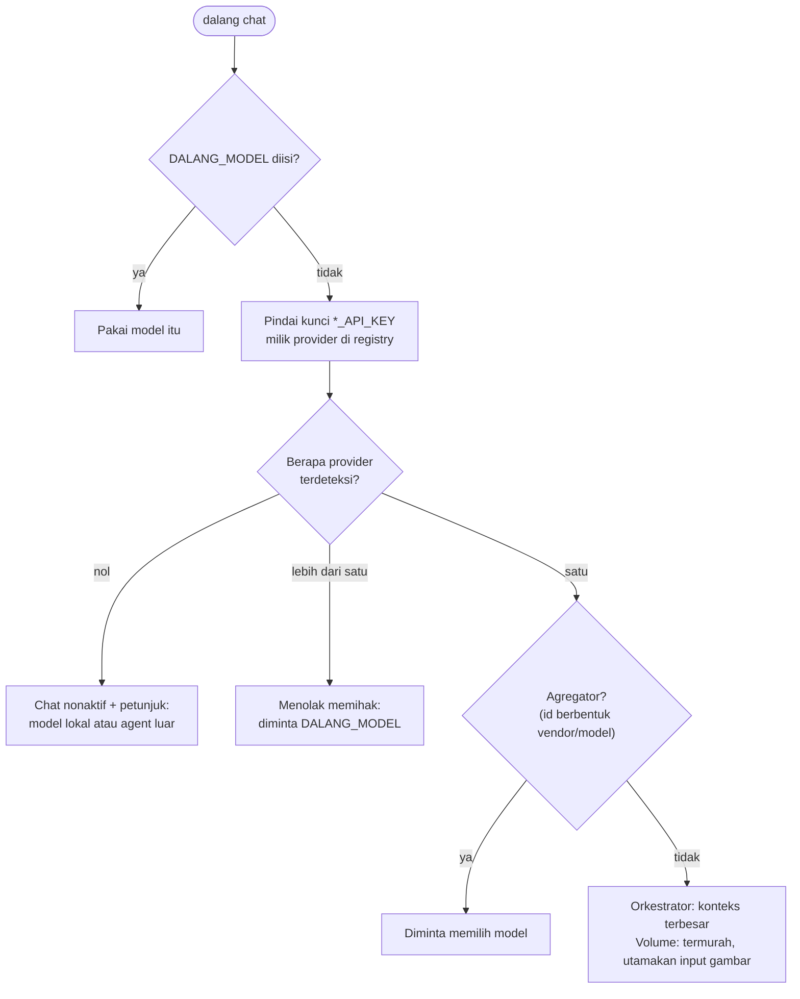
```mermaid
flowchart TD
    mulai(["dalang chat"]) --> eksplisit{"DALANG_MODEL diisi?"}
    eksplisit -->|ya| pakai["Pakai model itu"]
    eksplisit -->|tidak| pindai["Pindai kunci *_API_KEY<br/>milik provider di registry"]
    pindai --> jumlah{"Berapa provider<br/>terdeteksi?"}
    jumlah -->|nol| nonaktif["Chat nonaktif + petunjuk:<br/>model lokal atau agent luar"]
    jumlah -->|lebih dari satu| tolak["Menolak memihak:<br/>diminta DALANG_MODEL"]
    jumlah -->|satu| agregator{"Agregator?<br/>(id berbentuk vendor/model)"}
    agregator -->|ya| minta["Diminta memilih model"]
    agregator -->|tidak| pilih["Orkestrator: konteks terbesar<br/>Volume: termurah, utamakan input gambar"]
```

Aturannya sengaja sempit, karena registry berisi ratusan provider dan menebak
dari semua variabel lingkungan akan salah:

- **Hanya variabel `*_API_KEY`** yang dianggap tanda "saya ingin memakai provider
  ini". `GITHUB_TOKEN`, `HF_TOKEN`, dan `AWS_*` dipasang orang untuk keperluan
  lain: providernya tetap bisa dipakai bila kamu memilihnya eksplisit, tetapi
  tidak pernah menentukan default. (Registry mendaftarkan GitHub Copilot dengan
  kunci `GITHUB_TOKEN`; tanpa aturan ini, siapa pun yang punya token itu di
  mesinnya akan dipilihkan Copilot untuk chat tanpa pernah memintanya.)
- **Satu variabel untuk banyak provider dianggap ambigu.** `MINIMAX_API_KEY` dipakai
  empat provider (global, CN, paket coding) dengan alamat berbeda; Dalang tidak
  menebak, kamu menyebut yang kamu maksud.
- **Agregator tidak dipilihkan modelnya.** "Konteks terbesar" di antara 323 model
  OpenRouter bukan pilihan yang layak.
- **Server lokal tidak ditebak**, karena daftar modelnya di registry hanyalah
  katalog; yang dimuat di servermu bisa lain sama sekali.
- **Lebih dari satu provider terdeteksi berarti menolak memilih.** Pengguna yang
  memasang `ANTHROPIC_API_KEY` dan `GROQ_API_KEY` sekaligus mendapat penolakan
  yang menyebut keduanya, plus satu baris `DALANG_MODEL` untuk memutuskan.

### Menjelajahi registry: `dalang models`

Membaca registry saja, jadi gratis dan tidak memanggil model apa pun.

```text
$ DEEPSEEK_API_KEY=... dalang models
Registry models.dev — cache lokal (kurang dari 24 jam)
  226 provider, 8383 model (7327 bisa tool-calling, syarat orkestrator)

Kunci terpasang di environment ini (1): deepseek
Server lokal tanpa key (5; pastikan servernya berjalan): atomic-chat, lmstudio, lynkr, ollama, privatemode-ai
Tidak bisa dipanggil lewat Dalang (15; butuh SDK khusus): aihubmix, amazon-bedrock, azure, ...

Model default saat ini: deepseek/deepseek-v4-pro (volume: deepseek/deepseek-v4-flash-vision-exp)
  provider deepseek terdeteksi dari environment (DEEPSEEK_API_KEY); model dipilih dari registry models.dev

$ dalang models cari llama --provider groq --alat --urut biaya -n 4
MODEL                         KONTEKS  MASUK  KELUAR  ALAT  GAMBAR  STATUS
groq/llama-3.1-8b-instant     131K     0.050  0.080   ya    tidak   siap
groq/llama-3.3-70b-versatile  131K     0.590  0.790   ya    tidak   siap
```

Keluaran di atas nyata (harga per 2026-10-03, dalam USD per 1 juta token) dan
akan berubah mengikuti registry. Opsi: `--provider`, `--alat`, `--vision`,
`--siap`, `--urut biaya|konteks|nama`, `-n`, `--json`, `--offline`, `--segarkan`.
`dalang models provider [kata]` menampilkan tiap provider beserta statusnya
(`siap`, `butuh-env`, `tak-didukung`), jalurnya, dan variabel yang kurang.
`siap` berarti konfigurasi lengkap; ia tidak memeriksa apakah akun atau servernya
benar-benar aktif.

`dalang doctor` dan `dalang setup` memakai jawaban yang sama dengan chat
sungguhan, jadi provider di luar daftar kunci bawaan tidak dilaporkan "mati"
padahal chat-nya hidup.

### Keamanan: registry adalah masukan tak tepercaya

Registry menyatakan **ke mana kunci dikirim**, jadi:

- provider yang meminta variabel milik provider bawaan (`ANTHROPIC_API_KEY`,
  `OPENAI_API_KEY`, `GOOGLE_*`, `GEMINI_API_KEY`) ditolak: entri yang diracuni
  tidak bisa mengarahkan kunci Anthropic ke penampung;
- mengirim kunci lewat `http://` di luar mesin ini ditolak (server **tanpa** kunci,
  mis. Ollama di LAN, boleh);
- host tujuan ditampilkan di banner `dalang chat`, tanpa kuncinya.

### Yang belum terbukti

**Tidak satu pun panggilan ke provider sungguhan dilakukan** untuk fitur ini:
butuh kunci berbayar yang tidak tersedia di sini. Yang terbukti: klasifikasi atas
data registry nyata, dan bentuk permintaan di kabel ke server lokal untuk tiga
jalur (OpenAI-compatible: path, header `Authorization`, id model berslash utuh;
bergaya Anthropic: `/messages` dengan `x-api-key`; Ollama: tanpa header
`Authorization`). Kualitas tool-calling di tiap endpoint berbeda antar-vendor dan
tidak diuji. Sembilan endpoint kurasi diperiksa dengan permintaan tanpa kunci
(401/403 berarti endpoint ada dan menuntut kredensial), bukan dengan panggilan
berhasil. Rujukan: [ADR-0044](docs/decisions/0044-registry-sampai-ke-pemanggilan.md).

## Pakai dari agent lain

Kalau kamu sudah berlangganan Claude Code, Codex, atau agent coding sejenis,
**Dalang tidak butuh kunci API model sama sekali**. Agent-nya yang berpikir, dan
langganan yang sudah kamu bayar yang menanggung biayanya; Dalang memberinya apa
yang tidak ia punya: **garis waktu**. Dua pintu, dua tujuan:

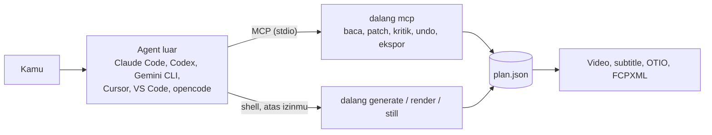
```mermaid
flowchart LR
    kamu["Kamu"] --> luar["Agent luar<br/>Claude Code, Codex, Gemini CLI,<br/>Cursor, VS Code, opencode"]
    luar -->|"MCP (stdio)"| mcp["dalang mcp<br/>baca, patch, kritik, undo, ekspor"]
    luar -->|"shell, atas izinmu"| cli["dalang generate / render / still"]
    mcp --> plan[("plan.json")]
    cli --> plan
    plan --> hasil["Video, subtitle, OTIO, FCPXML"]
```

- **Lewat MCP** (sembilan tool, sepuluh dengan `--izinkan-render`; lihat tabel di bawah): membaca rencana, mengubahnya
  dengan patch op tervalidasi, mengurungkan, mengkritik struktur, membuat proyek
  baru dari template, mengekspor, menulis subtitle. Scene terkunci ditolak
  persis seperti untuk agent Dalang sendiri. **Tidak ada tool yang memanggil
  model atau membelanjakan uang**: kliennya sudah agent, yang tidak dipunyainya
  adalah timeline.
- **Lewat shell agent itu sendiri**: `dalang generate` (suara dan aset),
  `dalang render`, `dalang still`. Pekerjaan berat dan berbiaya sengaja bukan tool
  MCP: tempat manusia berada di lingkaran adalah izin perintah shell yang sudah
  dimiliki tiap klien, dan panduan yang ditulis `dalang agen siapkan` menyuruh
  agent bertanya dulu bila ada penyedia berbayar.

### Memasang: `dalang agen siapkan`

```bash
pnpm dalang agen daftar ~/video       # agent yang didukung, mana di PATH, tersambung atau belum
pnpm dalang agen siapkan ~/video --untuk claude-code,codex
pnpm dalang agen siapkan ~/video --untuk semua --hanya-baca
pnpm dalang agen siapkan ~/video --cetak   # hanya tampilkan rencananya
pnpm dalang agen uji ~/video          # jalankan servernya seperti agent; daftar tool dan proyek
```

Tanpa `--untuk`, yang dipasang adalah agent yang ditemukan di `PATH`; bila tak ada
satu pun, perintah berhenti dengan pilihan yang bisa dipakai, bukan menulis lima
berkas ke folder kamu. Opsi lain: `--izinkan-render` (mendaftarkan tool render still,
lambat karena menyalakan peramban), `--tanpa-panduan`.

| Klien | Id | Konfigurasi yang ditulis | Berkas panduan | Bentuknya dipastikan dengan biner aslinya? |
|---|---|---|---|---|
| Claude Code | `claude-code` | `.mcp.json` | `CLAUDE.md` | **Ya**: dibaca balik oleh `claude mcp get` (versi 2.1.288) |
| Codex CLI | `codex` | dicetak: `codex mcp add dalang -- ...` atau TOML untuk `~/.codex/config.toml` | `AGENTS.md` | Menurut dokumentasi; binernya tidak ada di sini |
| Gemini CLI | `gemini` | `.gemini/settings.json` | `GEMINI.md` | Menurut dokumentasi |
| Cursor | `cursor` | `.cursor/mcp.json` | `AGENTS.md` | Menurut dokumentasi |
| VS Code (Copilot Chat) | `vscode` | `.vscode/mcp.json` (kunci `servers`) | `AGENTS.md` | Menurut dokumentasi |
| opencode | `opencode` | `opencode.json` (`command` berupa larik) | `AGENTS.md` | Menurut dokumentasi |

Tiga janji yang dijaga perintah ini:

- **Idempoten.** Dijalankan dua kali menghasilkan "sama", bukan berkas yang
  berubah lagi.
- **Tidak menimpa milik orang.** Yang disentuh hanya entri `dalang` di berkas
  konfigurasi (server lain dan kunci tambahan seperti `env` dipertahankan) dan blok
  di antara penanda `<!-- dalang:mulai -->` dan `<!-- dalang:selesai -->` di berkas
  panduan; teks di luarnya utuh. Codex tidak disentuh sama sekali: konfigurasinya
  ada di rumah penggunanya, jadi Dalang mencetak perintah dan cuplikannya.
- **Yang tak terbaca dengan pasti dilewati, bukan ditebak.** JSON rusak, JSONC
  berkomentar, atau bentuk yang tak dikenal membuat berkas itu dilewati dengan
  cuplikan untuk disalin tangan, dan kode keluar 1.

Perintah yang ditulis ke konfigurasi memuat path absolut ke node, pemuat tsx,
dan `main.ts` di checkout ini, supaya klien MCP bisa menjalankannya dari folder
mana pun. Konsekuensinya: **bila checkout dipindah, jalankan `siapkan` lagi.**

### Panduan yang ikut ditulis

`AGENTS.md` (Codex, Cursor, VS Code, opencode), `CLAUDE.md`, dan `GEMINI.md`
memuat satu blok berisi aturan, alur kerja, tabel tool, perintah CLI yang bisa
disalin, dan bagian biaya. Aturannya: jangan menulis `plan.json` langsung, jangan
mengarang aset, sampaikan daftar `tidakIkut` dan `peringatan` apa adanya, dan
jangan menyebut kritik struktur sebagai bukti video bagus. Tabel tool-nya berasal
dari katalog di kode, dan sebuah tes menyamakannya dengan tool yang **dilayani**
server sungguhan, sehingga panduan tidak bisa menyebut tool yang sudah diganti
namanya.

### Tool MCP

| Tool | Fungsi | Menulis berkas |
|---|---|---|
| `dalang_list_projects` | Proyek di ruang kerja ini (folder berisi plan.json), plus akar dan status hanya-baca. | tidak |
| `dalang_list_templates` | Template untuk memulai proyek baru: id, nama, ringkas. | tidak |
| `dalang_new_project` | Buat proyek baru dari template di bawah akar; tidak pernah menimpa. | ya |
| `dalang_get_plan` | Ringkasan garis waktu: scene, waktu, naskah, kesiapan aset dan suara (mentah=true untuk JSON utuh). | tidak |
| `dalang_critique` | Pemeriksaan struktur oleh mesin (irama, panjang narasi, musik, klise); gratis, tidak melihat render. | tidak |
| `dalang_apply_patch` | SATU-SATUNYA cara mengubah plan.json; op divalidasi skema, scene terkunci ditolak. | ya |
| `dalang_undo` | Balikkan patch terakhir yang dibuat lewat server ini. | ya |
| `dalang_export_timeline` | Tulis timeline.otio / timeline.fcpxml untuk Resolve, Premiere, Final Cut; selalu menyertakan daftar 'tidakIkut'. | ya |
| `dalang_write_subtitle` | Tulis berkas .srt / .vtt dari narasi dan transkrip untuk diunggah bersama video. | ya |
| `dalang_render_still` | Render frame pada detik tertentu jadi PNG untuk dilihat (lambat; menyalakan peramban). (hanya dengan `--izinkan-render`) | ya |

Server dijalankan dengan satu folder akar, dan tiap path yang masuk lewat tool
diperiksa, termasuk symlink (`realpath` di kedua sisi). Galat pagar dikembalikan
sebagai **hasil bertanda error**, bukan dilempar, supaya model tahu kenapa
panggilannya ditolak. `dalang_new_project` hanya menulis satu `plan.json`
kerangka: namanya harus satu nama folder, ia tidak pernah menimpa, dan ditolak
pada mode `--hanya-baca`.

### Urutan yang dijalankan gerbang CI

Gerbang `gate:agen` memasang konfigurasi ke folder kosong, membaca perintah
server dari `.mcp.json` yang BARU ditulis, menjalankannya lewat klien MCP di atas
stdio (hidup dalam sekitar tiga detik di mesin uji), lalu memakainya persis seperti agent:

```text
tools/list                 ->  sama persis dengan katalog yang dipakai panduan
dalang_new_project         ->  proyek baru dari template klip-tiga-detik
dalang_apply_patch         ->  updateScene: narasi baru
dalang_get_plan            ->  naskah baru terbaca, dan plan.json di disk ikut berubah
dalang_undo                ->  naskah asli kembali
dalang_write_subtitle      ->  dalang_export_timeline  (dengan daftar tidakIkut)
dalang_new_project(nama yang sudah ada)   ditolak: tidak menimpa
dalang_new_project("../keluar")           ditolak: bukan satu nama folder
dalang_get_plan("/etc")                   ditolak: di luar ruang kerja
```

### Mode tanpa layar

Claude Code punya `-p/--print`, `--mcp-config`, dan `--allowedTools` (ketiganya ada
di `claude --help` versi 2.1.288), jadi alur yang sama bisa dijalankan dari skrip:

```bash
claude -p "Buat proyek promo kopi 30 detik dari template klip-tiga-detik, isi naskahnya, lalu tulis subtitle" \
  --allowedTools "mcp__dalang__*"
```

Resep ini **belum dijalankan di sini**: satu panggilan sungguhan memakai model.

### Studio dan agent luar pada proyek yang sama

Studio dan server MCP boleh memegang proyek yang **sama**. Server MCP menulis
dengan bandingkan-dan-tukar dan menerapkan ulang patch pada plan yang segar,
sementara tahap pipeline Studio menyimpan hasilnya sebagai delta di atas plan
terbaru, jadi suntingan dari luar selagi tahap berjalan tidak ditimpa.

### Batas

- **Hanya Claude Code yang diperiksa dengan binernya.** Konfigurasi Codex, Gemini
  CLI, Cursor, VS Code, dan opencode ditulis menurut dokumentasi masing-masing dan
  belum dijalankan dengan klien aslinya. `dalang agen uji` membuktikan sisi
  servernya sehat; bila sebuah klien menolak berkasnya, di situlah bedanya terlihat.
- **Tidak diuji di Windows.** Konfigurasi JSON tidak melewati shell, tetapi kutipan
  di panduan mengikuti POSIX.
- **Dalang tidak menjadikan Claude Code atau Codex "model" untuk `dalang chat`.**
  Loop agent Dalang butuh tool-calling terstruktur dan persetujuan biaya yang
  interaktif; biner yang dijalankan non-interaktif tidak punya keduanya. Jalur
  di atas memberi hasil yang sama tanpa risikonya.
- Agent luar bisa salah memakai alat yang diberikan. Panduan mengurangi
  kemungkinannya, tidak menghilangkannya, dan hasil akhirnya tetap perlu dilihat
  mata manusia.

Rujukan: [ADR-0023](docs/decisions/0023-keluar-dan-masuk.md),
[ADR-0045](docs/decisions/0045-agent-luar-tanpa-kunci-api.md)

## Perintah

Folder proyek dan `plan.json` diterima sama saja di semua perintah yang
meminta `<proyek>`. Jalankan dengan `pnpm dalang <perintah>`; `--help` di tiap
perintah menampilkan opsi lengkapnya.

### Referensi

| Perintah | Fungsi | Opsi yang sering dipakai |
|---|---|---|
| `setup` | Pandu penyiapan: memindai mesin, menanyakan sisanya, menguji tiap kunci, menulis `.env` | `--env <path>`, `--tanpa-uji` |
| `doctor` | Apa yang menyala, apa yang kurang, kunci mana yang ditolak layanannya | `--env <path>`, `--uji` |
| `providers:check` | Uji koneksi nyata ke penyedia aset yang kuncinya terpasang | `-q <teks>` |
| `models` | Registry models.dev: ringkasan, kunci terbaca, model default | `--offline`, `--segarkan`, `--json` |
| `models cari [kata...]` | Cari model: harga, konteks, tool-calling, input gambar | `--provider`, `--alat`, `--vision`, `--siap`, `--urut`, `-n` |
| `models provider [kata...]` | Provider: status, jalur, dan variabel yang kurang | `--siap` |
| `agen daftar [akar]` | Agent yang didukung dan status sambungannya di ruang kerja | |
| `agen siapkan [akar]` | Tulis konfigurasi MCP dan panduan untuk Claude Code, Codex, Gemini CLI, Cursor, VS Code, opencode | `--untuk`, `--hanya-baca`, `--izinkan-render`, `--tanpa-panduan`, `--cetak` |
| `agen uji [akar]` | Jalankan server MCP seperti agent, lalu daftar tool dan proyek | `--detik <n>` |
| `mcp [akar]` | Server MCP (stdio): garis waktu sebagai tool untuk agent lain | `--hanya-baca`, `--izinkan-render` |
| `studio [proyek]` | Lobi atau editor tiga panel: chat, preview, timeline | `-p <port>`, `--lan`, `--model`, `--model-volume` |
| `chat [proyek]` | Chat agent di terminal | `--model`, `--model-volume`, `--once <pesan>`, `--yes`, `--step-cap`, `--budget <usd>` |
| `validate <proyek>` | Validasi skema plus kritik sutradara | `--bahasa` |
| `generate <proyek>` | Pipeline: suara narasi dan aset, menulis `renderState` | `--force`, `--render draft\|final` |
| `transcribe <proyek>` | Transkripsi rekaman di plan jadi teks berwaktu | `--scene`, `--pembicara`, `--force` |
| `proxy <proyek>` | Proxy pratinjau 540p untuk rekaman panjang atau berat | `--file`, `--force` |
| `sulih <proyek>` | Keadaan sulih suara per bahasa; dengan `--suara`, jalankan TTS bahasa itu | `--bahasa`, `--suara`, `--scene`, `--force` |
| `review <proyek>` | Render frame kunci, nilai dengan model vision (tidak mengubah plan) | `--frame <n>`, `--perhatian`, `--model-volume` |
| `log [proyek]` | Garis waktu pipeline, agent, dan biaya | `-n <jumlah>` |
| `memori [aksi] [teks...]` | Preferensi agent lintas proyek (`daftar`, `tambah`, `hapus`) | `--jenis gaya\|suara\|format\|larangan\|catatan` |
| `template [aksi] [args...]` | Paket template (`daftar`, `ekspor`, `pasang`, `copot`, `pakai`, `mulai`) | `--id`, `--nama`, `--out`, `--judul` |
| `render <proyek>` | Render video: MP4, WebM, MOV, H.265 | `-o`, `--profile draft\|final`, `--video-format`, `--resolution 540\|720\|1080`, `--quality cepat\|seimbang\|terbaik`, `--concurrency`, `--no-cache`, `--proxy`, `--target local\|lambda`, `--bahasa` |
| `still <proyek>` | Render beberapa frame (PNG/JPEG) untuk dilihat | `-t <detik...>`, `-o <folder>`, `-s <skala>`, `--profile`, `--format`, `--bahasa` |
| `subtitle <proyek>` | Berkas `.srt` atau `.vtt` dari narasi dan transkrip | `--format srt\|vtt`, `-o`, `--bahasa` |
| `export <proyek>` | Garis waktu ke OpenTimelineIO atau FCPXML | `--format otio\|fcpxml`, `-o`, `--bahasa` |
| `import <berkas>` | `.otio` atau `.fcpxml` jadi kerangka scene-plan | `-o <folder>`, `--judul` |
| `publish <proyek>` | Unggah render terbaru ke YouTube (bawaan privat; berkas yang sama tidak diunggah dua kali) | `--privasi`, `--judul`, `--deskripsi`, `--tag`, `--force`, `--tanpa-subtitle`, `--yes` |
| `cloud:check [proyek]` | Konfigurasi render cloud (Lambda) dan estimasi biayanya | |

### Contoh

```bash
# Penyiapan dan pemeriksaan
pnpm dalang setup                    # pandu penyiapan: pindai, tanya, uji, tulis .env
pnpm dalang doctor --uji             # apa yang menyala, apa yang kurang, kunci mana yang ditolak
pnpm dalang models                   # kunci model mana yang terbaca, dan model apa yang akan dipilih
pnpm dalang agen siapkan ~/video     # pasang Dalang ke Claude Code, Codex, dll. (lalu: agen uji)

# Bekerja
pnpm dalang studio                   # lobi: daftar proyek di folder ini
pnpm dalang studio proyekku/         # langsung buka satu proyek
pnpm dalang chat proyekku/           # chat agent di terminal
pnpm dalang validate proyekku/       # skema + kritik sutradara
pnpm dalang generate proyekku/       # pipeline: TTS, aset, proxy
pnpm dalang transcribe proyekku/     # transkripsi rekaman ke renderState
pnpm dalang sulih proyekku/          # keadaan sulih suara per bahasa
pnpm dalang sulih proyekku/ --bahasa en --suara       # TTS untuk bahasa sulih
pnpm dalang review proyekku/         # render frame kunci, nilai dengan model vision
pnpm dalang log proyekku/            # garis waktu pipeline, agent, dan biaya
pnpm dalang memori                   # preferensi lintas proyek
pnpm dalang template daftar          # template terpasang (bawaan + milikmu)
pnpm dalang template mulai klip-tiga-detik --out klipku --judul "Judulku"
pnpm dalang template ekspor proyekku/ --id gaya-kanalku --nama "Gaya kanalku"
pnpm dalang template pakai gaya-kanalku proyeklain/   # pinjam TAMPILANNYA saja

# Menghasilkan berkas
pnpm dalang render proyekku/ --profile draft
pnpm dalang render proyekku/ --bahasa en -o out/en.mp4  # versi bahasa lain
pnpm dalang render proyekku/ --video-format webm --resolution 720 --quality terbaik
pnpm dalang still  proyekku/ -t 8 -t 29 -t 44 -o out
pnpm dalang subtitle proyekku/                    # .srt untuk diunggah bersama video
pnpm dalang subtitle proyekku/ --format vtt       # .vtt untuk pemutar web
pnpm dalang export proyekku/ --format otio        # ke Resolve, Premiere, Final Cut
pnpm dalang import rough.otio -o proyekku/        # dari editor lain jadi kerangka
pnpm dalang publish proyekku/ --privasi unlisted  # unggah render terbaru ke YouTube

# Cloud dan integrasi
pnpm dalang cloud:check proyekku/                 # konfigurasi Lambda + estimasi biaya
pnpm dalang render proyekku/ --target lambda      # render di AWS
pnpm dalang mcp ~/video                           # timeline sebagai tool untuk agent lain

# Pengembangan
pnpm test | pnpm typecheck | pnpm lint
pnpm studio:remotion                              # Remotion Studio untuk preset
pnpm --filter @dalang/studio gate:layout          # geometri UI di 18 lebar layar
pnpm --filter @dalang/studio gate:interaksi       # seretan sungguhan lewat CDP
pnpm --filter @dalang/cli gate:agen               # server MCP hidup dari konfigurasi yang ditulis
pnpm --filter @dalang/renderer asset-url-parity   # paritas aset lokal vs URL
```

## Konfigurasi

Semua konfigurasi opsional. Satu **katalog** memuat ke-36 setelan beserta
kemampuan yang dibukanya dan langkah mendapatkannya, dikelompokkan dengan
bahasa tujuan ("Ubah rekaman jadi teks berwaktu", bukan "ASR"). Lima
permukaan membacanya, jadi menambah satu entri memunculkannya di kelimanya
sekaligus:

| Permukaan | Untuk |
|---|---|
| `.env.example` | Dibangkitkan dari katalog; tes menolak yang basi |
| `dalang setup` | Wizard yang memindai dulu, baru bertanya |
| `dalang doctor --uji` | Laporan keadaan, dan menghubungi tiap layanan |
| Panel Pengaturan | Sama, di lobi Studio, tanpa terminal |
| README (bagian ini) | Referensi variabel di bawah; tes menolak variabel yang tertinggal |

Satu tes memindai seluruh kode sumber dan menolak variabel lingkungan yang
dibaca program tetapi tidak dijelaskan ke siapa pun. Audit yang melahirkan
katalog ini menemukan sembilan variabel seperti itu, yang diam-diam mengunci
transkripsi, stiker, dan efek suara.

Isi kunci tidak pernah dicetak ke layar maupun dikirim ke peramban: yang
tampil hanya empat karakter terakhirnya. Berkas `.env` milikmu tidak pernah
ditulis ulang — komentar, urutan, dan variabel yang bukan urusan Dalang tetap
di tempatnya.

### Referensi variabel

Dibangkitkan dari katalog yang sama dengan `.env.example`, dikelompokkan menurut
kemampuan yang dibukanya. "Wajib (salah satu)" berarti satu saja dari kelompoknya
cukup menyalakan kemampuan itu; "wajib (semua)" berarti seluruhnya harus ada.
Nilai rahasia tidak pernah dicetak utuh: yang tampil hanya empat karakter
terakhirnya.

<details>
<summary>Buka seluruh 36 variabel</summary>

#### Bikin video lewat percakapan

Kamu menulis maunya dengan kalimat biasa, dan agent yang menyusun naskah, memilih aset, lalu merapikan timeline. *Tanpa ini:* Studio dan CLI tetap berfungsi penuh untuk mengedit sendiri; panel chat mengatakan kunci apa yang kurang.

| Variabel | Jenis | Peran | Efek |
|---|---|---|---|
| `ANTHROPIC_API_KEY` | rahasia | wajib (salah satu) | Menyalakan chat agent dengan model Claude. |
| `GOOGLE_GENERATIVE_AI_API_KEY` | rahasia | wajib (salah satu) | Menyalakan chat agent dengan model Gemini. |
| `GEMINI_API_KEY` | rahasia | wajib (salah satu) | Nama lain untuk kunci Google AI di atas — nama yang dipakai Gemini CLI, jadi kunci yang sudah ada langsung terpakai. Cukup isi salah satu. *Bawaan:* GOOGLE_API_KEY juga diterima, tetapi hanya bila kamu memilih google/... eksplisit lewat DALANG_MODEL (nama itu dipakai layanan Google lain). |
| `OPENAI_API_KEY` | rahasia | wajib (salah satu) | Menyalakan chat agent dengan model GPT. |
| `OPENROUTER_API_KEY` | rahasia | wajib (salah satu) | Satu kunci untuk ratusan model dari banyak vendor lewat OpenRouter. Karena ia agregator, Dalang tidak memilihkan modelnya: set DALANG_MODEL=openrouter/<vendor>/<model>. |
| `DALANG_OPENAI_COMPAT_BASE_URL` | url | wajib (salah satu) | Memakai server yang bicara protokol OpenAI tetapi tidak ada di daftar models.dev: vLLM, LiteLLM, gateway kantor. Bisa sepenuhnya lokal dan gratis. |
| `DALANG_OPENAI_COMPAT_API_KEY` | rahasia | opsional | Kunci untuk gateway di atas. *Bawaan:* Kosongkan untuk server lokal seperti Ollama yang tidak memakai kunci. |
| `OLLAMA_HOST` | teks | opsional | Memberi tahu Dalang di mana Ollama berjalan bila bukan di mesin ini (dipakai bila kamu memilih ollama/<model>). Bentuknya sama dengan yang dipakai Ollama sendiri: host:port. *Bawaan:* http://127.0.0.1:11434 — Ollama di mesin yang sama. |
| `DALANG_MODEL` | teks | opsional | Memilih model tertentu alih-alih membiarkan Dalang memilihkan, dalam bentuk provider/model-id. Provider mana pun dari dalang models provider boleh, termasuk ollama lokal. Wajib bila kamu memasang lebih dari satu kunci atau memakai agregator seperti OpenRouter. *Bawaan:* Dipilih otomatis dari registry models.dev bila tepat SATU provider terdeteksi dari kunci `*_API_KEY` yang terpasang; bila lebih, Dalang menolak memihak. |
| `DALANG_MODEL_VOLUME` | teks | opsional | Dipakai untuk pekerjaan bervolume: riset naskah dan meninjau frame render. Model kecil yang murah cocok di sini. *Bawaan:* Memakai model orkestrator, atau tool terkait mengatakan tidak tersedia. |

#### Suara narator yang terdengar manusia

Narasi dibacakan dengan suara sintetis berkualitas tinggi, lengkap dengan penanda waktu per kata untuk caption. *Tanpa ini:* Tetap ada suara: Edge TTS gratis tanpa kunci, dan provider silence membuat trek hening berdurasi tepat supaya timing video tetap benar.

Sudah jalan tanpa mengisi apa pun; setelan di bawah hanya penghalus.

| Variabel | Jenis | Peran | Efek |
|---|---|---|---|
| `ELEVENLABS_API_KEY` | rahasia | wajib (salah satu) | Menyalakan suara ElevenLabs, termasuk Bahasa Indonesia, dengan penanda waktu per kata dari providernya sendiri. |
| `ELEVENLABS_MODEL_ID` | teks | opsional | Memilih model suara tertentu. *Bawaan:* eleven_multilingual_v2, yang mendukung Bahasa Indonesia. |

#### Cari video dan foto stok otomatis

Scene bertipe stok mengambil footage yang cocok dari pustaka berlisensi jelas, lalu menyimpannya ke folder proyek. *Tanpa ini:* Scene stok tidak bisa di-resolve. Kamu tetap bisa memakai gambar dan rekaman sendiri, template animasi, dan warna solid.

| Variabel | Jenis | Peran | Efek |
|---|---|---|---|
| `PEXELS_API_KEY` | rahasia | wajib (salah satu) | Video dan foto gratis dengan lisensi yang boleh dipakai komersial. |
| `PIXABAY_API_KEY` | rahasia | wajib (salah satu) | Pustaka kedua, dipakai sebagai cadangan bila Pexels tidak menemukan. |

#### Ubah rekaman jadi teks berwaktu

Rekaman panjang ditranskrip per kata, sehingga bisa dipotong berdasarkan kalimat dan dijadikan caption otomatis. *Tanpa ini:* Rekaman tetap bisa dipasang dan dipotong dengan tangan; caption ditulis sendiri.

| Variabel | Jenis | Peran | Efek |
|---|---|---|---|
| `WHISPER_CPP_BIN` | path | opsional | Transkripsi berjalan sepenuhnya di mesinmu, gratis, tanpa mengirim rekaman ke siapa pun. *Bawaan:* Dicari otomatis di PATH. |
| `WHISPER_CPP_MODEL` | path | opsional | Model yang dipakai transkripsi lokal. *Bawaan:* Dicari otomatis di folder model yang lazim. |
| `DEEPGRAM_API_KEY` | rahasia | wajib (salah satu) | Transkripsi lewat layanan Deepgram, cepat dan akurat. Rekaman dikirim ke server mereka. |
| `DEEPGRAM_MODEL` | teks | opsional | Memilih model pengenalan suara tertentu. *Bawaan:* Bawaan provider. |

#### Stiker dan GIF beranimasi

Menempelkan stiker beralfa dan GIF ke scene, untuk klip yang lebih hidup. *Tanpa ini:* Ikon dari Iconify tetap tersedia tanpa kunci apa pun, dan bisa diwarnai sendiri.

| Variabel | Jenis | Peran | Efek |
|---|---|---|---|
| `GIPHY_API_KEY` | rahasia | wajib (salah satu) | Pencarian stiker dan GIF GIPHY. Isinya unggahan orang lain, jadi hak pakainya perlu kamu periksa sebelum dipublikasikan. |
| `TENOR_API_KEY` | rahasia | wajib (salah satu) | Pustaka stiker kedua, dengan peringatan hak pakai yang sama. |

#### Efek suara

Menambahkan efek suara berlisensi terbuka ke scene. *Tanpa ini:* Sudah jalan tanpa apa pun. Token di bawah hanya menaikkan batas laju.

Sudah jalan tanpa mengisi apa pun; setelan di bawah hanya penghalus.

| Variabel | Jenis | Peran | Efek |
|---|---|---|---|
| `OPENVERSE_TOKEN` | rahasia | opsional | Menaikkan batas jumlah pencarian per jam. Openverse tetap bisa dipakai tanpa ini. *Bawaan:* Tanpa token, dengan batas laju yang lebih rendah. |

#### Unggah langsung ke YouTube

Hasil render diunggah dari Studio atau CLI, dengan judul dan deskripsi yang sudah diturunkan dari plan. *Tanpa ini:* Berkas hasil render tetap ada di folder proyek dan bisa diunggah sendiri lewat browser.

| Variabel | Jenis | Peran | Efek |
|---|---|---|---|
| `YOUTUBE_ACCESS_TOKEN` | rahasia | wajib (semua) | Menyalakan tombol Unggah. Bawaan unggahan selalu privat, dan setiap unggahan minta konfirmasi. |

#### Render di cloud, bukan di laptop

Render dikerjakan AWS Lambda secara paralel, jadi video panjang selesai jauh lebih cepat. *Tanpa ini:* Render tetap berjalan penuh di mesin ini. Untuk kebanyakan orang ini sudah cukup.

| Variabel | Jenis | Peran | Efek |
|---|---|---|---|
| `AWS_REGION` | teks | wajib (semua) | Region tempat fungsi dan bucket render berada. |
| `AWS_ACCESS_KEY_ID` | rahasia | wajib (semua) | Kredensial AWS. Dibaca oleh SDK AWS, bukan oleh Dalang sendiri, jadi profil AWS yang sudah terpasang di mesinmu juga berlaku. |
| `AWS_SECRET_ACCESS_KEY` | rahasia | wajib (semua) | Pasangan dari kunci di atas. |
| `DALANG_LAMBDA_FUNCTION` | teks | wajib (semua) | Fungsi render yang sudah kamu pasang di akun AWS-mu. |
| `DALANG_LAMBDA_BUCKET` | teks | wajib (semua) | Tempat hasil render disimpan sebelum diunduh. |
| `DALANG_LAMBDA_SERVE_URL` | url | wajib (semua) | Bundel template yang dipakai Lambda saat merender. |
| `DALANG_LAMBDA_MEMORY_MB` | angka | opsional | Menaikkannya mempercepat render, dan menaikkan biaya per detik. *Bawaan:* 2048 |
| `DALANG_LAMBDA_FRAMES_PER_LAMBDA` | angka | opsional | Semakin kecil, semakin banyak invokasi paralel. *Bawaan:* 20 |

#### Setelan lanjutan

Jarang perlu diubah. Ada di sini supaya tidak perlu membaca kode untuk menemukannya. *Tanpa ini:* Semua punya bawaan yang masuk akal.

Sudah jalan tanpa mengisi apa pun; setelan di bawah hanya penghalus.

| Variabel | Jenis | Peran | Efek |
|---|---|---|---|
| `DALANG_HOME` | path | opsional | Tempat memori preferensi lintas proyek disimpan. Berguna bila satu akun OS dipakai dua orang. *Bawaan:* ~/.dalang |
| `DALANG_CACHE_DIR` | path | opsional | Tempat bundel render dan snapshot registry model di-cache. *Bawaan:* ~/.cache/dalang |
| `DALANG_MAX_UPLOAD_MB` | angka | opsional | Batas berkas yang boleh diunggah lewat panel sumber di Studio. *Bawaan:* 4096 |
| `REMOTION_BROWSER_EXECUTABLE` | path | opsional | Dipakai bila Dalang tidak menemukan peramban sendiri, mis. di server tanpa antarmuka. *Bawaan:* Dicari otomatis, termasuk Chrome Headless Shell milik Remotion. |
| `PUPPETEER_EXECUTABLE_PATH` | path | opsional | Dibaca sebagai cadangan bila baris di atas kosong. *Bawaan:* Sama seperti di atas. |
| `PLAYWRIGHT_BROWSERS_PATH` | path | opsional | Folder tempat Playwright menaruh peramban; ikut dicari saat Dalang butuh Chromium. *Bawaan:* /opt/pw-browsers |

</details>

Provider model di luar daftar ini dikenali dari registry models.dev: kunci masing-masing
dibaca dari variabel yang **registry** sebutkan (mis. `DEEPSEEK_API_KEY`,
`GROQ_API_KEY`); `dalang models provider` menampilkan nama variabel tiap provider.

Rujukan: [ADR-0032](docs/decisions/0032-konfigurasi-yang-bisa-ditemukan.md),
[ADR-0044](docs/decisions/0044-registry-sampai-ke-pemanggilan.md)

## Kualitas dan verifikasi

| Gerbang | Yang dijaganya |
|---|---|
| Lebih dari 1.500 unit test | Kontrak lock, pin, dan undo; timing caption; snapshot timeline demo; cache, resume, dan fallback pipeline; protokol provider lewat fixture; keamanan staging path; pembaca registry dan perute provider atas cuplikan data nyata models.dev (termasuk permintaan sungguhan ke server lokal); pagar server MCP termasuk pembuatan proyek; perencana konfigurasi agent luar |
| Render smoke test | Render sungguhan di CI, bukan mock |
| Gerbang paritas migrasi | Plan v1 (dimigrasikan) dan plan v2 dirender, wajib identik byte per byte — tiap sisi dirender dua kali sebagai kontrol, jadi render yang tidak deterministik tidak bisa terbaca sebagai cacat migrasi |
| Gerbang tata letak | Geometri UI di 18 lebar layar (380-1920), editor dan lobi: kontrol yang saling menindih, tergunting, atau membuat halaman bisa digeser ke samping, dan preview yang tergeser keluar dari antara panel saat Chat atau Properti ditutup — diukur setelah animasi CSS benar-benar selesai, bukan setelah jeda yang ditebak |
| Gerbang interaksi | Seretan pointer dan papan ketik **sungguhan** lewat CDP, lalu plan **di server** yang diperiksa — seretan yang cuma menggeser kotak di layar tanpa patch adalah cacat yang tidak ditangkap unit test mana pun. Kotak diukur setelah animasi CSS selesai, jadi pointer tidak pernah mendarat di panel yang masih bergeser |
| Gerbang paritas aset | Satu still dirender lewat dua jalur (bundel dan URL) dan wajib identik byte per byte; kalau berselisih, selisihnya dilaporkan sebagai hitungan piksel dan PNG-nya diunggah sebagai artefak CI |
| Gerbang interop | Keluaran OTIO/FCPXML dibaca ulang dengan pustaka OpenTimelineIO dan adapter fcpx_xml resmi, atas plan apa adanya DAN varian berklip banyak |
| Gerbang pengayaan | Bingkai yang sama dirender tiga kali — polos, ber-vignette, berbutir — lalu DIUKUR: vignette wajib menggelapkan sudut tanpa menambah tekstur, butiran wajib menambah tekstur tanpa menggelapkan sudut. Efek yang tertukar implementasinya membuat keempat pemeriksaan merah. Bagian kedua merender dua klip yang disambung clock-wipe di 16:9, 9:16, dan 1:1, lalu memastikan tak ada petak bingkai yang masih gelap setelah transisi selesai |
| Gerbang rekaman | Dua rekaman polos 16:9 (merah, hijau) dirender di bingkai 9:16 pada kedua preset, lalu piksel DIUKUR: sudut bingkai harus berwarna rekaman, bukan warna latar, dan bagian atas kotak lapisan harus berwarna rekaman lapisan. Ditulis setelah uji promo menemukan rekaman landscape tampil sebagai pita kecil di tengah bingkai vertikal — tanpa galat apa pun |
| Gerbang bunyi ketik | Video sungguhan dirender di ketiga preset dengan teks `typewriter` ber-`sound`, lalu DARI FILE-nya diukur kapan huruf tampil (bingkai) dan kapan ketukan berbunyi (audio): jumlahnya harus sama, selisihnya konstan, dan huruf hanya tampil di kisi jadwal. Kontrol tanpa `sound` harus senyap. Ia juga menangkap `tutorial-01` yang dulu tidak memutar efek suara apa pun |
| Gerbang sulih suara | Contoh dua bahasa dijalankan JALUR PENUH: TTS bahasa sulih, lalu tuntutan bahwa tiap bahasa jadi plan satu-bahasa yang utuh, susunan scene-nya tidak berubah, dan durasinya benar-benar bergeser mengikuti narasinya. Terakhir satu bingkai dirender DUA kali dan wajib berbeda byte — dua PNG identik berarti bahasanya tidak sampai ke layar |
| Gerbang subtitle | Berkas .srt/.vtt dibaca pustaka `webvtt-py` — pembaca RUJUKAN, bukan pembaca kami sendiri — lalu tiap kartu dicocokkan ke scene asalnya lewat `activeSceneIndex` milik renderer, atas empat plan contoh. Subtitle yang melenceng tetap berkas yang sah dan lolos tiap tes format; cacatnya cuma terlihat oleh penonton yang menyalakan teksnya |
| Gerbang agen luar | `dalang agen siapkan` ditulis ke folder kosong, lalu perintah server dibaca dari `.mcp.json` yang BARU ditulis dan dijalankan lewat klien MCP di atas stdio — seperti yang dilakukan Claude Code. Di atasnya satu alur agent utuh (proyek baru, patch, undo, subtitle, ekspor) dan tiga penolakan pagar. Satu argumen yang bergeser membuat semua klien menunjuk ke ketiadaan tanpa tes yang merah; gerbang ini yang membuatnya merah, dengan stderr server di pesannya |
| Eval self-check | Penilai yang rusak atau plan contoh yang melanggar kaidahnya sendiri membuat CI merah, tanpa kunci API dan tanpa biaya |

Semua berjalan di CI GitHub Actions, tanpa kunci API dan tanpa jaringan
berbayar. Lint dan format dengan Biome.

**Hasil ukur** di container CPU-only, video 55 detik dan 8 scene:

| Profil | Waktu render | Keluaran |
|---|---|---|
| Draft 540p | 78 detik | 2,6 MB |
| Final 1080p | 242 detik | 16,1 MB |

Campuran akhir kedua render mendarat di -16,0 LUFS, tepat di sasaran, diukur
dari berkas hasilnya sendiri.

## Pertanyaan umum

<details>
<summary><strong>Apakah harus punya API key?</strong></summary>

Tidak. Menyunting di Studio, merender, mengekspor, dan menulis subtitle jalan
tanpa kunci apa pun. Agent-nya pun bisa datang dari tempat lain: dari agent yang
kamu langgani lewat [server MCP](#pakai-dari-agent-lain), atau dari model lokal
([Ollama atau LM Studio](#jalur-3--model-lokal-tanpa-cloud)). Kunci hanya perlu untuk
chat agent Dalang sendiri dengan provider cloud, atau untuk layanan tambahan
(suara ElevenLabs, stok Pexels, unggah YouTube, ...); lihat
[Apa yang butuh apa](#apa-yang-butuh-apa).
</details>

<details>
<summary><strong>Bisakah memakai Claude Code, Codex, atau Gemini CLI?</strong></summary>

Bisa, dan itulah jalur 2: `pnpm dalang agen siapkan ~/video --untuk claude-code`
menulis konfigurasi MCP dan panduan kerja untuk agent-nya, `pnpm dalang agen uji`
membuktikan servernya hidup. Agent-nya yang berpikir dan langgananmu yang
membayar. Yang jujur perlu diketahui: hanya Claude Code yang sudah diperiksa
dengan binernya; klien lain ditulis menurut dokumentasinya. Rincian di
[Pakai dari agent lain](#pakai-dari-agent-lain).
</details>

<details>
<summary><strong>Model dan provider apa saja yang didukung?</strong></summary>

Semua provider di [models.dev](https://models.dev) yang bisa dipanggil lewat
endpoint OpenAI-compatible, Anthropic-compatible, atau SDK OpenAI: 211 dari 226
provider per 2026-10-03, ditambah Ollama lokal. Lima belas sisanya (Bedrock,
Vertex, Azure, dan sejenisnya) butuh SDK dengan autentikasi sendiri dan ditolak
dengan alasan. `pnpm dalang models provider` menampilkan daftar lengkapnya
beserta variabel kunci tiap provider. Panggilan ke provider sungguhan belum
pernah diuji dari repo ini ([batasnya](#batas-yang-dinyatakan)).
</details>

<details>
<summary><strong>Kenapa <code>dalang chat</code> menolak memilih model?</strong></summary>

Karena ada lebih dari satu kunci provider di lingkunganmu, atau provider-nya
agregator seperti OpenRouter yang punya ratusan model. Dalang tidak memihak vendor,
jadi kamu memutuskan: `DALANG_MODEL=provider/model-id`. Cari model dengan
`pnpm dalang models cari <kata>`.
</details>

<details>
<summary><strong>Saya sudah mengisi <code>GITHUB_TOKEN</code> atau <code>HF_TOKEN</code>, tetapi chat bilang tidak ada kunci</strong></summary>

Disengaja. Hanya variabel berakhiran `_API_KEY` yang dianggap tanda "pakai
provider ini", karena `GITHUB_TOKEN` dan `HF_TOKEN` dipasang orang untuk keperluan
lain. Providernya tetap bisa dipakai bila kamu memilihnya sendiri, mis.
`DALANG_MODEL=huggingface/<model>`.
</details>

<details>
<summary><strong>Server MCP tidak muncul di agent saya</strong></summary>

1. Jalankan `pnpm dalang agen uji <akar>`. Kalau ini gagal, masalahnya di sisi
   Dalang dan pesannya memuat stderr server.
2. Bila `uji` berhasil tetapi klien tidak melihatnya: Claude Code meminta
   persetujuan sekali untuk server dari `.mcp.json` (jalankan `claude` dan setujui),
   dan klien lain perlu dimulai ulang atau server-nya dinyalakan di pengaturannya.
3. Bila checkout Dalang dipindah, path absolut di konfigurasi sudah basi:
   jalankan `pnpm dalang agen siapkan` lagi.
4. Berkas konfigurasi yang berkomentar atau rusak tidak ditulis ulang. `siapkan`
   mencetak cuplikan yang harus kamu tempel sendiri, dan berhenti dengan kode 1.
</details>

<details>
<summary><strong>Render pertama lama, atau Chromium tidak ditemukan</strong></summary>

Render pertama membundel komposisi dan, bila tak ada peramban terpasang, mengunduh
headless shell Remotion sekali. Setelahnya bundel di-cache (mulai render sekitar 2
detik saat cache cocok). Untuk memakai peramban tertentu, isi
`REMOTION_BROWSER_EXECUTABLE`; `pnpm dalang doctor` melaporkan apakah peramban
ditemukan. Hasil ukur: video 55 detik, 8 scene, di container CPU-only butuh 78 detik
(draft 540p) dan 242 detik (final 1080p).
</details>

<details>
<summary><strong>Di mana berkas disimpan?</strong></summary>

| Apa | Di mana |
|---|---|
| Rencana video | `plan.json` di folder proyek |
| Ledger cache pipeline, proxy, riwayat render | `.dalang/` di samping `plan.json` |
| Keluaran `still` dan render bawaan | folder `out/` (atau yang kamu tunjuk dengan `-o`) |
| Memori preferensi, template terpasang | `~/.dalang/` (`DALANG_HOME`) |
| Cache bundel render dan registry models.dev | `~/.cache/dalang/` (`DALANG_CACHE_DIR`) |
| Kunci | `.env` yang kamu pilih; tidak pernah ditulis ulang di luar baris yang diubah |
</details>

<details>
<summary><strong>Apa yang keluar dari mesin saya?</strong></summary>

Bergantung pada penyedia yang kamu nyalakan, dan tidak ada yang menyala tanpa kamu
menyalakannya: model yang kamu pilih menerima percakapan dan ringkasan proyek;
penyedia suara menerima teks narasi (Edge TTS dan ElevenLabs); penyedia stok
menerima kata kunci pencarian; ASR cloud menerima audio, sedangkan whisper.cpp,
render lokal, subtitle, dan ekspor tidak mengirim apa pun. Studio hanya mendengar
di loopback kecuali kamu memakai `--lan`. Tidak ada kode telemetri atau analitik di
repo ini; dependensi pihak ketiga tidak diaudit untuk itu.
</details>

<details>
<summary><strong>Bisa dijalankan di Windows atau macOS?</strong></summary>

CI hanya berjalan di Linux, jadi hanya itu yang terbukti. Renderer memakai
Chromium/Chrome dan Remotion yang lintas-platform, tetapi repo ini tidak menguji
keduanya, dan kutipan shell di panduan agent mengikuti POSIX.
</details>

<details>
<summary><strong>Apa lisensinya? Bagaimana berkontribusi?</strong></summary>

Repo ini belum menyertakan berkas `LICENSE`; sampai pemiliknya menetapkannya,
jangan mengasumsikan lisensi tertentu. Alur kontribusi dan konvensi ada di
[CONTRIBUTING.md](CONTRIBUTING.md); keputusan arsitektur ditulis sebagai ADR
sebelum diimplementasikan.
</details>

## Batas yang dinyatakan

Bagian ini ada supaya tidak ada yang perlu menebak. Yang belum pernah
dijalankan terhadap layanan sungguhan, dikatakan begitu.

- **Panggilan ke provider model sungguhan belum pernah dijalankan dari repo
  ini.** Yang terbukti: klasifikasi 226 provider atas data registry nyata (211
  bisa dipanggil), dan bentuk permintaan di kabel ke server lokal untuk tiga jalur.
  Kualitas tool-calling di tiap endpoint, rute `@ai-sdk/openai` dengan alamat
  kustom (memakai Responses API), dan sembilan endpoint kurasi (hanya diperiksa
  dengan permintaan tanpa kunci) tidak diuji dengan kunci sungguhan. Lima belas
  provider yang butuh SDK khusus (Bedrock, Vertex, Azure, ...) ditolak.
  [ADR-0044](docs/decisions/0044-registry-sampai-ke-pemanggilan.md) menulis
  batasnya lengkap.
- **Pengguna yang memasang lebih dari satu kunci provider akan mendapat penolakan
  memilih model.** Dulu kunci di luar empat yang dikenal diabaikan diam-diam; kini
  semuanya terhitung, dan Dalang tidak memihak. Satu baris `DALANG_MODEL` memutuskannya.
- **Hanya Claude Code yang diperiksa dengan binernya.** Konfigurasi Codex, Gemini
  CLI, Cursor, VS Code, dan opencode ditulis menurut dokumentasi masing-masing dan
  belum dijalankan dengan klien aslinya; mode tanpa layar Claude Code (`-p`) belum
  dijalankan karena memakai model. Agent luar tidak bisa menjalankan `generate`
  atau `render` lewat MCP (sengaja: berbiaya dan berat), dan `dalang chat` tidak
  memakai biner agent lain sebagai model.
  [ADR-0045](docs/decisions/0045-agent-luar-tanpa-kunci-api.md) menulis alasannya.
- **Panel Pengaturan di Studio belum mengenali provider registry** di luar katalog
  statis; `dalang doctor` dan `dalang setup` sudah.
- **CI hanya berjalan di Linux.** Windows dan macOS tidak diuji.
- **Jalur AWS Lambda belum pernah dijalankan terhadap akun sungguhan** — repo
  ini tidak punya kredensialnya. Yang terverifikasi: seluruh urutan langkah
  dengan fake, dan seluruh kontrak SDK lewat typecheck terhadap tipe paket
  terpasang, yang menemukan dua API deprecated dan satu kunci S3 tebakan yang
  salah untuk WebM dan MOV. `dalang cloud:check` dibuat supaya pemilik repo
  bisa memverifikasi sisanya sendiri.
- **Jalur ASR berbayar dan whisper.cpp belum dijalankan di sini.** Bentuk
  responsnya divalidasi Zod, jadi kontrak yang meleset gagal dengan pesan,
  bukan menghasilkan transkrip kosong diam-diam.
- **Tinjauan vision belum pernah dijalankan terhadap model sungguhan.**
- **Unggahan YouTube diuji terhadap HTTP palsu** yang mengikuti dokumentasi
  Google, belum terhadap YouTube sungguhan.
- **Ekspor OTIO dan FCPXML belum pernah dibuka di Resolve, Premiere, atau
  Final Cut sungguhan.** Yang ada: gerbang CI yang membacanya ulang dengan
  pustaka OpenTimelineIO resmi.
- **Skor eval mengukur kepatuhan dan kerajinan, bukan apakah naskahnya
  menarik.** Plan membosankan yang rapi bisa mendapat 100.
- **Agent tidak bisa mendengar isi rekaman.** Deteksi hening menunjukkan di
  mana memotong, bukan apa yang layak dipotong; untuk memilih momen ia
  diperintahkan meminta transkrip, bukan menebak.
- **Screen recording** (deteksi klik, auto-zoom kursor) belum dibangun.
- **Aturan pemotongan kartu subtitle adalah tebakan tipografis.** 42 karakter
  per baris adalah angka yang lazim untuk latin, bukan hukum alam; angkanya
  diekspor sebagai konstanta supaya bisa diubah tanpa membongkar logikanya.
  [ADR-0039](docs/decisions/0039-berkas-subtitle.md) menulis batasnya lengkap.
- **Sulih suara hanya mengganti NARASI.** Musik, efek suara, dan rekaman orang
  yang bicara di kamera tetap terdengar bahasa aslinya di bawah narasi bahasa
  lain. Tiap bahasa jadi satu berkas video sendiri, bukan satu video bertrek
  audio banyak seperti yang didukung YouTube. Label anotasi tutorial belum
  punya sulihan sama sekali, dan mutu terjemahannya tidak diperiksa repo ini —
  yang dijaga hanya panjang ucapannya. Terjemahan yang basi (naskah utama
  disunting sesudah diterjemahkan) TIDAK ditandai; subtitle bahasa tanpa spasi
  (CJK, Thai) belum dipatahkan dengan benar; pemain pratinjau Studio memutar
  bahasa utama (versi lain hanya lewat render). Jalur TTS sulih, YouTube
  `captions.insert`, dan model penerjemah belum pernah dipanggil terhadap
  layanan sungguhan dari repo ini.
  [ADR-0040](docs/decisions/0040-sulih-suara.md) menulis batasnya lengkap.
- **Belum cocok untuk film merek atau sistem identitas ketat.** Uji promo
  sungguhan (Oktober 2026) menemukan satu cacat berat yang sudah ditutup
  ([ADR-0042](docs/decisions/0042-rekaman-memenuhi-bingkai.md)) dan daftar celah
  yang belum: tidak ada konsep logo/tanda air (logo jadi lapisan per scene,
  berbayangan kartu), tidak ada edit selaras ketukan musik, speed ramp, masker,
  4:5, 4K, atau 60 fps; kartu penutup memakai narasi sebagai teks CTA; keluaran
  H.264 bertanda BT.601 rentang penuh. Peta lengkap dengan buktinya ada di
  [roadmap §3.12](docs/roadmap.md).
- **Semua audio keluaran terlambat sekitar 43 ms terhadap videonya** (terukur
  pada tiap cue, penyandian AAC yang tidak diimbangi). Di bawah ambang kepekaan
  dan sama untuk narasi, musik, dan efek, jadi keselarasan relatif terjaga, tetapi
  belum diperbaiki ([ADR-0043](docs/decisions/0043-bunyi-ketik.md)).
- **Satu advisori dependensi belum tertutup.** `pnpm audit --prod` melaporkan
  satu temuan moderat pada `file-type` (loop tak berujung saat membaca berkas
  ASF yang rusak), yang dibawa `jimp` untuk analisis gambar oleh agent;
  menutupnya butuh lompatan major pada jimp. Temuan lain (undici, fast-uri,
  ip-address, hono) sudah ditutup lewat `pnpm.overrides` ke versi tambalan
  dalam major yang sama.
- **Menyunting berdua tidak punya akun.** Yang punya tautan `--lan` punya
  segalanya: menyunting, merender, mengunggah. Bentrok ditolak dan tidak
  pernah digabungkan otomatis, tidak ada kursor bersama, dan semuanya berbagi
  satu proses di satu komputer — kalau komputer itu tidur, semua berhenti.
  [ADR-0038](docs/decisions/0038-beberapa-orang-satu-proyek.md) menulis
  batasnya lengkap.
- **Template tidak punya toko.** Tidak ada indeks yang di-host, akun,
  peringkat, atau pemasangan dari URL; paket berpindah sebagai berkas. Ia juga
  tidak bisa membawa cara MENGGAMBAR baru — preset Remotion tetap berupa
  komponen di dalam repo — dan lobi belum menampilkan pratinjau gambar per
  template. [ADR-0037](docs/decisions/0037-paket-template.md) menulis batasnya
  lengkap.
- **Kamera klip yang di-keyframe belum punya berlian di timeline**, dan preset
  `tutorial-01` tidak memakainya sama sekali — panggung tangkapan layarnya
  mengarahkan kamera dari anotasi. `dalang validate` mengatakannya alih-alih
  membiarkan keyframe-nya hilang diam-diam.
  [ADR-0036](docs/decisions/0036-keyframe-kamera-klip.md) menulis batasnya
  lengkap.
- **Klip di dalam scene belum bisa J/L cut, speed ramp, atau multicam.** Satu
  scene sekarang memang boleh memuat beberapa potongan berurutan yang bisa
  dibelah, digeser tepinya (ripple/roll), dibuang, dan disusun ulang — tapi
  audio tetap melekat pada kliknya sendiri, `speed` tetap satu angka per klip,
  dan tidak ada sinkronisasi banyak sumber.
  [ADR-0033](docs/decisions/0033-beberapa-klip-dalam-satu-scene.md) menulis
  batasnya lengkap.
- **Angka zona aman platform bukan spesifikasi platform.** Repo ini tidak
  pernah mengukur antarmuka TikTok, Reels, atau Shorts; pilihan "Sedang" dan
  "Longgar" di Studio adalah cadangan konservatif yang persentasenya
  ditampilkan apa adanya. Berapa yang benar untuk platform tujuanmu adalah
  pengetahuanmu; yang dijamin repo ini adalah tata letak benar-benar
  menghormatinya.
- **Kartu judul dan outro tidak bisa jadi salah satu potongan.** Kartu itu
  komposisi satu scene UTUH, bukan potongan gambar, jadi scene berklip banyak
  yang memuatnya ditolak validasi — beserta saran memisahkannya jadi scene
  tersendiri. Ini ditegakkan, bukan disarankan: sebelum aturannya ada, plan
  seperti itu lolos, rendernya sukses, dan potongan sesudah kartunya hilang
  tanpa satu pun pesan.
- **Preset klip-01 tidak merender anotasi.** Sorotan dan panah adalah milik
  tutorial-01; plan berformat klip yang memuat anotasi akan kehilangan
  anotasinya di gambar tanpa peringatan, meski Inspector Studio menyebutkan
  preset aktifnya. Kartu hook-nya juga menampilkan `meta.title`, bukan teks
  hook per scene — teks hook dirender sebagai teks overlay biasa.
  [ADR-0035](docs/decisions/0035-preset-klip-01.md) menulis batasnya lengkap.
- **Preset tutorial-01 menggambar potongannya, tapi anotasinya tetap milik
  scene.** Sorotan dan panah berjangkar pada satu screenshot; kalau potongan
  kedua menampilkan layar lain, anotasinya tidak ikut berpindah.

Batas per keputusan ditulis lengkap di bagian "Batas" masing-masing ADR.

## Struktur repo

```
packages/
  core/            skema scene-plan, patch ops, patch log, resolusi durasi (zod saja)
  pipeline/        stage deterministik, ledger SQLite, content-hash, port provider
  providers/       adapter TTS, stock, ASR, ikon, efek suara, publikasi + katalog konfigurasi
  agent/           runtime agent: AI SDK v7, registry models.dev (metadata + rute provider), tools, guardrails
  studio/          UI hybrid (Vite + React + Player) + server Hono/SSE single-writer
  templates/       preset Remotion terkurasi (documentary-01, tutorial-01, klip-01) + 6 font
  renderer/        RenderTarget lokal: staging, bundling, profil, pengukur kenyaringan
  render-lambda/   RenderTarget cloud (Remotion Lambda)
  interop/         pembaca dan penulis OpenTimelineIO dan FCPXML
  mcp/             server MCP, katalog tool, dan perencana konfigurasi untuk agent luar
  cli/             perintah dalang (+ gerbang agen luar)
examples/
  borobudur-60s/   demo dokumenter + aset lokal berlisensi tercatat
  tutorial-studio/ demo tutorial dari tangkapan layar Dalang Studio sendiri
  klip-borobudur/  demo klip: satu scene, tiga potongan gambar (ADR-0033)
  klip-hook/       plan terkecil untuk preset klip-01 (ADR-0035)
  sulih-dua-bahasa/ satu plan, dua bahasa (ADR-0040)
  pengayaan/       katalog filter, efek, transisi, dan bunyi (ADR-0041)
docs/
  PRD.md           dokumen produk (sumber kebenaran)
  decisions/       ADR
  roadmap.md       arah selanjutnya, disusun dari inventaris kode dibanding lapangan
  media/           logo, tangkapan layar, frame hasil render, dan frame video promosi
```

## Status dan keputusan

Fase 0 sampai 4 dan 6 sampai 8 selesai; Fase 5 selesai kecuali verifikasi
terhadap AWS sungguhan; Fase 9 selesai kecuali dua hal yang tercatat di
[Batas yang dinyatakan](#batas-yang-dinyatakan); Fase 10 berjalan.

| Fase | Isi | Keadaan |
|---|---|---|
| 0 | Fondasi visual: skema v0, preset `documentary-01`, render lokal | Selesai |
| 1 | Pipeline deterministik: TTS, aset, cache content-hash, resumability | Selesai |
| 2 | Agent: AI SDK v7, registry models.dev, tools, guardrails | Selesai |
| 3 | UI hybrid: Dalang Studio tiga panel | Selesai |
| 4 | Mode tutorial dan preset `tutorial-01` | Selesai |
| 5 | RenderTarget cloud (Remotion Lambda) | Selesai, belum diverifikasi ke AWS |
| 6 | Transkrip sebagai fondasi | Selesai |
| 7 | Agent melihat hasil kerjanya, dan bisa diukur | Selesai |
| 8 | Interchange OTIO/FCPXML dan server MCP | Selesai |
| 9 | Editor yang terasa seperti editor | Selesai kecuali dua batas |
| 10 | Skala dan kolaborasi | Berjalan |

Pekerjaan terbaru di luar tabel fase: registry models.dev dipakai sampai ke pemanggilan
dan Dalang bisa dipakai dari agent lain tanpa kunci model ([roadmap §3.13](docs/roadmap.md);
batasnya di atas).

Sisa Fase 9 dan Fase 10 ada di [docs/roadmap.md](docs/roadmap.md), disusun
dari inventaris kode repo ini dibanding lapangan (editor video, kerangka
agentik, format interchange, ASR), lengkap dengan celah beserta buktinya,
risiko yang harus diputuskan, dan daftar yang sengaja **tidak** dikerjakan.

<details>
<summary>Indeks keputusan arsitektur (ADR)</summary>

Setiap keputusan yang tidak bisa dibalik murah ditulis sebagai ADR sebelum
diimplementasikan, lengkap dengan konteks, alternatif yang ditolak, dan
batasnya. Perubahan skema §5.1 hanya boleh lewat ADR.

| ADR | Judul |
|---|---|
| [0001](docs/decisions/0001-struktur-monorepo.md) | Struktur monorepo |
| [0002](docs/decisions/0002-state-management-patch-log.md) | Patch-log, bukan CRDT |
| [0003](docs/decisions/0003-deviasi-skema-scene-plan-v0.md) | Deviasi dan presisi skema scene-plan v0 |
| [0004](docs/decisions/0004-render-stack-fase-0.md) | Render stack: lokal, libx264, Chromium terdeteksi |
| [0005](docs/decisions/0005-pengerasan-fondasi-fase-0.md) | Pengerasan fondasi: kontrak timestamps, cache bundle, CI |
| [0006](docs/decisions/0006-arsitektur-pipeline-deterministik.md) | Arsitektur pipeline deterministik |
| [0007](docs/decisions/0007-tts-dan-word-timestamps.md) | TTS Bahasa Indonesia dan word timestamps |
| [0008](docs/decisions/0008-stock-provider-dan-lisensi.md) | Stock provider dan metadata lisensi |
| [0009](docs/decisions/0009-agent-runtime.md) | Agent runtime |
| [0010](docs/decisions/0010-studio-ui.md) | UI hybrid: Studio, server single-writer, SSE |
| [0011](docs/decisions/0011-pengayaan-editor.md) | Filter, transisi, teks overlay, chat multimodal |
| [0012](docs/decisions/0012-mode-tutorial.md) | Mode tutorial dan preset `tutorial-01` |
| [0013](docs/decisions/0013-pengayaan-editor-2.md) | Teks bergaya, tempo transisi, seni prosedural, font |
| [0014](docs/decisions/0014-ekspor-kaya-craft-expert.md) | Ekspor kaya, musik latar, kaidah sutradara |
| [0015](docs/decisions/0015-kehandalan-gerak.md) | Kehandalan gerak dan satu bahasa easing |
| [0016](docs/decisions/0016-tipografi.md) | Caption bergaya, tipografi kinetik, rupa teks |
| [0017](docs/decisions/0017-agent-berkerajinan.md) | Resep format, kritik diri, mengklip rekaman |
| [0018](docs/decisions/0018-pustaka-media.md) | GIF, stiker, ikon, efek suara |
| [0019](docs/decisions/0019-render-cloud.md) | RenderTarget cloud: aset lewat URL, biaya lebih dulu |
| [0020](docs/decisions/0020-lobi-workspace.md) | Lobi, dan gerbang yang mengukur tata letak |
| [0021](docs/decisions/0021-transkrip-fondasi.md) | Transkrip sebagai fondasi |
| [0022](docs/decisions/0022-agent-melihat-hasilnya.md) | Agent melihat hasil kerjanya, dan bisa diukur |
| [0023](docs/decisions/0023-keluar-dan-masuk.md) | Interchange, dan Dalang sebagai kemampuan |
| [0024](docs/decisions/0024-manipulasi-langsung-di-kanvas.md) | Manipulasi langsung di kanvas |
| [0025](docs/decisions/0025-lapisan-video.md) | Lapisan video |
| [0026](docs/decisions/0026-audio-per-klip.md) | Audio per klip |
| [0027](docs/decisions/0027-keyframe-properti.md) | Keyframe sembarang untuk properti |
| [0028](docs/decisions/0028-proxy-rekaman-panjang.md) | Proxy pratinjau dan rekaman panjang |
| [0029](docs/decisions/0029-memori-preferensi-lintas-proyek.md) | Memori preferensi lintas proyek |
| [0030](docs/decisions/0030-publikasi-langsung.md) | Publikasi langsung ke YouTube |
| [0031](docs/decisions/0031-studio-hanya-menerima-perintah-dirinya-sendiri.md) | Studio hanya menerima perintah dari dirinya sendiri |
| [0032](docs/decisions/0032-konfigurasi-yang-bisa-ditemukan.md) | Konfigurasi yang bisa ditemukan tanpa membaca kode |
| [0033](docs/decisions/0033-beberapa-klip-dalam-satu-scene.md) | Beberapa klip dalam satu scene; skema v2 + migrasi pertama |
| [0034](docs/decisions/0034-zona-aman-platform.md) | Zona aman platform: teks menjauh dari tepi yang ditimpa antarmuka |
| [0035](docs/decisions/0035-preset-klip-01.md) | Preset `klip-01` untuk konten pendek vertikal |
| [0036](docs/decisions/0036-keyframe-kamera-klip.md) | Kamera visual dasar scene bisa di-keyframe (zum, geser, opasitas) |
| [0037](docs/decisions/0037-paket-template.md) | Template sebagai paket yang bisa dibagikan (kerangka + tampilan, tanpa berkas) |
| [0038](docs/decisions/0038-beberapa-orang-satu-proyek.md) | Beberapa orang pada satu proyek: bentrok per scene, kehadiran, kunci tautan |
| [0039](docs/decisions/0039-berkas-subtitle.md) | Berkas subtitle .srt/.vtt yang berjalan bersama video, ikut terunggah ke YouTube |
| [0040](docs/decisions/0040-sulih-suara.md) | Sulih suara: satu plan banyak bahasa, durasi ikut narasinya |
| [0041](docs/decisions/0041-pengayaan.md) | Pengayaan: 9 font, 11 preset warna, vignette/butiran, 10 transisi, 11 gerak, 8 bunyi bawaan |
| [0042](docs/decisions/0042-rekaman-memenuhi-bingkai.md) | Rekaman memenuhi bingkai: `objectFit` lewat prop, uji promo sungguhan, dan percobaan warna yang ditolak |
| [0043](docs/decisions/0043-bunyi-ketik.md) | Bunyi ketik: satu ketukan tuts per huruf, tepat di bingkainya; `tutorial-01` tidak lagi senyap |
| [0044](docs/decisions/0044-registry-sampai-ke-pemanggilan.md) | Registry models.dev dipakai sampai ke pemanggilan: 211 dari 226 provider, deteksi kunci yang sempit, Ollama lokal |
| [0045](docs/decisions/0045-agent-luar-tanpa-kunci-api.md) | Dalang dipakai dari Claude Code, Codex, dan sejenisnya tanpa kunci model: `dalang agen`, panduan, `dalang_new_project` |

</details>

---

Alur kontribusi dan konvensi: [CONTRIBUTING.md](CONTRIBUTING.md).
